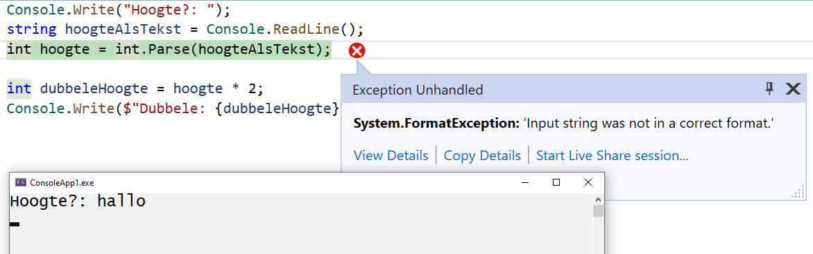

# Programmeren Basis - Deel 05
## 1. Numerieke invoer robuust opvangen
### 1.1. Parse kan leiden tot runtimefouten
Op de console vangen we de invoer van de gebruiker op aan de hand van `Console.ReadLine()`. Deze functionaliteit levert ons een tekst (`string`) op.

In sommige gevallen wordt echter numerieke informatie ingevoerd, en wensen we die ingevoerde waardes in te zetten in een berekening. Op dat moment hebben we -tot dus ver- gebruik gemaakt van `int.Parse()` of `double.Parse()` om de `string` waarde in `int` of `double` vorm om te zetten.

We lopen hierbij het risico dat de gebruiker een reeks van karakters gaat invoeren die voor `int.Parse()` of `double.Parse()` niet omzetbaar zijn, bijvoorbeeld de tekst *"hallo"*. Een runtimefout, bijvoorbeeld een *FormatException* of *OverflowException*, treedt in dat geval op. Indien onze code daar niet op voorzien is crasht onze applicatie.

Voorbeeld van onveilig invoer opvangen met Parse

```csharp
Console.Write("Hoogte?: ");
string hoogteAlsTekst = Console.ReadLine();
int hoogte = int.Parse(hoogteAlsTekst);

int dubbeleHoogte = hoogte * 2;
Console.Write($"Dubbele: {dubbeleHoogte}");
```

Indien er *10* wordt ingevoerd verloopt alles naar wens…​

```csharp
Hoogte?: 10
Dubbele: 20
```

Bij de invoer van *hallo* loopt het echter grondig fout…​



Bij een *runtimefout*, *exception* ook wel genoemd, breekt het programma af.

> **Tip: Raadplegen van exception informatie, en terugkeren naar editeer modus.**
>
> Visual Studio schakkelt indien een exception optreedt naar debugging modus, en markeert welke instructie het probleem heeft veroorzaakt. Vooral de naam van de exceptie, FormatException bijvoorbeeld, en de additional information bieden ons informatie over wat nu precies fout liep.
>
> Om terug te keren naar editeer modus kies je in Visual Studio voor **Debug** **›** **Stop Debugging**.

Runtimefouten die `int.Parse()` en `double.Parse()` ons opleveren, kunnen we vermijden aan de hand van `int.TryParse()` en `double.TryParse()`.

### 1.2. TryParse oplossing
`int.TryParse()` en `double.TryParse()` leveren geen exceptions op, maar signaleren of de conversie slaagt.

Op basis van die indicatie (*slagen* of *falen* van de conversie) kan het programma zijn verdere verloop bepalen. Op die manier kunnen we op veilige wijze (zonder de vrees voor exceptions) `string` informatie *proberen* om te zetten in `int` of `double` vorm.

Aan `TryParse()` geef je…​

-   de om te zetten `string` waarde mee

-   de variabele mee waaraan het omgezette resultaat wordt toegekend

`TryParse()` signaleert vervolgens met een `bool` waarde of deze omzetting is gelukt…​

-   `true` wordt opgelevert als de omzetting slaagt

-   `false` indien deze faalt

Voorbeeld van veilig invoer opvangen met TryParse

In de console numerieke invoer opvangen bijvoorbeeld, kan zo eindelijk ook op robuuste wijze.

```csharp
Console.Write("Getal?: ");
string getalAlsTekst = Console.ReadLine();

int getal;
bool invoerOk = int.TryParse(getalAlsTekst, out getal);
if (invoerOk) {
    Console.Write($"Je hebt int waarde {getal} ingevoerd.");
} else {
    Console.Write("Gelieve een geheel getal in te voeren.");
}
```

De tekst die wordt omgezet zit in onze eerste argumentwaarde `getalAlsTekst`, na de komma geven we aan dat in de variabele `getal` de *output* (`out`) van onze conversie mag komen.

Deze aanroep (`int.TryParse(getalAlsTekst, out getal)`) levert een `bool` waarde op die vervolgens aan `invoerOk` werd toegekend.

Op basis van deze `bool` waarde laten we het programma met een `if` statement beslissen hoe het verder wil.

Indien we het voorbeeld uitvoeren en de gebruiker de waarde *123* invoert en op Enter drukt, dan krijgen we volgende output…​

```csharp
Getal?: 123
Je hebt int waarde 123 ingevoerd.
```

Merk op dat de omgezette waarde, na het aanroepen naar `TryParse()`, ook effectief in de variabele `getal` is terechtgekomen.

Indien we het voorbeeld uitvoeren en de gebruiker de waarde *hallo* invoert, dan krijgen we volgende output…​

```csharp
Getal?: hallo
Gelieve een geheel getal in te voeren.
```

Deze keer breekt het programma niet af (er treed immers geen exception op), maar de *foutsituatie* wordt netjes afgehandeld.

In tegenstelling tot `Parse` levert `TryParse` dus geen omgezette waarde op, maar een `bool`. Een ander mechanisme (een *output parameter*) wordt door `TryParse` gebruikt om aan de aanroepende code de omgezette waarde door te geven. Het `out` sleutelwoord moet vermeld worden voor de naam van je *output variabele*. Anders uitgedrukt: voor de naam van de variabele waaraan je het omgezette resultaat wil toekennen.

> **Waarschuwing**
>
> Het gebruik van *out* (*output parameters*) is niet aan te raden. Ze verminderen ondermeer de leesbaarheid van onze code. Hier hebben we echter geen keuze, de `TryParse()` varianten werken nu éénmaal zo.
>
> Erg vaak worden ze niet ingezet, het gebruik ervan voelt immers geforceerd aan. Het verzorgt de mogelijkheid compact te coderen. `TryParse()` bijvoorbeeld kan zo meerdere resultaten opleveren; zowel het signaal van slagen of falen, als het omgezette resultaat.

## 2. Herhalingen
Bij het opstellen van een verzameling van instructies, of het nu een algoritme is, een wegomschrijving, of een recept voor een gerecht, combineren we verschillende controlestructuren. We spreken we in deze verzamelingen van instructies niet alleen in termen van *sequenties* en *selecties*, ook *herhalingen* komen van pas.

Misschien kan je nog de drie eerder aangehaalde controlestructuren herinneren…​

-   **sequentie** : opdrachten uitvoeren in de volgorde waarin ze in de broncode staan

-   **selectie** : stukken code wel of niet uitvoeren (op basis van één of andere voorwaarde)

-   **iteratie** : stukken herhalen (weerom afhankelijk van een voorwaarde)

*Herhalingen*, ook wel *iteraties* genoemd, kwamen nog niet aan bod. Ze stellen ons in staat aan te geven dat bepaalde stappen worden herhaald, zolang op zijn minst voldaan is aan een bepaalde voorwaarde.

Dit kan ondermeer met do while statement…​

``` nowrap
do {
   code block
} while (voorwaarde);
```

Het *code block*, vervat tussen de `do` en `while` sleutelwoorden, en omsloten met accolades, bevat de te herhalen stappen. Zolang de *voorwaarde* klopt wordt er effectief herhaald. Het *code block* wordt in zo’n geval van bij het begin opnieuw uitgevoerd.

De voorwaarde wordt net als in een `if` statement met een `bool` expressie gevormd.

Merk ook op dat na de *while clausule* van dit `do while` statement een `;` wordt verwacht.

### Analogie
Het meermaal kunnen herhalen van dezelfde instructie biedt ons heel wat flexibiliteit, bijvoorbeeld…​

-   In een wegomschrijving: *rij door tot aan de molen*; wordt de stap *"rij door"* herhaald. Dit zolang je *"nog niet aan de molen bent"*.

-   In een recept: *roer alle gesmolten boter beetje voor beetje door het deeg*; wordt de stap *"een beetje gesmolten boter door het deeg roeren"* herhaald. Deze keer zolang *"er nog boter overblijft"*.

### 2.1. Controlestructuur : do while
Ook in onze eigen algoritmes zijn herhalingen bruikbaar.

Voorbeeld zonder herhalingsstructuur

Wensen we elk jaartal uit de jaren negentig af te drukken, dan kunnen we in principe werken met een opeenvolging van gelijkaardige instructies…​

```csharp
Console.WriteLine("1990");
Console.WriteLine("1991");
Console.WriteLine("1992");
Console.WriteLine("1993");
Console.WriteLine("1994");
Console.WriteLine("1995");
Console.WriteLine("1996");
Console.WriteLine("1997");
Console.WriteLine("1998");
Console.WriteLine("1999");
```

Indien we het voorbeeld uitvoeren dan krijgen we volgende output…​

```csharp
1990
1991
1992
1993
1994
1995
1996
1997
1998
1999
```

Het werken met een sequentie van gelijkaardige instructies is hier nog net haalbaar.

Maar stel je eens voor dat we alle jaartallen uit de twintigste eeuw wensen af te drukken (van *1900* tot en met *1999*). Dan wordt het erg omslachtig dit louter aan de hand van een sequentie op te lossen. Dergelijke aanpak is weinig flexibel, kan moeilijk overweg met veranderende omstandigheden.

Of nog erger, stel je voor dat we alle jaartallen willen afdrukken tot en met een door de gebruiker ingevoerd jaartal. Hierbij is zelfs onmogelijk dit louter aan de hand van een sequentie op te lossen.

Voorbeeld met herhalingsstructuur

Indien we alle getallen van *1990* tot en met *1999* wensen af te drukken kan dit vrij eenvoudig aan de hand van een `do while` statement.

Telkenmale wordt een *getal* afgedrukt. Dit getal is niet steeds dezelfde. Nog voor we het getal opnieuw afdrukken, wensen we het te verhogen met één…​

```csharp
1 : int jaar = 1990;
2 : do {
3 :     Console.WriteLine(jaar); // (1)
4 :     jaar = jaar + 1;         // (2)
5 : } while (jaar <= 1999);      // (3)
```

1.  Telkens wordt een variabel getal afgedrukt.

2.  Niet hetzelfde getal, maar een getal die telkens met één verhoogt.

3.  Deze twee stappen blijven we herhalen zolang de variabele een waarde bevat die kleiner is dan, of gelijk aan, 1999.

Indien we het voorbeeld uitvoeren bekomen we opnieuw volgende output…​

```csharp
1990
1991
1992
1993
1994
1995
1996
1997
1998
1999
```

Het gebruik van een variabele expressie `jaar` brengt hier oplossing. Het is deze die steeds, bij elke uitvoering van de *herhalingsbody* met één wordt verhoogd.

Men gebruikt wel eens de term *body* voor de verzameling van instructies die worden geherhaald. Dit is het code block dat tussen de accolades tussen `do` en `while` is komen te staan.

> **Tip**
>
> Wens je deze keer alle jaartallen uit de twintigste eeuw af te drukken, dan kan je natuurlijk eenvoudigweg de startwaarde *1990* in *1900* aanpassen.

We zouden het verloop van de waarde in `jaar` met een traceertabel kunnen schetsen…​

| Regel | waarde van `jaar` |
|-------|-------------------|
| 1     | 1990              |
| 2     | 1990              |
| **3** | 1990              |
| **4** | 1991              |
| **5** | 1991              |
| 3     | 1991              |
| 4     | 1992              |
| 5     | 1992              |
| …​     | …​                 |

Regels *3*, *4* en *5* worden herhaald, zolang `jaar` althans niet groter wordt dan *1999*. Telkens na de uitvoer van regel *4* wordt onze variabele met één verhoogd.

|     |          |
|-----|----------|
| …​   | …​        |
| 3   | 1998     |
| 4   | 1999     |
| 5   | 1999     |
| 3   | 1999     |
| 4   | **2000** |
| 5   | **2000** |

Pas op het moment dat `jaar` de waarde *2000* krijgt, breekt onze herhaling af. Pas dan is het immers zo dat de voorwaarde `jaar <= 1999` naar `false` zal evalueren.

Sommige herhalingen kan je nog uitschrijven aan de hand van een sequentie, hier had dit nog net mogelijk geweest…​

```csharp
int jaartal = 1990;

Console.WriteLine(jaartal);
jaartal = jaartal + 1;

Console.WriteLine(jaartal);
jaartal = jaartal + 1;

Console.WriteLine(jaartal);
jaartal = jaartal + 1;

...
```

Je merkt echter hoe weinig elegant deze oplossing is. Laat staan dat je op deze wijze alle jaartallen uit de twintigste eeuw wil afdrukken.

Soms helpt het echter daadwerkelijk eerst de instructies in sequentie uit te schrijven. Eens je daar in slaagt weet je immers ***wat*** nu eigenlijk herhaald wordt. Of *wat* er met andere woorden in de *body* van de *herhaling* moet komen.

Merk je op een bepaald moment dat bepaalde instructies op identieke wijze worden herhaald, dan weet je meteen *wat* in de body van de iteratie kan komen. Hier is het uiteraard het stuk…​

```csharp
Console.WriteLine(jaartal);
jaartal = jaartal + 1;
```

…​die de body zal vormen.

### Eerst het 'wat', daarna het 'hoelang'
Denk eerst aan ***wat*** je wil herhalen, bepaal pas daarna ***hoelang*** je dit wil herhalen. De volgorde van de instructies in de *body* van de herhaling heeft vaak invloed op de manier waarop je de *herhalingsvoorwaarde* moet formuleren.

Voorbeeld met focus op het 'wat' en het 'hoelang'

Indien we eerst afdrukken, om pas daarna te verhogen, moet onze voorwaarde met die verhoogde waarde rekening houden…​

```csharp
int jaar = 1990;
do {
    Console.WriteLine(jaar); // (1)
    jaar = jaar + 1;         // (2)
} while (jaar <= 1999);
```

1.  Eerst afdrukken, …​

2.  …​daarna verhogen.

Ook als `jaar` *1999* is, moet dit jaartal nog eens worden afgedrukt. Dat is hier ook zo, `jaar <= 1999` evalueert dan immers naar `true`, wat maakt dat de herhalingsbody nogmaals wordt uitgevoerd.

Ga je de instructies in de body omwisselen, dan moet je ook de voorwaarde hierop aanpassen…​

```csharp
int jaar = 1989;
do {
    jaar = jaar + 1;         // (1)
    Console.WriteLine(jaar); // (2)
} while (jaar < 1999);
```

1.  Deze keer: eerst verhogen…​

2.  …​daarna afdrukken.

De herhalingsbody mag niet meer worden uitgevoerd vanaf jaartal *1999*, want deze waarde verhoogd met één mag uiteraard niet worden afgedrukt. Om die reden is het noodzakelijk dat dit jaartal kleiner blijft dan *1999*.

> **Waarschuwing**
>
> Beide oplossingen leveren een correct resultaat, bij beide worden de jaartallen *1990* tot en met *1999* afgedrukt. De laatste oplossing is echter minder optimaal, de code kan al snel de lezer verwarren. De initialisatie `jaar = 1989` suggereert dat we eerst met het jaartal *1989* iets gaan aanvangen, de voorwaarde `jaar < 1999` suggereert dat we slecht tot en met jaartal *1998* aan de slag gaan. En eigenlijk klopt dat ook, maar op zijn minst zijn deze suggesties misleidend. Pas op het moment dat de lezer ziet dat het jaartal eerst wordt verhoogd, pas daarna wordt afgedrukt, begrijpt de lezer dat het eerst afgedrukt getal niet *1989* zal zijn, maar *1990*.
>
> De eerste oplossing, met initialisatie `jaar = 1990` en voorwaarde `jaar <= 1999`, is op dat vlak beter leesbaar. Het heeft immers nergens een misleidende indruk.

Het is ondertussen duidelijk dat het bepalen van het ***wat te herhalen*** voorafgaat aan het bepalen ***hoelang te herhalen***.

Schrijf met andere woorden eerst de body van je herhaling uit, nog voor je al te lang stilstaat bij de voorwaarde.

### 2.2. Noodzaak aan herhalingsstructuren
Indien je de *herhalingsbody* geen vast -op voorhand gekend- aantal keer wil uitvoeren, is een sequentie compleet uitgesloten.

Je zal in dat geval geen andere mogelijkheid hebben dan het inzetten van een iteratie statement.

Voorbeeld waar iteratie noodzakelijk is

Het afsluitende jaartal (het laatst af te drukken jaartal) zou bijvoorbeeld door de gebruiker kunnen bepaald zijn…​

```csharp
int jaar = 1990;
Console.Write($"Jaartal {jaar} en alle volgende jarentalen, tot en met?: ");
int laatsteJaartal = int.Parse(Console.ReadLine());

do {
    Console.WriteLine(jaar);
    jaar = jaar + 1;
} while (jaar <= laatsteJaartal);
```

Indien voorbeeld wordt uitgevoerd, en *1999* wordt ingevoerd bekomen we opnieuw alle jaartallen van 1990 tot en met 1999…​

```csharp
Jaartal 1990 en alle volgende jarentalen, tot en met?: 1999
1990
1991
1992
1993
1994
1995
1996
1997
1998
1999
```

Je zou hier onmogelijk zonder herhaling hetzelfde resultaat kunnen bereiken. Door *x aantal code fragmenten* in sequentie te plaatsen, leg je immers vast dat *x aantal keer* dergelijk code fragement wordt uitgevoerd.

Bij het inzetten van een herhaling daarentegen, kan je op basis van een *runtime aspect* gaan herhalen. Bijvoorbeeld op basis van een waarde die tijdens uitvoer wordt bepaald.

In ons aangehaalde voorbeeld werd pas tijdens uitvoer van het programma bepaald tot en met welk jaartal we de lijst willen afdrukken. Een stuk code met een herhalingsstructuur, bijvoorbeeld een `do while` statement, was bijgevolg noodzakelijk.

### Oneindige herhalingen
We komen pas uit een herhaling op het moment dat de herhalingsvoorwaarde niet meer correct is (naar `false` evalueert).

Zorg er dan ook voor dat je body iets gaat veranderen aan de informatie (de variabelen) waarop de voorwaarde is gebaseerd.

Voorbeeld van oneindige herhaling

In een algoritme voor het brengen van de getallen *1* tot en met *10* vergeten we onze `getal` variabele te verhogen…​

```csharp
int getal = 1;

do {
    Console.WriteLine(getal);
} while (getal <= 10);
```

`getal` is gelijk aan *1* bij het binnenkomen van de body. De inhoud van `getal` wordt niet aangepast.

Hierdoor zal de voorwaarde `getal <= 10` altijd naar `true` evalueren, en wordt het `getal` oneindig vaak afgedrukt.

### Andere herhalingsstructuren
Naast `do while` statement kan je ook gebruik maken van statements als `while`, `for` of `foreach`.

`while` statements komen verderop aan bod.

`for` en `foreach` worden in een volgend deel besproken.

## 3. Invoer herhalen
Ook invoer kan herhaald worden. Dit bijvoorbeeld om het verder verloop af te wachten tot een correct omzetbare waarde is opgegeven.

We zouden kunnen blijven vragen om een waarde in te voeren zolang nog geen acceptabele waarde werd ingevoerd.

Voorbeeld van herhalen van invoer

```csharp
double afstandInMeter;
bool invoerOk;
do
{
    Console.Write("Afstand in meter?: ");
    invoerOk = double.TryParse(Console.ReadLine(), out afstandInMeter);
} while (!invoerOk);

double afstandInCm = afstandInMeter * 100;
Console.WriteLine($"In cm is dit: {afstandInCm}");
```

Indien we het voorbeeld uitvoeren en de gebruiker de waardes *hallo*, *wereld* en *123* invoert bekomen we…​

```csharp
Afstand in meter?: hallo
Afstand in meter?: wereld
Afstand in meter?: 123
In cm is dit: 12300
```

Steeds opnieuw moet de gebruiker een waarde invoeren. Totdat de conversie van de ingegeven tekst, slaagt. Pas op dat moment zal `TryParse()` true opleveren.

Indien de gebruiker meteen een getal invoert worden geen instructies herhaald…​

```csharp
Afstand in meter?: 5
In cm is dit: 500
```

Het is pas nadat de eerste tekst werd ingevoerd, dat wordt gecontroleerd of deze tekst omzetbaar is in `double` vorm.

> **Opmerking**
>
> Bij het gebruik van een `do while` statement wordt pas na de eerste keer dat de herhalingsbody wordt uitgevoerd, gecontroleerd *of* deze body nogmaals moet worden uitgevoerd.

## 4. Herhalingen
### 4.1. Controlestructuur : while
Een tweede iteratie statement biedt zich aan…​

``` nowrap
while (voorwaarde) {
    code block
}
```

Opnieuw kan hiermee een stuk code (het *code block* dat typisch tussen accolades wordt vermeld) worden herhaald. En opnieuw gebeurt dit op basis van een voorwaarde.

Indien de voorwaarde klopt (naar `true` evalueert) wordt de *herhalingsbody* (of dus het code block) overnieuw uitgevoerd. Anders uitgedrukt: pas op het moment dat de voorwaarde niet meer klopt (naar `false` evalueert) geraken we uit de herhaling.

Voorbeeld van while statement

Om alle getallen van *1* tot en met *5* af te drukken kunnen als volgt tewerk gaan…​

```csharp
int getal = 1;
while (getal <= 5) {
    Console.WriteLine(getal);
    getal = getal + 1;
}
```

Soms kan een `while` ook worden omgevormd in een `do while` (of omgekeerd), hier is dat het geval…​

```csharp
getal = 1;
do {
    Console.WriteLine(getal);
    getal = getal + 1;
} while (getal <= 5);
```

Beide leveren alle gewenste getallen…​

```csharp
1
2
3
4
5
```

### 4.2. while versus do while
`do while` met *een voorwaarde vermeld **na de body*** , is anders dan een `while` met *een voorwaarde vermeld **voor de body*** .

-   In het geval van de `do while` zal pas **na de eerste uitvoer van de body** worden gecontroleerd of men deze nogmaals moet uitvoeren.

-   In het geval van een `while` wordt de voorwaarde (ter herhaling van die body) meteen geëvalueerd, **nog vóór de body een eerste keer zou worden uitgevoerd**.

> **Opmerking**
>
> De body van
>
> -   `do while` wordt minstens één keer uitgevoerd
>
> -   `while` wordt mogelijks nooit uitgevoerd

Ondanks dat beide iteratie statements `do while` en `while` enigszins gelijkaardig lijken, beide herhalen ze een code block op basis van een voorwaarde, moet je toch een bewuste keuze gaan maken voor één van de twee.

#### Liever een while
Voorbeeld van het verkiezen van een while

Om alle getallen vanaf een door de gebruiker ingevoerd getal, kleiner dan 10 af te drukken kunnen we als volgt te werk…​

```csharp
Console.Write($"Lijst vanaf getal ... (zolang kleiner dan 10)?: ");
int getal = int.Parse(Console.ReadLine());
while (getal < 10) {
    Console.WriteLine(getal);
    getal = getal + 1;
}
```

Bij invoer van *5* bekomen we…​

```csharp
Lijst vanaf getal ... (zolang kleiner dan 10)?: 5
5
6
7
8
9
```

Ook bij de invoer van een (te groot) getal *15* bekomen we een acceptabele uitvoer…​

```csharp
Lijst vanaf getal ... (zolang kleiner dan 10)?: 15
```

De lijst is leeg, geen enkel getal wordt afgedrukt. Een goed resultaat want *15* maakt geen deel uit van dergelijk lijst.

Werken we hier echter met een `do while` in plaats van een `while`…​

```csharp
Console.Write($"Lijst vanaf getal ... (zolang kleiner dan 10)?: ");
int getal = int.Parse(Console.ReadLine());
do {
    Console.WriteLine(getal);
    getal = getal + 1;
} while (getal < 10);
```

Dan zal bij *5* het resultaat identiek zijn (aan onze `while` variatie), maar is onze lijst niet leeg bij de invoer van *15*…​

```csharp
Lijst vanaf getal ... (zolang kleiner dan 10)?: 15
15
```

Dat is niet het resultaat dat we voor ogen hadden. Zoals we reeds aangaven maakt *15* geen deel uit van dergelijke lijst.

Getal *15* werd toch afgedrukt omdat pas na het verhogen van dit getal (waarbij het *16* werd) werd opgemerkt dat het getal niet meer kleiner is dan *10*.

We zouden al een `if` moeten bouwen rond onze `do while` om alsnog een correct resultaat te bekomen…​

```csharp
Console.Write($"Lijst vanaf getal ... (zolang kleiner dan 10)?: ");
int getal = int.Parse(Console.ReadLine());
if (getal < 10) {
    do {
        Console.WriteLine(getal);
        getal = getal + 1;
    } while (getal < 10);
}
```

Zo vermijden we dat het ingevoerde getal, los van zijn verhouding ten opzicht van *10*, wordt afgedrukt. Opnieuw bekomen we invoer van *15* een correct resultaat…​

```csharp
Lijst vanaf getal ... (zolang kleiner dan 10)?: 15
```

Deze aanpak is echter complexer door de extra `if`, dus we verkiezen een `while`.

Je kan het zo bekijken, een `while` als…​

``` nowrap
while (voorwaarde X) {
    code fragment A
}
```

…​komt overeen met een `do while` als…​

``` nowrap
if (voorwaarde X) {
    do {
        code fragment A
    } while (voorwaarde X)
}
```

Om een extra -voorafgaande- controle te vermijden, verkiest men een `while` boven een combinatie van `if` en een `do while`.

#### Liever een do while
Maar soms maak je bewust de omgekeerde keuze.

Voorbeeld van het verkiezen van een do while

Pas na de keuze al dan niet *nog een lengte om te zetten*, is het zinvol te controleren of *"ja"* werd ingevoerd…​

```csharp
string nogEenLengteOmzetten;
do {
    Console.Write("Lengte in km?: ");
    double lengteInKm = double.Parse(Console.ReadLine());

    double lengteInMijl = lengteInKm * 0.621371;
    Console.WriteLine($"{lengteInKm} km = {lengteInMijl} mijl");

    Console.Write("Nog een lengte omzetten (\"ja\" om te herhalen)?: ");
    nogEenLengteOmzetten = Console.ReadLine();
} while (nogEenLengteOmzetten == "ja");
```

Het valt ook op hoe je enorm veel code moet herhalen om hetzelfde resultaat te bereiken met een `while` statement…​

```csharp
double lengteInKm;
double lengteInMijl;
string nogEenLengteOmzetten;

Console.Write("Lengte in km?: ");                                // (1)
lengteInKm = double.Parse(Console.ReadLine());                   // (2)

lengteInMijl = lengteInKm * 0.621371;                            // (3)
Console.WriteLine($"{lengteInKm} km = {lengteInMijl} mijl");     // (4)

Console.Write("Nog een keer (\"ja\" om te herhalen)?: ");        // (5)
nogEenLengteOmzetten = Console.ReadLine();                       // (6)

while (nogEenLengteOmzetten == "ja") {
    Console.Write("Lengte in km?: ");                            // (1)
    lengteInKm = double.Parse(Console.ReadLine());               // (2)

    lengteInMijl = lengteInKm * 0.621371;                        // (3)
    Console.WriteLine($"{lengteInKm} km = {lengteInMijl} mijl"); // (4)

    Console.Write("Nog een keer (\"ja\" om te herhalen)?: ");    // (5)
    nogEenLengteOmzetten = Console.ReadLine();                   // (6)
}
```

Regels (1) tot en met (6) worden twee keer op identieke wijze herhaald. Dat kan uiteraard niet de bedoeling zijn.

Afsluitend zouden we het ook als volgt kunnen verwoorden, een `do while` als…​

``` nowrap
do {
    code fragment A
} while (voorwaarde X)
```

…​komt overeen met een `while` als…​

``` nowrap
code fragment A
while (voorwaarde X) {
    code fragment A
}
```

Om te vermijden bepaalde voorafgaande code fragmenten, die ook deel uit maken van de herhaling, meermaals te moeten definiëren, verkiest men een `do while` boven de `while`.

Denk eraan, jezelf herhalen is nooit een goed idee. We hadden het in een voorgaand deel al over het *DRY* principe (*Don’t Repeat Yourself*).

## 5. Combineren van controlestructuren
In één van de voorgaande voorbeelden zag je hoe we een `do while` in een `if` kunnen uitschrijven. Hiermee wordt beslist al dan niet te *herhalen*.

``` nowrap
if (voorwaarde 1) {
    do {
        ...
    } while (voorwaarde 2)
}
```

Al vele malen hebben we een `if`, `while` of `do while` in sequentie laten volgen op, en laten voorafgaan door andere statements.

``` nowrap
code fragment 1
if (voorwaarde 1) {
   code fragment 2
}
code fragment 3
while (voorwaarde 2) {
    code fragment 4
}
code fragment 5
```

Naast deze combinaties van controlestructuren zijn ook alle mogelijke andere combinaties inzetbaar. Nog één voorbeeld; wens je een beslissing te herhalen, dan kan je een `if` in een `while` of `do while` plaatsen…​

``` nowrap
while (voorwaarde Y) {
    if (voorwaarde X) {
        ...
    }
}
```

Voorbeeld van combineren van controlestructuren

Wens je van een door de gebruiker ingevoerd getal op de console te drukken of het al dan niet een priemgetal is, dan kan je bijvoorbeeld als volgt te werk…​

```csharp
Console.Write("Geheel getal (min 2)?: ");
string getalAlsTekst = Console.ReadLine();

int getal;
bool invoerOk = int.TryParse(getalAlsTekst, out getal);

if (invoerOk && getal >= 2) {
    bool deelbaarDoor = false;

    int deler = 2;
    while (!deelbaarDoor && deler < getal)
    {
        deelbaarDoor = (getal % deler == 0);
        deler = deler + 1;
    }

    if (deelbaarDoor) {
        Console.WriteLine($"{getal} is geen priemgetal.");
    } else {
        Console.WriteLine($"{getal} is een priemgetal.");
    }
} else {
    Console.WriteLine("Dit is geen geheel getal (die minstens 2 is).");
}
```

Besteeds niet teveel aandacht aan hoe dit algoritme te werk gaat, maar laat je opvallen dat vele controlestructuren hier in combinatie worden gebruikt…​

```csharp
if (...) {
    ...

    while (...) {
    ...
    }

    if (...) {
    ...
    } else {
    ...
    }
} else {
    ...
}
```

Er is sprake van een *herhaling*, meerdere *selecties* en uiteraard -zoals steeds- ook *sequenties*.

Aan de hand van een selectie wordt de keuze gemaakt een foutmelding te geven, of na te gaan of er sprake is van een priemgetal. In dat laatste geval wordt in sequentie nog voor de beslissing *geen priemgetal* of *een priemgetal* af te drukken, een herhaling gebruikt om naar een mogelijke deler op zoek te gaan.

Er bestaan krachtigere algoritmes om priemgetallen op te sporen. Maar ook in die (langere) algoritmes ga je alle controlestructuren met elkaar moeten combineren.
