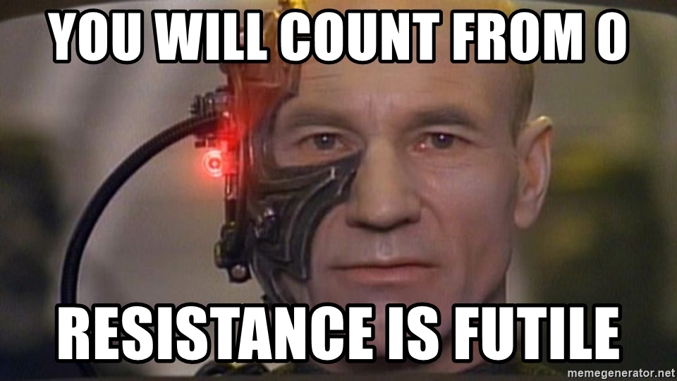

# Programmeren Basis - Deel 06
## 1. Visual Studio tips & tricks
### 1.1. Code in/uit commentaar zetten
Soms is het nodig om tijdelijk een aantal regels code van je programma in commentaar te zetten, bv. om rap iets uit te proberen.

Je kunt er natuurlijk overal `//` voor typen, maar er bestaat een betere manier :

-   de geselecteerde regels in commentaar zetten

    -   kies in de menubalk **Edit** **›** **Advanced** **›** **Comment Selection**

    -   of gebruik de toetsencombinatie Ctrl+K en vervolgens Ctrl+C

-   de geselecteerde regels uit commentaar halen

    -   kies in de menubalk **Edit** **›** **Advanced** **›** **Uncomment Selection**

    -   of gebruik de toetsencombinatie Ctrl+K en vervolgens Ctrl+U.

Voorbeeld waarom je regels in commentaar zou willen zetten

Hernemen we [de oplossing van D04geslaagd](../deel-04-oplossingen/deel-04-oplossingen.html#_oplossing_d04geslaagd) :

```csharp
Console.Write("geef score 1 : ");
string score1AlsTekst = Console.ReadLine();
int score1 = int.Parse(score1AlsTekst);

Console.Write("geef score 2 : ");
string score2AlsTekst = Console.ReadLine();
int score2 = int.Parse(score2AlsTekst);

Console.Write("geef score 3 : ");
string score3AlsTekst = Console.ReadLine();
int score3 = int.Parse(score3AlsTekst);

if (score1 >= 5 && score2 >= 5 && score3 >= 5) {
    Console.WriteLine("Geslaagd");
} else {
    int som = score1 + score2 + score3;
    if (som >= 18 && score1 >= 4 && score2 >= 4 && score3 >= 4) {
        Console.WriteLine("Geslaagd");
    } else {
        Console.WriteLine("Niet geslaagd");
    }
}
```

Veronderstel dat het ons niet vlotjes lukt om de if/else code correct te krijgen. Om na te gaan of onze recentste poging goed werkt, zullen we heel vaak het programma moeten starten en de drie testgetallen invoeren.

Als een programma veel gebruikersinput nodig heeft, is het vervelend en tijdrovend werk om telkens alles opnieuw in te typen.

Wat we dan kunnen doen is, het input gedeelte van ons programma in commentaar zetten en de variabelen van *literal* waarden voorzien :

```csharp
//Console.Write("geef score 1 : ");              // (1)
//string score1AlsTekst = Console.ReadLine();
//int score1 = int.Parse(score1AlsTekst);

//Console.Write("geef score 2 : ");
//string score2AlsTekst = Console.ReadLine();
//int score2 = int.Parse(score2AlsTekst);

//Console.Write("geef score 3 : ");
//string score3AlsTekst = Console.ReadLine();
//int score3 = int.Parse(score3AlsTekst);

int score1 = 3; // (2)
int score2 = 7;
int score3 = 9;

if (score1 >= 5 && score2 >= 5 && score3 >= 5) {
    Console.WriteLine("Geslaagd");
} else {
    int som = score1 + score2 + score3;
    if (som >= 18 && score1 >= 4 && score2 >= 4 && score3 >= 4) {
        Console.WriteLine("Geslaagd");
    } else {
        Console.WriteLine("Niet geslaagd");
    }
}
```

1.  we zetten het input gedeelte in commentaar

2.  we geven elk van de variabelen een *literal* waarden om ermee te kunnen testen

Telkens we iets aan de if/else code aanpassen kunnen we nu heel snel het programma testen met deze (of andere!) *literal* waarden.

Eenmaal we overtuigd zijn dat de if/else code correct is, kunnen we de *literal* waarden wegdoen en het input gedeelte weer uit commentaar halen.

## 2. De uitvoering van het programma pauzeren
Als het programma te snel gaat voor de gebruiker, kun je een vertraging inbouwen met de `Sleep()` opdracht. Deze laat het programma gedurende een gegeven aantal milliseconden wachten.

De `Sleep()` opdracht ziet er als volgt uit :

```csharp
System.Threading.Thread.Sleep(5000); // wacht 5000 milliseconden
```

Voorbeeld

```csharp
const int aantalMillisecondenPerSeconde = 1000;

Console.Write("Hoeveel seconden wil u uw adem inhouden : ");
int aantalSeconden = int.Parse(Console.ReadLine());

int aantalMilliseconden = aantalSeconden * aantalMillisecondenPerSeconde;

Console.WriteLine("We gaan dit eens testen, hou nu uw adem in...");

System.Threading.Thread.Sleep(aantalMilliseconden); // wacht

Console.WriteLine($"U kunt weer ademhalen, er zijn {aantalSeconden} seconden verstreken.");
```

Merk op dat de cursor zichtbaar is tijdens het wachten met `Sleep()`! Normaliter verschijnt deze enkel bij het wachten op input via `Console.ReadLine()`, dus dit kan wat verwarrend zijn voor de gebruiker. Via `Console.CursorVisible` kun je evt. de cursor tijdelijk onzichtbaar maken.

## 3. Het console scherm wissen
Je kunt het console scherm leegmaken met de opdracht `Console.Clear()`.

Een programma dat 10 seconden aftelt alvoren een `Start!` bericht te tonen :

```csharp
int teller = 10;
while (teller > 0) {
    Console.Clear(); // (1)
    Console.Write(teller);
    teller--;
    System.Threading.Thread.Sleep(1000); // wacht 1 seconden
}
Console.Clear(); // (1)
Console.WriteLine("Start!");
```

1.  Verwijder alle tekst van het console venster

En ja, het is inderdaad wat ironisch om een programma te eindigen met een `Start!` mededeling.

## 4. Herhalingen
In het vorige deel kwamen de volgende twee controlestructuren aan bod, waarmee dezelfde code meermaals kon uitgevoerd worden :

```csharp
do {
    code block
} while (voorwaarde);
```

```csharp
while (voorwaarde) {
    code block
}
```

Zo’n herhalingsstructuur noemt men ook wel een ***loop***, het *code block* heet dan de ***loop body***.

### 4.1. Controlestructuur : for loop
Heel vaak zul je een *loop* moeten programmeren waarvan het aantal herhalingen eigenlijk al vastligt op het moment dat de loop begint *tijdens de uitvoering*. Bijvoorbeeld, we zullen later met lijsten werken en als je een lijst met 14 waarden wil overlopen om per waarde iets te doen, dan weet je bij de aanvang van de eerste herhaling al dat er wellicht 14 herhalingen nodig zullen zijn. Let op : we bedoelen niet dat dit aantal gekend is *op het moment dat je de code schrijft*, al is dat ook een mogelijkheid natuurlijk.

Het is typisch dat er in zo’n situatie een **tellervariabele** gebruikt wordt. De teller start met beginwaarde en krijgt na elke herhaling een iets grotere (of kleinere) waarde. De *loop* voorwaarde vergelijkt de teller met een of andere grenswaarde. Op die manier stuurt de teller dus de herhalingen.

Voorbeelden van een herhaling met sturende teller

```csharp
Console.Write("Wat is de bovengrens (niet inclusief) : ");
int bovengrens = int.Parse(Console.ReadLine());

int getal = 1;                 // (1)
while (getal < bovengrens) {   // (2)
    Console.WriteLine(getal);
    getal++;                   // (3)
}
```

1.  beginwaarde van de tellervariabele `getal`

2.  *loop* voorwaarde gebaseerd op de teller

3.  aanpassing van de teller

Je ziet dat `getal` de teller is die het aantal herhalingen bepaalt. Als de uitvoering bij het begin van de loop aankomt, ligt eigenlijk al vast hoeveel herhalingen er zullen zijn : er zullen `(bovengrens - 1)` herhalingen plaatsvinden.

In bovenstaand voorbeeld wordt de teller ook effectief voor iets nuttigs gebruikt in de *loop body*, maar dit hoeft zelfs niet :

```csharp
Console.Write("Hoe oud wordt de jarige : ");
int leeftijd = int.Parse(Console.ReadLine());

int jaar = 1;               // (1)
while (jaar <= leeftijd) {  // (2)
    Console.WriteLine("Hiep hiep hiep, hoera!");
    jaar++;                 // (3)
}
```

1.  beginwaarde van de tellervariabele `jaar`

2.  *loop* voorwaarde gebaseerd op de teller

3.  aanpassing van de teller

Hier bepaalt de teller `jaar` het aantal herhalingen, maar heeft geen ander nut voor ons programma : we doen er verder niks mee in de *loop body*

Dit soort *loops* met een tellervariabele komt zo vaak voor, dat quasi alle programmeertalen er een aparte controlestructuur voor aanbieden : de *for loop*.

Een *loop* met een tellervariabele heeft drie onderdelen :

1.  **beginwaarde** van de tellervariabele

2.  *loop* voorwaarde gebaseerd op de teller

3.  **aanpassing** van de teller

In een ***for loop*** structuur worden deze drie onderdelen gebundeld in de hoofding (i.e. de eerste regel van de for loop), zodat je ze makkelijk terugvindt en herkent.

De algemene vorm van een *for loop* is :

```csharp
for (beginwaarde ; voorwaarde ; aanpassing) {
    code block
}
```

De voorwaarde vergelijkt normaliter de teller met een of andere **grenswaarde** die niet mag overschreden worden.

Heel vaak is de teller enkel relevant tijdens de *loop* en niet daarbuiten. In zo’n geval plaatsen we de declaratie van de tellervariabele meteen bij het *beginwaarde* gedeelte van hoofding.

> **Belangrijk**
>
> De tellervariabele is zo goed al altijd van type `int`.
>
> Als de tellervariabele in de hoofding wordt gedeclareerd, is zijn *scope* gelijk aan de *loop body*. Voor en na de *for loop* is de variabele dus *out of scope*!

Indien de teller geen echte betekenis heeft en van type `int` is, gebruikt men gewoonlijk de namen `i`, `j` of `k`.

Voorbeelden van een herhaling met een for loop

```csharp
Console.Write("Wat is de bovengrens (niet inclusief) : ");
int bovengrens = int.Parse(Console.ReadLine());

for (int getal = 1 ; getal < bovengrens ; getal++ ) { // (1) (2)
    Console.WriteLine(getal);
}
```

1.  de hoofding van de for loop maakt meteen duidelijk hoe de herhalingen worden geregeld. Let op de grenswaarde `bovengrens`.

2.  de tellervariabele `getal` wordt in de hoofding gedeclareerd en is enkel in de *loop body* bruikbaar.

In het eerdere `hiep hiep hiep, hoera!` voorbeeld werd de tellervariabele `jaar` voor niks anders gebruikt. Bij een for loop geven we zo’n tellervariabele de naam `i` om dit duidelijk te maken.

```csharp
Console.Write("Hoe oud wordt de jarige : ");
int leeftijd = int.Parse(Console.ReadLine());

for (int i = 1; i <= leeftijd ; i++ ) { // (1)
    Console.WriteLine("Hiep hiep hiep, hoera!");
}
```

1.  We geven de tellervariabele de naam `i` om duidelijk te maken dat deze geen andere rol vervult. De grenswaarde is hier `leeftijd`.

Terzijde

Programmeurs beginnen trouwens (bijna altijd) vanaf 0 te tellen en zullen een loop als

```csharp
for (int i = 1; i <= leeftijd ; i++ ) {
    code block
}
```

eerder schrijven als

```csharp
for (int i = 0; i < leeftijd ; i++ ) { // (1)
    code block
}
```

1.  let op de beginwaarde `0` (i.p.v. `1`) en de vergelijking op basis van `<` (i.p.v. `<=`).

Deze beroepsmisvorming ontstaat gaandeweg omdat in veel situaties, het eerste element in een reeks de positie `0` krijgt toebedeeld. We zullen dit later nog tegenkomen als we met de individuele symbolen van een string willen werken, of naar een bepaald *slot* in een *array* willen verwijzen.



### 4.2. Aandachtspunten
Nemen we nog eens de algemene vorm van een for loop :

```csharp
for (beginwaarde ; voorwaarde ; aanpassing) {
    loop body
}
```

Indien we veronderstellen dat de for loop tijdens de uitvoering 3 keer wordt herhaald, dan gebeurt het volgende :


- teller krijgt **beginwaarde**


- **voorwaarde** check : `true` (dus *loop body* uitvoeren)
- loop body (eerste iteratie)
- teller **aanpassing**


- **voorwaarde** check : `true` (dus *loop body* uitvoeren)
- loop body (tweede iteratie)
- teller **aanpassing**


- **voorwaarde** check : `true` (dus *loop body* uitvoeren)
- loop body (derde iteratie)
- teller **aanpassing**


- **voorwaarde** check : `false` (dus *loop body* overslaan!!)


> **Belangrijk**
>
> Merk op dat het kan gebeuren dat een for loop geen enkele keer de *loop body* uitvoert, namelijk als de voorwaarde check al van bij het begin `false` oplevert!
>
> Dit kan een bug zijn, maar er zijn ook situaties waarin dit het correcte gedrag is. Bijvoorbeeld, als de beginwaarde of grenswaarde gebaseerd is op gebruikersinput en de gebruiker geeft rare waarden in.

De mate waarin de teller verandert bij elke herhaling noemt men de **stapgrootte**.

Vaak is de stapgrootte +1 maar deze kan eigenlijk eender wat zijn, zelfs negatief. In dat geval gaat de teller dus omlaag vanaf de beginwaarde!


| De teller .. 
| Kenmerken van de for loop 


stijgt, loopt op, wordt groter, klimt


- beginwaarde is lager dan de grenswaarde
- stapgrootte is positief
- voorwaarde vergelijkt teller met grenswaarde op basis van `&lt;` of `&lt;=`


zakt, neemt af, wordt kleiner, daalt


- beginwaarde is hoger dan de grenswaarde
- stapgrootte is negatief
- voorwaarde vergelijkt teller met grenswaarde op basis van `&gt;` of `&gt;=`


In de voorwaarde van een for loop vergelijk je teller en grenswaarde doorgaans niet met `!=` (al is dat niet verkeerde).

> **Belangrijk**
>
> Een vaak voorkomende fout bij loops is een *off by one* error, je programma doet dan één herhaling teveel (of te weinig).
>
> Zoals bij elke soort loop, kun je ook bij een for loop een oneindige herhaling bekomen. Dit zal wellicht te wijten zijn aan een verkeerde loop voorwaarde, want bij een for loop zul je niet zo snel vergeten de teller aan te passen.

De stapgrootte verandert normaal gezien niet tijdens de uitvoering van een for loop.

Demonstratie met oplopende teller

Voorspel eens de output van deze for loops en probeer ze dan uit in Visual Studio :

```csharp
Console.WriteLine("beginwaarde is 1, voorwaarde is <= 10, stapgrootte +1");
for (int i = 1 ; i <= 10 ; i++ ) {
    Console.WriteLine(i);
}
Console.WriteLine();

Console.WriteLine("beginwaarde is 10, voorwaarde is <= 30, stapgrootte +5");
for (int i = 10 ; i <= 30 ; i += 5 ) {
    Console.WriteLine(i);
}
Console.WriteLine();
```

Demonstratie met afnemende teller

Voorspel eens de output van deze for loops en probeer ze dan uit in Visual Studio :

```csharp
Console.WriteLine("beginwaarde is 10, voorwaarde is >= 1, stapgrootte -1");
for (int i = 10 ; i >= 1 ; i-- ) {
    Console.WriteLine(i);
}
Console.WriteLine();

Console.WriteLine("beginwaarde is 30, voorwaarde is >= 10, stapgrootte -5");
for (int i = 30 ; i >= 10 ; i-=5 ) {
    Console.WriteLine(i);
}
Console.WriteLine();
```

Je kunt eindeloos variëren qua beginwaarde/voorwaarde/stapgrootte en toch een correct resultaat krijgen, als je tenminste alles goed op elkaar afstemt.

Het komt erop aan een variatie te kiezen die makkelijk te begrijpen is en de code niet onnodig complex maakt.

Voorbeelden die de tafel van 7 tonen

De onderstaande 7 for loops produceren allen een correcte tafel van 7

```csharp
// (1)
Console.WriteLine("loop 1 : beginwaarde is 1, voorwaarde is <= 10, stapgrootte +1");
for (int i = 1; i <= 10; i++) {
    int product = i * 7;
    Console.WriteLine($"{i} x 7 = {product}");
}
Console.WriteLine();

// (2)
Console.WriteLine("loop 2 : beginwaarde is 0, voorwaarde is < 10, stapgrootte +1");
for (int i = 0; i < 10; i++) {
    int aantal = i + 1;
    int product = aantal * 7;
    Console.WriteLine($"{aantal} x 7 = {product}");
}
Console.WriteLine();

// (3)
Console.WriteLine("loop 3 : begin 7, grens is <= 70, stapgrootte +7");
for (int i = 7; i <= 70; i += 7) {
    int aantal = i / 7;
    int product = i;
    Console.WriteLine($"{aantal} x 7 = {product}");
}
Console.WriteLine();

// (4)
Console.WriteLine("loop 4 : begin 10, grens is >= 1, stapgrootte -1");
for (int i = 10; i >= 1; i--) {
    int aantal = 10 - i + 1;
    int product = aantal * 7;
    Console.WriteLine($"{aantal} x 7 = {product}");
}
Console.WriteLine();

// (5)
Console.WriteLine("loop 5 : begin 10, grens is > 0, stapgrootte -1");
for (int i = 10; i > 0; i--) {
    int aantal = 10 - i + 1;
    int product = aantal * 7;
    Console.WriteLine($"{aantal} x 7 = {product}");
}
Console.WriteLine();

// (6)
Console.WriteLine("loop 6 : begin 70, grens is >= 7, stapgrootte -7");
for (int i = 70; i >= 7; i -= 7) {
    int aantal = (70 - i) / 7 + 1;
    int product = 70 - i + 7;
    Console.WriteLine($"{aantal} x 7 = {product}");
}
Console.WriteLine();

// (7)
Console.WriteLine("loop 7 : begin 350, grens is >= 35, stapgrootte -35");
for (int i = 350; i >= 35; i -= 35) {
    int aantal = (350 - i) / 35 + 1;
    int product = 70 - (i / 5) + 7;
    Console.WriteLine($"{aantal} x 7 = {product}");
}
Console.WriteLine();
```

Variaties 4 t.e.m. 7 vallen af : ze zijn nogal moeilijk te begrijpen en onnodig complex in vergelijking met de eerste drie.

Variatie 3 lijkt het meest aan te sluiten bij het idee van een tafel van 7, maar de for loops in variaties 1 en 2 vergen net iets minder breinkracht om ze te snappen.

Je kunt de tellervariabele van een for loop op heel veel creatieve manieren beïnvloeden, zowel bij de aanpassing in de hoofding alsook in de loop body zelf. Het is echter niet de bedoeling om op die manier de herhalingen van een for loop te sturen.

Enkele tips

-   gebruik voor elke iteratie dezelfde stapgrootte

-   pruts niet aan de tellerwaarde in de *loop body*

-   besef dat de voorwaarde niet continue gecheckt wordt tijdens de uitvoering van de *loop body*

Zorg dat de grenswaarde in de *loop* voorwaarde, relevant is voor de serie waarden die de teller aanneemt.

Voorbeeld van een verwarrende loop voorwaarde

Kijk eens naar de voorwaarde in deze for loop :

```csharp
for (int i = -10; i <= 4 ; i+=4 ) {
    loop body
}
```

Afgaande op de beginwaarde en stapgrootte, zie je dat `i` de serie `-10`, `-6`, `-2`, `2`, `6`, `10`, `14`, …​ wil doorlopen. Dan is de voorwaarde `i <= 4` wel een beetje vreemd (wegens het gelijkheidsteken), kies liever `i <= 2` of `i < 3` of `i < 6`.

Soms is het uitvlooien van de precieze grens in de serie nogal omslachtig. Wat is bv. de relevante grens uit de serie voor een opgave als "toon alle veelvouden van 23 onder 1000". In dit geval heb je echter een andere relevante grenswaarde, nl. de 1000 uit de opdracht!

Heb je een loop nodig die geen duidelijke teller heeft, of meerdere gelijktijdige tellerachtige waarden aanpast, gebruik dan liever while of do-while loop.

Gebruik geen teller van type `double`. Door de inherente afrondingsfouten kan het zijn dat de *loop body* 1 keer te veel of te weinig herhaald wordt.

Demonstratie : een double teller is problematisch

Hoe vaak wordt deze loop herhaald?

```csharp
for (int i = 0 ; i < 10 ; i+=1) {
    Console.WriteLine(i);
}
```

Als we nu eens met een `double` teller werken en alles in de hoofding delen door 10, krijgen we :

```csharp
for (double d = 0 ; d < 1.0 ; d += 0.1) {
    Console.WriteLine(d);
}
```

Hoeveel keer wordt de loop nu uitgevoerd? Probeer dit beslist eens uit! Je zult zien dat de loop een keer teveel wordt herhaald, door afrondingsfouten.

Als je toch een simpele teller herhaling wil én met die teller ook kommagetallen wil berekenen, gebruik dan een `int` teller en zet om naar een `double` op het moment dat je gaat rekenen :

```csharp
for (int i = 0 ; i < 10 ; i+=1) {
    double d = Convert.ToDouble(i) / 10; // (1)
    Console.WriteLine(d);
}
```

1.  de omzetting van de `int` teller naar een kommagetal bij de berekening.

Denk eraan,

> **Belangrijk**
>
> For loops zijn bedoeld voor simpele, regelmatige en voorspelbare herhalingen.
>
> Van zodra je iets gesofistikeerders wil, gebruik je beter een while of do-while loop.

Hou het dus simpel en overzichtelijk, je medeprogrammeurs rekenen erop dat je het KISS principe toepast…​


### 4.3. Kiezen tussen de verschillende soorten loops
We zagen eerder dat er een eenvoudige overeenkomst bestaat tussen een for-loop en een while loop.

Herhaling


| For loop 
| Equivalente code met een while loop 


`for (int i = 0; i &lt; 10; i++) {
    Console.WriteLine(i);
}`


`int i = 0;
while (i &lt; 10) {
    Console.WriteLine(i);
    i++;
}`


.


`for (int i = 10; i &gt;= 4; i -= 2) {
    Console.WriteLine(i);
}`


`int i = 10;
while (i &gt;= 4) {
    Console.WriteLine(i);
    i -= 2;
}`


.


Er is echter geen simpel verband tussen een for loop en een do-while loop. Dat komt omdat een for loop minstens `0` keer wordt doorlopen, terwijl een do-while loop altijd minstens `1` keer wordt uitgevoerd.

Wanneer moet je nu welk soort *loop* gebruiken?

Gebruik een for loop indien

-   de loop een teller heeft waarvan de stapgrootte gelijk blijft tijdens de loop

-   het aantal (potentiële) herhalingen al vast staat **bij de aanvang van de eerste iteratie**

In alle andere gevallen gebruik je beter een while of do-while loop. Je kiest hiertussen op basis van het minimum aantal herhalingen :

-   indien min. 1 herhaling : do-while loop

-   indien min. 0 herhalingen : while loop

Indien je per vergissing een do-while gebruikt als het ook mogelijk is om `0` herhalingen te hebben, dan zul je zien dat je de loop body (of toch een groot stuk ervan) in een grote if verpakt moet worden.

Indien je per vergissing een while loop gebruikt als de loop min. 1 keer herhaald moet worden, dan zul je *soms* merken dat je vóór de loop een groot stuk van de loop body zult moeten herhalen.

Voorbeeld

Stel, we moeten een programma schrijven dat telt hoeveel getallen de gebruiker achtereenvolgens invoert.

Het programma vraagt telkens naar het volgende getal en de gebruiker kan `-1` invoeren om aan te geven dat er geen getallen meer volgen (de `-1` zelf telt natuurlijk niet mee).

We zullen sowieso een herhaling moeten programmeren waarin we telkens naar het volgende getal vragen. In deze loop hebben we ook een teller nodig die bijhoudt hoeveel getallen al werden ingevoerd.

Wat voor soort loop zouden we best gebruiken?

Er is sprake van een simpele teller, dus misschien is een for loop de juiste keuze?

-   bedenk echter dat het totaal aantal iteraties onmogelijk gekend kan zijn bij het begin van de herhalingen : het aantal hangt af van de gebruiker en is pas gekend als de `-1` komt.

Het is dus zeker al geen for loop!

Hoeveel herhalingen zullen er minstens zijn?

-   Vermits we de vraag naar het volgende getal stellen in de *loop body*, zal de loop minstens 1 keer doorlopen moeten worden.

Dus we kiezen voor een do-while loop.

Onze eerste poging ziet er bijvoorbeeld zo uit :

```csharp
int getal = 0;
int aantal = 0;
do {
    Console.Write("Geef het volgende getal (-1 om te stoppen) : ");
    getal = int.Parse(Console.ReadLine());
    aantal++;
} while (getal != -1);
Console.WriteLine($"u gaf {aantal} getallen in");
```

Merk op dat de ingevoerde `-1` ook meegeteld wordt, wat niet de bedoeling was.

We kunnen deze bug op verschillende manieren oplossen :

1.  compenseer achteraf voor wat we teveel telden : trek na de loop eentje af van `aantal`

    ```csharp
    int getal = 0;
    int aantal = 0;
    do {
        Console.Write("Geef het volgende getal (-1 om te stoppen) : ");
        getal = int.Parse(Console.ReadLine());
        aantal++;
    } while (getal != -1);

    // corrigeer aantal achteraf voor de teveel getelde -1 invoer
    aantal--;   // (1)

    Console.WriteLine($"u gaf {aantal} getallen in");
    ```

    1.  Het verduidelijkende commentaar is hier echt wel nodig om uit te leggen waarom we plots `aantal` verlagen.

1.  compenseer vooraf voor wat we teveel zullen tellen : begin met `aantal` gelijk aan `-1` i.p.v. `0`

    ```csharp
    int getal = 0;

    // corrigeer aantal op voorhand al voor de -1 invoer die we straks ten onrechte zullen meetellen.
    int aantal = -1; // (1)

    do {
        Console.Write("Geef het volgende getal (-1 om te stoppen) : ");
        getal = int.Parse(Console.ReadLine());
        aantal++;
    } while (getal != -1);

    Console.WriteLine($"u gaf {aantal} getallen in");
    ```

    1.  Het verduidelijkende commentaar is echt wel nodig om deze vreemde `-1` startwaarde te verklaren.

1.  tel correct : verhoog `aantal` enkel indien de input niet `-1` is

    ```csharp
    int getal = 0;
    int aantal = 0;
    do {
        Console.Write("Geef het volgende getal (-1 om te stoppen) : ");
        getal = int.Parse(Console.ReadLine());
        if (getal != -1) { // (1)
            aantal++;
        }
    } while (getal != -1);
    Console.WriteLine($"u gaf {aantal} getallen in");
    ```

    1.  Een extra `if` zodat de `-1`**niet** meegeteld wordt.

Deze laatste oplossing is duidelijker dan de vorige twee : het staat expliciet in de code dat er iets speciaals aan de hand is met die `-1` invoer en de telling. In de vorige twee fragmenten was dit impliciet en moest het verduidelijkt worden met commentaar.

Het derde fragment is weliswaar duidelijker, maar tegelijk ook iets complexer (door die extra `if`) en ook een ietsiepietsie minder efficiënt. **Toch is het de betere oplossing, gewoon omdat ze duidelijker is!**
