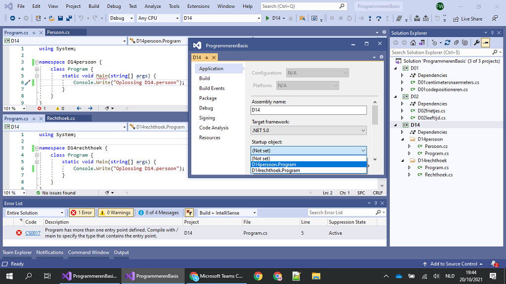
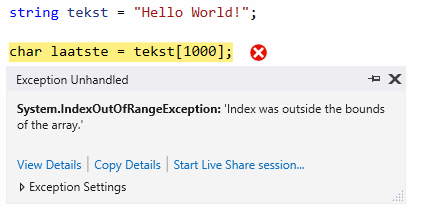

# Programmeren Basis - Deel 07
## 1. Projecten in Visual Studio
### 1.1. Zelf een project creëren
In Visual Studio kunnen we verschillende soorten applicaties opzetten. We starten met het creëren van een *project*.

Bij de opstart van Visual Studio kunnen we meteen een project laten creëren…​


Indien Visual Studio reeds is opgestart kan je in de menu kiezen voor *****File** **›** **New** **›** **Project…​*****.


Een volgend venster laat ons een project-template uitkiezen…​


In ons geval kiezen we voor ***Console App (.NET Core)*** (of gewoon ***Console App*** zonder het ***(.NET Core)*** stukje). Let er op dat we met een *C#* template werken.

Eventueel kan je taal aanpassen door op de *Language* uitvallijst te klikken en te kiezen voor *C#*. Aan de linker kant van dit venster worden de recent gebruikte project templates getoond.


Eens de *C#* *Console App (.NET Core)* template is geselecteerd, klikken we op de knop ***Next***.

Een nieuw venster komt naar voor en vraagt ons naar de project en solution naam en plaats van opslag.


Je zou het de naam *HelloWorldApp* kunnen geven. Klik op de ***Create*** knop om verder te gaan.

Visual Studio creëert alvast een broncode bestand (*Program.cs*), voegt deze toe aan het project, en opent de broncode in de code editor…​


### 1.2. Meerdere broncodebestanden in één project
Je hoeft niet alle broncode in één broncode document onder te brengen. Het is aan te raden **voor elk code onderdeel** (bijvoorbeeld voor elke klasse) **een eigen broncode document** te creëren.

Kies in de menu voor *****Project** **›** **Add New Item…​*****.


Selecteer de **template *Class*** en voer een gepaste bestandsnaam in, bijvoorbeeld ***OtherProgram.cs***. Klik op de ***Add*** knop om verder te gaan…​


Meerdere broncodebestanden kan je samen op het scherm brengen…​


> **Tip: Hoe breng ik meerdere broncodebestanden samen op het scherm?**
>
> Maak gebruik van een *Vertical* of *Horizontal Tab Groep* in Visual Studio om meerdere broncodebestanden naast of onder elkaar te plaatsen.
>
> Rechterklik hiervoor op de naam van het tabblad en kies hiervoor voor opties als *New Horizontal* of *Vertical Tab Group*.

### 1.3. Meerdere opstartobjecten in één project
Indien je aan een project een tweede klasse met `Main` method zou toevoegen, kan je dit tweede programma niet zomaar opstarten. Het project weet immers niet meer waar mee moet worden opgestart.

Een compilefout *'Program has more than one entry point defined.'* treedt op. Logisch want er zijn immers meerdere *vertrek punten* van waaruit het programma kan opstarten.

> **Let op**
>
> Toegegeven, het is geen normale opzet. Normaal gezien beschikt een *Console App* slechts over één klasse met een `static void Main`. Bij de uitvoer van een applicatie wordt steeds via één *entry point* (*vertrek punt*) in het programma gestapt.
>
> Tijdens het ontwikkelen, bijvoorbeeld in een overgangsfase van één versie van een programma naar een andere, zou je toch tijdelijk over verschillende van die klassen (die elk een `Main` method hebben) kunnen beschikken.
>
> Ook voor het snel schakkelen tussen verschillenden testjes of oefeningen zou je bijvoorbeeld in deze situatie kunnen belanden.

Door in het project aan te geven met welke klasse (het ***startup object***) wordt gestart, kan je een keuze maken en deze compilefout vermijden.

Laten we het eens uitproberen…​

Voeg een `static void Main` toe aan het *OtherProgram.cs* document…​

OtherProgram.cs

```csharp
using System;
using System.Collections.Generic;
using System.Text;

namespace HelloWorldApp {
    class OtherProgram {
        static void Main() {  // (1)
            Console.WriteLine("Other program...");
        }
    }
}
```

1.  Deze `Main` method wordt toegevoegd.

Ons *project* beschikt nu over twee klassen met een hoofdmethod (`Main` method), er is immers ook nog het oorspronkelijk gecreëerde document *Program.cs*…​

Program.cs

```csharp
using System;

namespace HelloWorldApp {
    class Program {
        static void Main(string[] args) {  // (1)
            Console.WriteLine("Hello World!");
        }
    }
}
```

1.  Ook hier is er een `Main` method aanwezig.

Bij het opstarten van de applicatie (starten van het project), bijvoorbeeld door in de menu te kiezen voor **Debug** **›** **Start Debugging**, komt een compilefout boven…​


Om een keuze te maken, en ons project met `Program` of `OtherProgram` te laten starten, moeten we een projecteigenschap aanpassen. Kies in de menu voor **Project** **›** **HelloWorldApp Properties…​**


Kiezen we daar bijvoorbeeld voor `HelloWorldApp.OtherProgram`, en starten we het project op (**Debug** **›** **Start Debugging**) dan krijgen we inderdaad de uitvoer van de `Main` method van die `class OtherProgram` te zien…​

```csharp
Other program...
```

### 1.4. Namespaces om code te structureren
Om duidelijk te maken dat `Program` een ander *programma* was dan `OtherProgram` hebben we ze elk een unieke naam gegeven. Dit hoeft echter niet. Je kan binnen hetzelfde *Visual Studio project* ook perfect **meerdere klassen** aanmaken **met dezelfde naam** (bijvoorbeeld de defaultnaam `Program`). Hierbij is dan echter wel vereist dat je ze **elk in een andere namespace** gaat **opnemen**.

Een `namespace` is een taalelement die je toelaat code elementen (zoals *klassen*) samen te groeperen.

Een voorbeeld…​

D14persoon\Program.cs

```csharp
using System;

namespace D14persoon { // (1)
    class Program {
        static void Main(string[] args) {
            Console.Write("Oplossing D14persoon");
        }
    }
}
```

1.  Merk op dat de `Program` klasse zich hier in de namespace `D14persoon` bevindt.

En…​

D14rechthoek\Program.cs

```csharp
using System;

namespace D14rechthoek {  // (1)
    class Program {
        static void Main(string[] args) {
            Console.Write("Oplossing D14rechthoek");
        }
    }
}
```

1.  Merk op dat de `Program` klasse zich hier in de namespace `D14rechthoek` bevindt.

*Namespaces* mag je bekijken als een *map*, of noem het een *rubriek*, waarin code onderdelen als klassen worden uitgeschreven. In dergelijke *rubriek* verzamelen we bijvoorbeeld alle klassen die samenhoren.

> **Opmerking: Analogie met mappen**
>
> Een namespace kan je op verschillende manieren vergelijken met *een map in een filesysteem*, bijvoorbeeld een *folder* op onze harde schijf. We maken mappen in hoofdzaak aan om een tweetal redenen:

Net hetzelfde is van toepassingen bij namespaces en hun onderdelen, bijvoorbeeld klassen.

-   Enerzijds kunnen **verschillende klassen met dezelfde naam** (bv `Program`) voorkomen, zolang ze zich maar bevinden **in een andere namespace**.

-   Indien we over vele klassen beschikken, kan het helpen deze klassen in namespaces, met eventuele subnamespaces onder te brengen. Een **hiërarchische structuur** kan zo worden opgebouwd.

#### 1.4.1. Folderopbouw zoals de namespaces
We raden we aan om in het project voor elke `namespace` een eigen *folder* te voorzien. Met *folder* bedoelen we hier een effectieve map in je filesysteem. Geef die folder dezelfde naam als de namespace.

> **Opmerking: Een folder aanmaken inVisual Studio.**
>
> Rechterklik in het *Solution Explorer* toolvenster op de projectnaam en kies voor **Add** **›** **New Folder**.

Verplaats (dit kan met *click and drag* bewegingen) je broncodedocument naar de gewenste folder.

In ons voorgaand voorbeeld…​



Opnieuw kan je uiteraard bij de projecteigenschappen instellen wat het *startup object* is dat je verkiest. Merk op dat daar de volledig kwalificerende namen worden gehanteerd.

#### 1.4.2. Subnamespaces en fully qualified names
Indien klasse `Program` zich in namespace `D14persoon` bevindt, is de volledige naam van deze klasse `D14persoon.Program`. In dergelijke *volledig kwalificerende naam* (Engels: fully qualified name) wordt de naam van de klasse dus voorafgegaan door een *dot* en de naam van de bevattende namespace.

Een namespace *X* kan ook zelf in een andere namespace (*Y*) worden gedefiniëerd. *Namespace X* zou je in dat geval een *subnamespace* kunnen noemen, *namespace Y* de *parent namespace*.

Bijvoorbeeld…​

```csharp
using System;

namespace Boomshine {    // (1)
    namespace Figuren {  // (2)
        class Cirkel {
            //...
        }
    }
}
```

1.  De *parent namespace* is hier `Boomshine`.

2.  De *subnamespace* is hier `Figuren`.

Dit kan ook aan de hand van één namespace statementblok…​

```csharp
using System;

namespace Boomshine.Figuren {  // (2)
    class Cirkel {
        //...
    }
}
```

1.  Opnieuw is de *parent namespace* is `Boomshine`, en *subnamespace* `Figuren`.

Je plaats *dots* tussen de namen van de verschillende parent- of subnamespaces.

Het resultaat bevat (bij standaard code opmaak) minder insprongen, en is zo misschien iets overzichtelijker.

### 1.5. Meerdere projecten in een solution
Ook ***meerdere projecten*** kan je samen ***in één Visual Studio solution*** beheren.

Laten we ook dat eens uitproberen…​

Rechterklik op de solution naam in de *Solution Explorer* en kies voor **Add** **›** **New Project…​**


Ook in het algemene *File* menu kan je deze actie vervullen via **File** **›** **Add** **›** **New Project…​**

Kies je voor een *Console App (.NET Core)* dan kan je bijvoorbeeld je project verder als volgt configureren…​


We gaven het hier de naam *OtherHelloWorldApp* en laten het, net als onze eerste applicatie, toevoegen aan de folder van onze solution. Die had dezelfde naam gekregen als onze oorspronkelijke, en eerste, applicatie in deze solution. Dat kan wat verwarrend zijn.

Momenteel kunnen we de toegevoegde applicatie (het tweede project) nog niet uitvoeren. Hiervoor moeten we eerst aangeven dat we met dit project wensen te starten. Rechterklik op de project naam (van het opstart project) en kies voor **OtherHelloWorldApp** **›** **Set as Startup Project**.

-

Ook in het algemene *Project* menu kan je deze actie vervullen via **Project** **›** **Set as Startup Project**

Als alles goed is verlopen krijg je vervolgens bij de uitvoer ook effectief het resultaat van dit tweede project te zien…​


Verderop gaan we zien hoe je de code in één project kan gebruik maken van de code in een ander project. In dergelijk geval ga je een *referentie* van dat ene project naar dat andere project moeten leggen. Dat bekijken we later wel eens.

## 2. String bewerkingen en char datatype
### 2.1. Een getal omzetten naar een geformatteerde string
In een vorig deel kwam aan bod hoe een `int` of `double` waarde naar tekst kan worden omgezet, met `.ToString()` of via string concatenatie.

Dat is eenvoudig maar geeft ons geen enkele controle over hoe die tekst er moet uitzien. Soms willen we dat echter wel vastleggen :

-   op een kassaticket staan alle prijzen rechts uitgelijnd (m.a.w. waar nodig staan er extra spaties vóór het getal)

-   een kommagetal kan veel getallen na de komma hebben, maar we willen er meestal maar een paar van tonen (afgerond)

We hebben een *format string* nodig die het formaat vastlegt.

Voor `int` is de *format string* een getal gevolgd door `:d` en (optioneel) gevolgd door nog een getal :

-   De algemene vorm is `x:dy`

    -   x is de minimale ruimte die het getal moet innemen (desnoods aangevuld met spaties aan de linkerkant)

    -   y is het minimum aantal cijfers dat moet getoond worden (desnoods aangevuld met extra nullen vóór het getal)

We kunnen de formattering toepassen door deze *format string* aan onze *string interpolation* toe te voegen, nl. tussen de accolades `{` `}` van de variabele die we willen formatteren.

Een int voorbeeld

Let op : in de tabel hieronder zitten de `_` tekens niet in het resultaat, we zetten ze in de plaats van de spaties zodat er iets te zien zou zijn.

| Format string | `int` waarde | Resultaat  | Opmerking                                    |
|---------------|--------------|------------|----------------------------------------------|
| `7:d5`        | 123          | `__00123`  | 2 spaties vooraan en aangevuld met 2 nullen  |
| `7:d7`        | 123          | `0000123`  | aangevuld met vier nullen                    |
| `7:d7`        | -123         | `-0000123` | opgelet, breedte 8 wegens extra minteken!    |
| `5:d`         | 123          | `__123`    | 2 spaties vooraan, niet aangevuld met nullen |
| `0:d5`        | 123          | `00123`    | te weinig plaats, wordt gewoon getoond       |
| `0:d5`        | 123456       | `123456`   | te weinig plaats, wordt gewoon getoond       |

Je kan dit uitproberen met de volgende code

```csharp
int getal = 123;

Console.WriteLine($"het getal is {getal,7:d5}!");
```

Let erop hoe de *format string* tussen de accolades `{` en `}` staat, achter de variabele die we willen formatteren (en vergeet de komma `,` niet!)

Voor `double` is de *format string* een getal gevolgd door `:f` en (optioneel) gevolgd door nog een getal :

-   De algemene vorm is `x:fy`

    -   x is het totaal aantal posities voor het getal in de tekst (desnoods aangevuld met spaties aan de linkerkant). Hou er rekening mee dat de `.` of `,` scheiding voor de fractie ook meetelt.

    -   y is het aantal cijfers na de komma (afgerond of aangevuld met extra nullen ná het getal)

We kunnen de formattering toepassen door deze *format string* aan onze *string interpolation* toe te voegen, nl. tussen de accolades `{` `}` van de variabele die we willen formatteren.

Een double voorbeeld

Let op : in de tabel hieronder zitten de `_` tekens niet in het resultaat, we zetten ze in de plaats van de spaties zodat er iets te zien zou zijn. Of de fractie gescheiden wordt d.m.v. een komma `,` of een punt `.` hangt af van de taalinstellingen van je computer.

| Format string | `double` waarde | Resultaat  | Opmerking                                                               |
|---------------|-----------------|------------|-------------------------------------------------------------------------|
| `7:f2`        | 123.4567        | `_123.46`  | 1 spatie vooraan en afgerond op 2 cijfers na de komma                   |
| `7:f2`        | 123.4           | `_123.40`  | 1 spatie vooraan en aangevuld met een nul achteraan                     |
| `7:f2`        | -123.4567       | `-123.46`  | geen spatie vooraan (wel minteken) en afgerond op 2 cijfers na de komma |
| `0:f2`        | 99123.4567      | `99123.46` | te weinig plaats, afgerond tot 2 cijfers na de komma                    |

Je kan dit uitproberen met de volgende code

```csharp
double getal = 123;

Console.WriteLine($"het getal is {getal,7:f2}!");
```

Let erop hoe de *format string* tussen de accolades `{` en `}` staat, achter de variabele die we willen formatteren (en vergeet de komma `,` niet!)

### 2.2. De onderdelen van een string
In een vorige deel zagen we dat een string een tekst voorstelt.

We hebben strings met elkaar vergeleken op basis van `==` en `!=` en een aantal handige mogelijkheden gebruikt zoals `.ToLower()`, `.ToUpper()` en `.Trim()`. We weten ook hoe we een conversie kunnen uitvoeren van string naar int of double. Dit kwam allemaal goed van pas bij het verwerken van gebruikersinput.

In dit deel wordt besproken hoe we toegang kunnen krijgen tot de inhoud van de tekst (nl. de individuele symbolen) en wat er nog zoal aan handige mogelijkheden bestaat.

#### 2.2.1. De lengte opvragen met .Length
Je kan de lengte van een string opvragen met `.Length` :

```csharp
string str = "Hello World!";
int lengte = str.Length;
```

Voorbeeld

Een programma dat de lengte van een ingegeven tekst toont.

```csharp
Console.Write("Geef een zin : ");
string input = Console.ReadLine();
int lengte = input.Length;
Console.WriteLine($"De lengte van die zin is {lengte}.");
```

Een uitvoering waarbij de gebruiker `Supercalifragilisticexpialidocious` ingeeft ziet er zo uit :

```csharp
Geef een zin : Supercalifragilisticexpialidocious
De lengte van die zin is 34.
```

#### 2.2.2. Karakters, posities en index
Als we met tekst werken moeten we vaak kunnen verwijzen naar de onderdelen van een string op basis van hun positie.

De posities van de individuele karakters (i.e. symbolen) in een string worden genummerd, beginnend bij nul.

Voorbeeld

De string `"Hallo"` bestaat uit 5 karakters, op de volgende posities :

|         |     |     |     |     |     |
|---------|-----|-----|-----|-----|-----|
| symbool | `H` | `a` | `l` | `l` | `o` |
| positie | 0   | 1   | 2   | 3   | 4   |

In een tekst van 5 karakters zijn er dus 5 geldige posities : `0`, `1`, `2`, `3` en `4`.

In plaats van over *positie* is het gebruikelijk om over ***index*** te spreken, bv. in `"Hallo"` is het karakter op index `1` een `a`.

Het eerste karakter heeft index `0` en het vijfde karakter komt overeen met index `4`. Index `5` is dus geen geldige positie in een string van lengte 5!


------------------------------------------------------------------------

#### 2.2.3. Individuele karakters opvragen met \[index\]
Met de `[index]` notatie kun je het karakter achterhalen dat op een bepaalde positie in een string staat. Het karakter (i.e. symbool) zal een waarde van het datatype `char` zijn dat verderop wordt besproken.

In `[index]` staat `index` voor de positie waarvan we het karakter willen weten in de tekst.

Je schrijft dit achter de string waarover het gaat, bv. `tekst[4]`.

Voorbeeld

Veronderstel een string variabele `tekst` die de waarde `Hello World!` bevat.

De karakters en hun positie zijn dan :

|         |     |     |     |     |     |     |     |     |     |     |     |     |
|---------|-----|-----|-----|-----|-----|-----|-----|-----|-----|-----|-----|-----|
| symbool | `H` | `e` | `l` | `l` | `o` |     | `W` | `o` | `r` | `l` | `d` | `!` |
| positie | 0   | 1   | 2   | 3   | 4   | 5   | 6   | 7   | 8   | 9   | 10  | 11  |

Een zinnetje als `tekst[6]` in de broncode is een expressie. Het type van deze expressie is `char` en tijdens de uitvoering is de waarde van deze expressie het karakter `W`.

| Expressie               | Type   | Waarde         |
|-------------------------|--------|----------------|
| `tekst[0]`              | char   | `H`            |
| `tekst`                 | string | `Hello World!` |
| `tekst[4]`              | char   | `o`            |
| `tekst[6]`              | char   | `W`            |
| `tekst[2+7]`            | char   | `l`            |
| `tekst[11]`             | char   | `!`            |
| `tekst.Length`          | int    | 12             |
| `tekst[tekst.Length-1]` | char   | `!`            |

Een stukje broncode waarin dit gebruikt wordt :

```csharp
string tekst = "Hello World!";

char eerste = tekst[0];                // (1)
Console.WriteLine(eerste);

char tweede = tekst[1];                // (2)
Console.WriteLine(tweede);

int positie = 4;
char vijfde = tekst[positie];          // (3)
Console.WriteLine(vijfde);

char laatste = tekst[tekst.Length-1];  // (4)
Console.WriteLine(laatste);
```

1.  het eerste karakter heeft index `0`

2.  het tweede karakter staat op positie `1`

3.  de index kan natuurlijk ook uit een variabele komen, zoals `positie` in dit geval

4.  het laatste karakter staat altijd op positie `.Length-1`! In dit geval op positie `11` dus.

De index is dus steeds een geheel getal en moet `>= 0` zijn.

> **Waarschuwing**
>
> Let op, de gebruikte index moet natuurlijk wel een geldige positie zijn binnen de string!
>
> Zoniet crasht het programma met een *index out of range exception* :
>
> 

### 2.3. Het char datatype
C# heeft een datatype `char` om individuele karakters (symbolen) voor te stellen.

Een `char` *literal* wordt in de broncode afgebakend met een apostrof, bv. `'a'` stelt het karakter `a` voor.

Het `char` datatype kun je bv. ook gebruiken om variabelen te declareren, op dezelfde manier als alle andere datatypes :

```csharp
char letter = 'a';
Console.WriteLine(letter);
```

> **Belangrijk**
>
> Het is de afbakening (met aanhalingsteken of apostrof) die bepaalt wat voor soort literal het is, niet de lengte!

Naast `char` literals zullen we natuurlijk ook vaak werken met `char` waarden die we uit een string opvragen d.m.v. de `[index]` notatie.

#### 2.3.1. Grote en kleine letters
Je kan een karakter omzetten naar de grote of kleine versie met resp. `Char.ToUpper()` en `Char.ToLower()` :

```csharp
char kleineA = 'a';
char groteA = Char.ToUpper(kleineA); // (1)

char groteB = 'B';
char kleineB = Char.ToLower(groteB); // (2)
```

1.  `groteA` krijgt de waarde 'A'

2.  `kleineB` krijgt de waarde 'b'

Voor cijfers en leestekens hebben deze trouwens geen effect :

```csharp
char kleine9 = '9';
char grote9 = Char.ToUpper(kleine9);  // (1)

char puntKomma = ';';
char mysterie = puntKomma.ToLower(); // (2)
```

1.  `grote9` krijgt gewoon de waarde `9`

2.  `mysterie` krijgt gewoon de waarde `;`

#### 2.3.2. Het soort karakter achterhalen
Er bestaan ook een paar nuttige mogelijkheden om te achterhalen wat voor soort karakter je te pakken hebt :

-   `Char.IsLetter()` : is het een letter? Let op, dit is meer dan enkel het Westerse alfabet.

-   `Char.IsDigit()` : is het een cijfer (0 t.e.m. 9)?

-   `Char.IsLower()` en `Char.IsUpper()` : is het een kleine/grote letter?

-   `Char.IsPunctuation()` : is het een leesteken (puntkomma, haakje, accolade, …​)?

Het karakter dat je wil testen plaats je tussen de haakjes. Het resultaat is steeds een `bool` waarde, dus `true` of `false`.

Een voorbeeld om dit te illustreren :

```csharp
string tekst = "Hello World!";
char c = tekst[10]; // (1)

bool letter = Char.IsLetter(c);      // (2)
bool cijfer = Char.IsDigit(c);
bool hoofdLetter = Char.IsUpper(c);
bool kleineLetter = Char.IsLower(c); // (2)
bool punctuatie = Char.IsPunctuation(c);
```

1.  variabele `c` zal een `d` bevatten

2.  deze variabelen zullen `true` zijn, de andere zijn `false`

#### 2.3.3. Conversie van char naar string
We hebben tot dusver 2 manieren gezien om een tekst-achtige literal te definieren

-   `"hallo"`, dit is een `string` literal

-   `'a'`, dit is een `char` literal

Beide zijn verschillende types en zijn niet compatibel met elkaar.

```csharp
char letter = "a"; // (1)
string tekst = 'a'; // (2)
```

1.  Dit is foutief, rechts staat een `string` value en die proberen we in een `char` variabele te bewaren.

2.  Dit is ook foutief, rechts staat een `char` waarde die we in een `string` variabele proberen te stoppen.

We kunnen een `char` waarde omzetten naar een string door `.ToString()` te gebruiken.

```csharp
char letter = 'a';
string tekst = letter.ToString(); // (1)
```

1.  conversie van `char` naar `string`

Net zoals bij `int` en `double`, kunnen we de `.ToString()` achterwege laten als we een `char` aan een string plakken met string concatenatie `+`.

```csharp
char letter = 'A';
string tekst = "Zeg 'ns " + letter + letter + letter; // (1)

Console.WriteLine(tekst);
```

1.  [Zeg 'ns AAA](https://www.youtube.com/watch?v=qNtxfkm2jdI)

Er bestaat geen conversie functionaliteit voor de omzetting van string naar char. Hiervoor illustreerden we wel reeds hoe we individuele karakters uit de tekst bemachtigen als `char` waarden…​

```csharp
string tekst = "abc";
char tweedeLetter = tekst[1];
```

### 2.4. Alle karakters in een string overlopen
Soms is het nodig om alle karakters in een string te overlopen, bijvoorbeeld om na te gaan dat de gebruikersinput geen leestekens bevat : we moeten dan elk karakter testen met `Char.IsPunctuation()`.

#### 2.4.1. Overlopen met een for loop
Als we de `[index]` mogelijkheid met een *for loop* combineren, dan kunnen we alle karakters in een tekst overlopen!

Voorbeeld

```csharp
string tekst = "Hello World!";

for (int i = 0 ; i < tekst.Length ; i++) { // (1)
    char c = tekst[i];                     // (2)
    Console.WriteLine(c);
}
```

1.  let op het gebruik van `tekst.Length` als grenswaarde voor de loop

2.  hier vragen we het karakter op positie `i` op

De output van dit programma is

```csharp
H
e
l
l
o

W
o
r
l
d
!
```

Je zou de hoofding van de for loop natuurlijk ook anders kunnen schrijven, bijvoorbeeld

```csharp
for (int i = 0 ; i <= tekst.Length-1 ; i++) { // (1)
    char c = tekst[i];
    Console.WriteLine(c);
}
```

1.  de voorwaarde is lastiger door het gebruik van `<=` en de `.Length-1`

of

```csharp
for (int i = 1 ; i <= tekst.Length ; i++) {
    char c = tekst[i-1];                     // (1)
    Console.WriteLine(c);
}
```

1.  de *loop body* wordt lastiger want we moeten hier `i-1` als index gebruiken

Maar de oorspronkelijke hoofding was de eenvoudigste!

```csharp
for (int i = 0 ; i < tekst.Length ; i++) { // (1)
    char c = tekst[i];                     // (2)
    Console.WriteLine(c);
}
```

Dus kies `0` als beginwaarde en schrijf de loop voorwaarde met `<`.

Resistance is futile…​

#### 2.4.2. Overlopen met een foreach loop
Soms heb je bij het overlopen van de karakters in een string, de eigenlijke positie van die karakters niet nodig.

Bijvoorbeeld, als je alleen maar wil weten of een string al dan niet een leesteken bevat, dan doet het er niet toe op welke positie je een eventueel leesteken vindt.

Als je de positie niet nodig hebt bij het overlopen, gebruik dan een ***foreach loop*** :

```csharp
string tekst = "Hello World!";

foreach (char c in tekst) { // (1)
    Console.WriteLine(c);
}
```

1.  de hoofding declareert een variabele `c`. Deze zal bij elke iteratie het volgende karakter bevatten. De scope van `c` is de *loop body*.

Een foreach loop is veel eenvoudiger te schrijven (en te begrijpen!) :

-   er is geen teller administratie

-   er is geen `[index]` stap

De *loop body* van de `foreach` loop zal 1x uitgevoerd worden voor elk karakter uit de string.

### 2.5. Strings zijn immutable
Merk op dat een string waarde nooit kan veranderen, strings zijn ***immutable*** (Engels voor onwijzigbaar, onveranderlijk).

> **Belangrijk**
>
> Je kan dus nooit een letter in een string wijzigen. Een toekenning als `tekst[0] = 'A';` is niet toegelaten!

Wat je wel kan doen, is een *nieuwe* string (laten) maken op basis van een bestaande string (plus wat aanpassingen).

We zagen hier eerder al voorbeelden van :

```csharp
string tekst = "Hello World!";

string groteLetters = tekst.ToUpper();  // (1)
string kleineLetters = tekst.ToLower(); // (1)
```

1.  De `.ToUpper()` en `.ToLower()` produceren een nieuwe string op basis van `tekst`.

Een paar andere voorbeelden, dit keer om whitespace weg te laten. Whitespace is lege ruimte zoals spaties en tab karakters.

```csharp
string tekst = "   Hello World!   ";    // (1)

string niksVooraan = tekst.TrimStart(); // (2)
string niksAchteraan = tekst.TrimEnd(); // (3)
string niksBeideKanten = tekst.Trim();  // (4)
```

1.  let op de 3 spaties vooraan en 3 spaties achteraan

2.  `.TrimStart()` laat de whitespace vooraan weg, `niksVooraan` heeft nog 3 spaties achteraan.

3.  `.TrimEnd()` laat de whitespace achteraan weg, `niksAchteraan` heeft nog 3 spaties vooraan.

4.  `.Trim()` laat de whitespace vooraan en achteraan weg, `niksBeideKanten` heeft enkel nog de ene spatie middenin

Weerom, de oorspronkelijke inhoud van `tekst` wordt nooit gewijzigd. Elk van de Trim varianten maakt een nieuwe string die gebaseerd is op de inhoud van `tekst`.

### 2.6. Zoeken in een string
Af en toe zul je code moeten schrijven die zoekt in een tekst, bv.

-   forumsoftware zal checken dat een forumpost geen vloekwoorden bevat uit een vooraf ingestelde lijst

-   bij het inlezen van een bestand waarin data gescheiden is door `|` symbolen, moet je de posities van die symbolen achterhalen om aan de tussenliggende data te geraken

Het is belangrijk dat je je realiseert dat hier telkens 2 strings mee gemoeid zijn

1.  de **brontekst** waar**in** je zoekt, bv. `De man van An kan vanalles`

2.  de **zoektekst** waar**naar** je zoekt, bv. `an`

#### 2.6.1. Zoeken vanaf het begin in de brontekst
In het simpelste geval willen we de zoektocht starten bij het begin (positie `0`) van de brontekst.

We gebruiken hiervoor de `.IndexOf()` opdracht. De algemene vorm is

```csharp
bronTekst.IndexOf( zoekTekst );
```

Deze opdracht gaat in de `bronTekst` op zoek gaan naar de `zoekTekst`, beginnend op positie `0`. Het result is een `int` waarde :

-   indien de zoekTekst gevonden werd, is het resultaat de eerste positie waarop `zoekTekst` gevonden werd in `bronTekst`

-   indien de zoekTekst niet gevonden werd, is het resultaat `-1`

Voor `zoekTest` mag je trouwens ook altijd een eenvoudige `char` waarde nemen, bv. `tekst.IndexOf('a')`.

> **Belangrijk**
>
> Let op, het zoeken is **altijd hoofdlettergevoelig** (Engels : *case sensitive*)!

Voorbeeld

We vragen de gebruiker om de zoektekst en zoeken in `De man van An kan vanalles`. Het programma toont of de zoektekst gevonden werd (en zoja, op welke positie).

```csharp
const string bronTekst = "De man van An kan vanalles";

Console.Write("Geef de zoektekst : ");
string zoekTekst = Console.ReadLine();

int index = bronTekst.IndexOf( zoekTekst ); // (1)
if (index==-1) {
    Console.WriteLine($"werd niet gevonden in '{bronTekst}'.");
} else {
    Console.WriteLine($"gevonden op positie {index} in '{bronTekst}'");
}
```

1.  zoek naar de ingegeven `zoekTekst` in de `bronTekst`

Een uitvoering waarbij de gebruiker `blabla` intypt ziet er zo uit :

```csharp
Geef de zoektekst : blablabla
werd niet gevonden in 'De man van An kan vanalles'
```

Een uitvoering waarbij de gebruiker `an` intypt ziet er zo uit :

```csharp
Geef de zoektekst : an
gevonden op positie 4 in 'De man van An kan vanalles'
```

Denk eraan dat de nummering van de posities in een string begint bij `0`!

Een uitvoering waarbij de gebruiker `An` intypt ziet er zo uit :

```csharp
Geef de zoektekst : An
gevonden op positie 11 in 'De man van An kan vanalles'
```

Je ziet dat de `an` stukjes in `man` en `van` niet meetelden, de zoektocht beschouwt grote en kleine letters als verschillend.

#### 2.6.2. Zoeken vanaf een andere positie in de brontekst
De simpele `.IndexOf()` variant begint z’n speurtocht dus altijd op positie `0`.

Soms is het echter nodig om **de zoektocht op een andere positie te starten**, bv. als we op zoek zijn naar *alle* keren dat de zoektekst in de brontekst voorkomt : nadat we de zoektekst op positie `x` vonden, willen we verder zoeken vanaf positie `x+1`.

Voorbeeld

Als we op zoek zijn naar *alle* posities waarop de zoektekst `an` in de brontekst `De man van An kan vanalles` voorkomt, dan verwachten we `4` posities :

|           |     |     |     |     |       |     |     |     |       |     |     |     |     |     |     |        |     |     |     |        |     |     |     |     |     |     |
|---|---|---|---|---|---|---|---|---|---|---|---|---|---|---|---|---|---|---|---|---|---|---|---|---|---|---|
| brontekst | D   | e   |     | m   | a     | n   |     | v   | a     | n   |     | A   | n   |     | k   | a      | n   |     | v   | a      | n   | a   | l   | l   | e   | s   |
| positie   | 0   | 1   | 2   | 3   | **4** | 5   | 6   | 7   | **8** | 9   | 10  | 11  | 12  | 13  | 14  | **15** | 16  | 17  | 18  | **19** | 20  | 21  | 22  | 23  | 24  | 25  |
| gevonden  |     |     |     |     | a     | n   |     |     | a     | n   |     |     |     |     |     | a      | n   |     |     | a      | n   |     |     |     |     |     |

De posities waarop `an` gevonden kan worden in de zoektekst zijn : `4`, `8`, `15` en `19`.

Als we `bronTekst.IndexOf(zoekTekst)` uitvoeren, krijgen we `4` als resultaat. Indien we die opdracht gewoon nogmaals uitvoeren, dan krijgen we weer `4` als resultaat : elke zoektocht begint immers opnieuw vanop positie `0`!

We hebben dus de mogelijkheid nodig om aan te geven dat de volgende zoektocht vanaf positie `5` moet beginnen.

Gelukkig bestaat er een variant van `.IndexOf()` waarbij we de positie kunnen meegeven waarop de zoektocht moet starten!

De algemene vorm is

```csharp
bronTekst.IndexOf( zoekTekst , startPositie );
```

Deze opdracht gaat in de `bronTekst` op zoek gaan naar de `zoekTekst`, **beginnend op positie `startPositie`**.

Voorbeeld

```csharp
int resultaat1 = bronTekst.IndexOf(zoekTekst);     // resultaat1 krijgt waarde 4
int resultaat2 = bronTekst.IndexOf(zoekTekst, 5);  // resultaat2 krijgt waarde 8
int resultaat3 = bronTekst.IndexOf(zoekTekst, 9);  // resultaat3 krijgt waarde 15
int resultaat4 = bronTekst.IndexOf(zoekTekst, 16); // resultaat4 krijgt waarde 19
int resultaat5 = bronTekst.IndexOf(zoekTekst, 20); // resultaat5 krijgt waarde -1 // (1)
```

1.  `-1` omdat de `zoekTekst` niet meer gevonden wordt als de zoektocht begint op positie `20`

Als je ***elke*** positie wil vinden waarop de zoektekst voorkomt, zul je een *loop* moeten gebruiken. Je weet immers niet op voorhand hoe vaak je de zoektocht opnieuw moet starten om verder te zoeken!

Zo’n zoek-alle-posities-met-een-loop code heeft een aantal eigenschappen :

-   het is geen *for loop*.

    -   want het aantal iteraties is niet gekend bij het begin van de *loop*.

-   de zoektocht wordt hernomen op `1` positie verder dan het vorige resultaat.

    -   bv. vinden we de zoektekst op positie `4`, dan zoeken we in de volgende herhaling verder vanaf positie `5`.

-   de zoektocht mag stoppen zodra het resultaat `-1` bekomen wordt.

    -   dan zal dus ook de *loop* moeten eindigen.

#### 2.6.3. Zoekacties waarbij het resultaat geen positie is
Er zijn nog een paar andere mogelijkheden die geen positie opleveren maar wel een `bool` om aan te geven of iets wel/niet gevonden werd :

```csharp
bool bevat = bronTekst.Contains( zoekTekst );       // (1)
bool begintMet = bronTekst.StartsWith( zoekTekst ); // (2)
bool eindigtMet = bronTekst.EndsWith( zoekTekst );  // (3)
```

1.  bevat de `bronTekst` wel/niet de `zoektekst`?

2.  begint de `bronTekst` wel/niet met de `zoektekst`?

3.  eindigt de `bronTekst` wel/niet met de `zoektekst`?

Voor `zoekTest` mag je trouwens ook altijd een eenvoudige `char` waarde meegeven, bv. `tekst.Contains('a')`.

Je kan dit natuurlijk ook met `.IndexOf()` oplossen (door te checken welke positie resultaat eruit komt), maar dat soort code is meer werk om te schrijven en moeilijker te begrijpen.

### 2.7. Deeltekst van een string bemachtigen
Soms wil je een deeltekst van een string te pakken krijgen, hiervoor kun je de `.Substring()` mogelijkheid gebruiken.

De algemene vorm is :

```csharp
tekst.Substring( beginPositie , lengte );
```

Het resultaat is een nieuwe string die alle symbolen van `tekst` bevat vanaf `beginPositie` totdat een string van de gegeven `lengte` is bekomen. Anders gezegd, vanaf positie `beginPositie` *tot en met* positie `beginPositie+lengte-1`.

Indien je geen lengte opgeeft, bv. `tekst.Substring( beginPositie )` dan wordt het deel genomen vanaf `beginPositie` tot aan het einde van de tekst.

Voorbeeld

Veronderstel

```csharp
string tekst = "De man van An kan vanalles";
```

De karakters en hun posities in `tekst` zijn dan :

|         |     |     |     |     |     |     |     |     |     |     |     |     |     |     |     |     |     |     |     |     |     |     |     |     |     |     |
|---|---|---|---|---|---|---|---|---|---|---|---|---|---|---|---|---|---|---|---|---|---|---|---|---|---|---|
| tekst   | D   | e   |     | m   | a   | n   |     | v   | a   | n   |     | A   | n   |     | k   | a   | n   |     | v   | a   | n   | a   | l   | l   | e   | s   |
| positie | 0   | 1   | 2   | 3   | 4   | 5   | 6   | 7   | 8   | 9   | 10  | 11  | 12  | 13  | 14  | 15  | 16  | 17  | 18  | 19  | 20  | 21  | 22  | 23  | 24  | 25  |

```csharp
string deel1 = tekst.Substring( 3 , 10 ); // met lengte

string deel2 = tekst.Substring( 21 );     // zonder lengte
```

Variabele `deel1` krijgt de waarde `man van An` : de tekst van positie 3 tot en met positie 12 (precies lengte 10 dus)

Variabele `deel2` krijgt de waarde `alles` : de tekst van positie 21 tot aan het einde

> **Waarschuwing**
>
> Let op
>
> De `beginPositie` en `lengte` moeten samen altijd geldige posities opleveren, zoniet komt er een `ArgumentoutOfRangeException`:
>
>  
>
> De foutmelding geeft aan wat er verkeerd is : `startIndex` of `length`, onderlijnd in de abeeldingen.

### 2.8. Verdere mogelijkheden van strings
Een opdracht om een string te bouwen die `aantal` keer hetzelfde `symbool` bevat kan met de opdracht `new string(symbool, aantal)`

```csharp
string kimberleyVlaeminck = new string( '*' , 56 ); // (1)
```

1.  `kimberleyVlaeminck` [krijgt 56 sterretjes](https://www.youtube.com/watch?v=CHkPL36Torc)

Bij het zoeken naar een tekst hebben we hierboven twee `.IndexOf()` varianten gebruikt. Er bestaan echter ook twee gelijkaardige `.LastIndexOf()` varianten die de zoektocht van achter naar voren uitvoeren.

```csharp
int resultaat1 = bronTekst.LastIndexOf(zoekTekst);     // resultaat1 krijgt waarde 19
int resultaat2 = bronTekst.LastIndexOf(zoekTekst, 18); // resultaat2 krijgt waarde 15
int resultaat3 = bronTekst.LastIndexOf(zoekTekst, 14); // resultaat3 krijgt waarde 8
int resultaat4 = bronTekst.LastIndexOf(zoekTekst, 7);  // resultaat4 krijgt waarde 4
int resultaat5 = bronTekst.LastIndexOf(zoekTekst, 3);  // resultaat5 krijgt waarde -1 // (1)
```

Merk op dat `.LastIndexOf()` niet naar een achterstevoren versie zoekt of iets dergelijks, enkel de posities worden van achter naar voren doorlopen.

Er bestaan nog véél meer mogelijkheden voor strings, je kan deze terugvinden op

-   https://docs.microsoft.com/en-us/dotnet/api/system.string

Bijvoorbeeld

-   `.Replace()`, *search & replace* in een string uitvoeren

-   `.Insert()`, tekst inlassen middenin een andere tekst

-   `.Remove()`, tekst verwijderen middenin een andere tekst

> **Belangrijk**
>
> Weerom : deze methods wijzigen de string niet, maar produceren een nieuwe string op basis van de originele tekst met de wijzingen erin verwerkt.
