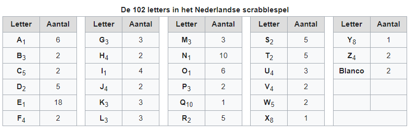

# Programmeren Basis - Deel 09 - Oefeningen
> **Opmerking**
>
> We raden je aan om zoveel mogelijk oefeningen te maken, dat is de beste voorbereiding.
>
> Als je te ver achterop raakt bij het volgen van deze cursus, dan zul je daar wellicht niet de tijd voor vinden want het zijn er behoorlijk veel.

> **Waarschuwing**
>
> Enkele aandachtspunten bij het oplossen van deze oefeningen :

## Vroegtijdig een loop beëindigen
### Oefening D09zoekdier
Begin een programma met

```csharp
string[] boerderijDieren={"kip", "koe", "paard", "geit", "schaap"};
```

en schrijf de rest van de code zodat het de gebruiker om een dier vraagt. Het programma meldt vervolgens of het wel of niet om een boerderijdier gaat. Dit programma is hoofdletterONgevoelig.

### Oefening D09herkansing
Schrijf een programma dat op basis van een puntenlijst meldt of er al dan niet een herkansing moet ingericht worden. Indien er minstens 1 student een onvoldoende behaalde (`score<10`) moet er een herkansing worden ingericht.

Gebruik de volgende puntenlijst in je programma :

```csharp
int[] puntenlijst = { 13, 16, 13, 18, 8, 12, 15, 3, 4, 11, 17, 18 };
```

## Parallelle arrays
### Oefening D09buisvakken
Begin een programma met de volgende twee arrays :

```csharp
string[] vakken={"Frans", "Engels", "Wiskunde", "Duits", "L.O."};
int[] scores={34, 55, 20, 10, 80};
```

De punten voor een vak staan steeds op de overeenkomstige positie in het `punten` array. Bv. op index 1 vinden we dat de student voor het vak `Engels` een score van `55` behaalde (op 100).

Schrijf een programma dat toont voor welke vakken de student een onvoldoende behaalde.

### Oefening D09toonscore
Begin weer met dezelfde twee arrays als in de vorige oefening :

```csharp
string[] vakken={"Frans", "Engels", "Wiskunde", "Duits", "L.O."};
int[] scores={34, 55, 20, 10, 80};
```

Het programma vraagt de gebruiker om de naam van een vak en toont vervolgens de score van die student. Het programma zoekt hoofdletterONgevoelig.

Indien het vak niet gevonden wordt, toont het programma "geen score bekend".

Enkel voorbeelduitvoeringen :

```csharp
Geef de naam van een vak : wiskunde
De score voor dit vak is 20/100
```

```csharp
Geef de naam van een vak : Hoelahoepen
Geen score bekend
```

### Oefening D09morse
Toen de communicatie over lange afstanden nog per telegraaf verliep, gebruikte men [Morse code](https://nl.wikipedia.org/wiki/Morse) om teksten om te zetten naar een opeenvolging van lange en korte elektrische signalen. Die lange en korte signalen noteren we hieronder met streepjes en stipjes.

Bijvoorbeeld, de letter `B` komt overeen met de combinatie `lang kort kort kort` en we noteren dit als `- . . .` in Morse code.

Schrijf een programma dat de gebruiker telkens om de Morse code voor een letter vraagt en zo gaandeweg een tekstbericht opbouwt.

Gegeven zijn de volgende twee declaraties :

```csharp
string[] morse = { ".-", "-...", "-.-.", "-..", ".", "..-.", "--.", "....", "..", ".---", "-.-", ".-..", "--", "-.", "---", ".--.", "--.-", ".-.", "...", "-", "..-", "...-", ".--", "-..-", "-.--", "--.." };
char[] letters = { 'a', 'b', 'c', 'd', 'e', 'f', 'g', 'h', 'i', 'j', 'k', 'l', 'm', 'n', 'o', 'p', 'q', 'r', 's', 't', 'u', 'v', 'w', 'x', 'y', 'z' };
```

Dit zijn twee parallelle arrays waarmee je de omzetting van een letter naar diens Morse code kunt maken :

-   vind je een letter op positie `i` in array `letters`

    -   dan staat de morse code voor die letter op dezelfde positie `i` in het `morse` array

        -   bv. de `f` staat op positie `5` in `letters` en op die positie `5` in array `morse` staat `..-.`

        -   dus `f` komt overeen met `..-.`

Je kunt ook de omgekeerde omzetting opzoeken, dus van een morse code naar een letter :

-   vind je een morse code op positie `i` in array `morse`

    -   dan staat de letter voor die code op dezelfde positie `i` in het `letters` array

        -   bv. de morse code `-…​` vinden we op positie `1` in array `morse` en op die positie `1` in array `letters` staat `b`

        -   dus `-…​` komt overeen met `b`

Een voorbeeld uitvoering :

```csharp
Morse code voor de volgende letter (. voor kort, - voor lang) ?: -...
Opgebouwde tekst tot nu toe : b
Morse code voor de volgende letter (. voor kort, - voor lang) ?: .-
Opgebouwde tekst tot nu toe : ba
Morse code voor de volgende letter (. voor kort, - voor lang) ?: -..--. (1)
Ongeldige morse code!                                                   (1)
Opgebouwde tekst tot nu toe : ba                                        (1)
Morse code voor de volgende letter (. voor kort, - voor lang) ?: .-..
Opgebouwde tekst tot nu toe : bal
```

1.  de ongeldige Morse code `-..--.` wordt genegeerd

Indien je een bepaalde Morse code niet terugvindt in array `morse` mag je ervan uitgaan dat het een ongeldige code is en moet deze genegeerd worden.

### Oefening D09scrabble
Schrijf een programma dat de gebruiker vraagt om een woord in te typen en vervolgens de Scrabble woordscore toont.

Je mag ervan uitgaan dat de gebruiker steeds exact 1 woord ingeeft, dus alle symbolen zullen letters zijn (geen cijfers, geen leestekens).

Elke letter van het alfabet heeft een score die op de overeenkomstige blokjes staat, je kunt deze opzoeken op [de Wikipedia pagina voor Scrabble](https://nl.wikipedia.org/wiki/Scrabble). De blanco blokjes zijn voor ons niet relevant.



Daar zie je bv. dat een `A` 1 punt waard is, een `B` 3 punten, een `C` 5 punten, enz. Hoofdletters en kleine letters krijgen dezelfde score.

Een voorbeeld uitvoering :

```csharp
Geef een woord : HoNd
Dat woord is 4+1+1+2=8 punten waard.
```

## Verdere oefeningen op arrays
### Oefening D09dagnummernaarmaand
Deze oefening is gebaseerd op [oefening D04dagnummer](../deel-04-oefeningen/deel-04-oefeningen.html#_oefening_d04dagnummer).

Schrijf een programma dat de gebruiker vraagt om een dagnummer in het jaar (i.e. van 1 t.e.m. 365, dus geen schrikkeljaar). Het toont vervolgens in welke maand (als tekst) die dag zich bevindt.

Gebruik hiervoor deze twee arrays :

```csharp
int[] aantalDagen = { 31, 28, 31, 30, 31, 30, 31, 31, 30, 31, 30, 31 };
string[] maandNamen = { "Januari", "Februari", "Maart", "April", "Mei", "Juni", "Juli", "Augustus", "September", "Oktober", "November", "December" };
```

Enkele voorbeeld uitvoeringen

```csharp
Geef het dagnummer : 59
De maand is Februari
```

```csharp
Geef het dagnummer : 183
De maand is Juli
```

```csharp
Geef het dagnummer : 365
De maand is December
```

```csharp
Geef het dagnummer : 366
De maand is onbepaald
```

### Oefening D09maximumtemperatuur
Schrijf een programma dat de minimum en maximumtemperatuur van een bepaalde dag weergeeft, gebaseerd op een lijst van meetwaarden van die dag.

Een waarde van -9999.0 wijst op een sensorprobleem en moet genegeerd worden.

Om te testen gebruik je deze lijst :

```csharp
double[] meetwaarden = { 13.4, 12.1, 10.8, 10.8, 10.3, 8.9, 7.9, 7.8, 7.4, 7.2, 6.4, 9.7, 13.7, 17.2, 19.6, -9999.0, -9999.0, 22.4, 22.7, 22.8, 22.3, 18.4 };
```

Let op : je mag er niet van uitgaan dat er 24 waarden inzitten. Een echte lijst kan net zo goed leeg zijn, of enkel maar sensorproblemen bevatten.

Je kan dit testen met de volgende lijsten :

```csharp
double[] meetwaarden = { }; // Duizend bommen en granaten Kuifje, een leeg array!
```

```csharp
double[] meetwaarden = { -9999.0, -9999.0 };
```

### Oefening D09speelkaarten
Schrijf een programma dat alle 52 speelkaarten op het scherm weergeeft.

In je programma begin je met deze twee arrays :

```csharp
string[] kleuren = {"harten", "klaver", "schoppen", "ruiten" };
string[] waarden = {"twee", "drie", "vier", "vijf", "zes", "zeven", "acht", "negen", "tien", "landbouwer", "dame", "koning", "aas" };
```

Je programma bouwt vervolgens een array van 52 strings op die kaarten voorstellen, bv. "harten twee", "klaver negen", "schoppen aas", enz.

De output van dit programma ziet er zo uit :

```csharp
harten twee
harten drie
harten vier
harten vijf
... (stuk weggelaten)
ruiten dame
ruiten koning
ruiten aas
```

### Oefening D09aantalkarakters
Schrijf een programma dat de som van het aantal karakters van een reeks woorden kan bepalen.

In je programma begin je met een `woorden` array :

```csharp
string[] woorden;

woorden = new string[] { "dit", "zijn", "een", "aantal", "woorden" };                  // 3,7,10,16,23
//woorden = new string[] { "dit", "zijn", "dan", "weer", "wat", "andere", "woorden" }; // 3,7,10,14,17,23,30

// (1)

// (2)

Console.WriteLine(string.Join(',', aantalKarakters));
```

1.  Creëer een nieuwe array voor de `int` waardes.

2.  Vul deze op met de som van het aantal karakters.

Je programma bouwt vervolgens een array met plaats voor evenveel `int` waardes als er woorden zijn in het `woorden` array.

Het nieuwe array vul je op met het aantal karakters van het woord op de corresponderende positie in het `woorden` array, en alle woorden op voorafgaande posities.

-   Het eerste element in deze array zal *3* zijn: het woord *dit* bestaat immers uit *3* karakters.

-   Het tweede element is *7*: *3* verhoogt met *4*, het aantal karakters van het woord *zijn*.

-   Het derde element is *10*: *7* verhoogt met *3*, het aantal karakters van het woord *een*.

-   …​

De output van dit programma ziet er zo uit :

```csharp
3,7,10,16,23
```

Of mogelijks…​

```csharp
3,7,10,14,17,23,30
```

Indien het `woorden` array de *andere woorden* bevat.

### Oefening D09durstenfeld
Breid de vorige oefening uit zodat het array met kaarten dooreengeschud wordt en toon dan pas alle kaarten in hun willekeurige volgorde.

Merk op dat dit geen kwestie is van telkens een random getal te nemen en dan de kaart op die positie te tonen. Want naarmate je vordert wordt de kans steeds groter dat je een dubbele krijgt en om dat te vermijden wordt de code nogal complex.

Een veel simpelere manier is de ***Durstenfeld shuffle*** (a.k.a. het *moderne Fisher-Yates algoritme*) te gebruiken. Hoe dit werkt zie je in deze [video demonstratie](https://www.youtube.com/embed/tLxBwSL3lPQ?start=0&amp;end=243&amp;autoplay=1).

Let op : hij begint per ongeluk niet alfabetisch (`G` en `F` zijn al op voorhand verwisseld). De beginsituatie is :

|        |     |     |     |     |     |     |     |     |
|--------|-----|-----|-----|-----|-----|-----|-----|-----|
| Waarde | A   | B   | C   | D   | E   | G   | F   | H   |
| Index  | 0   | 1   | 2   | 3   | 4   | 5   | 6   | 7   |

### Oefening D09getalfrequentie
Schrijf een programma dat de gebruiker om getallen vraag tussen 0 en 10 (grenzen inclusief) totdat de gebruiker 'stop' intypt (hoofdletterongevoelig).

Na afloop toont het programma hoe vaak elk van de ingevoerde getallen voorkwam.

Een voorbeeld uitvoering :

```csharp
Geef een getal in [0,10] : 2
Geef een getal in [0,10] : 7
Geef een getal in [0,10] : 7
Geef een getal in [0,10] : 2
Geef een getal in [0,10] : 6
Geef een getal in [0,10] : 7
Geef een getal in [0,10] : StOP
2 kwam 2 keer voor
6 kwam 1 keer voor
7 kwam 3 keer voor
```

### Oefening D09zoekhistoriek
Een programma houdt de 5 laatst ingetypte zoektermen bij, in een zoekhistoriek.

Schrijf een programma dat de gebruiker om een nieuwe zoekterm vraagt en deze in de zoekhistoriek stopt. Vermits de historiek van een vaste grootte is, moet er natuurlijk een oudere zoekterm verloren gaan want we houden er ten allen tijde maar 5 bij.

Begin met deze historiek :

```csharp
string[] zoekhistoriek = {"Charlie Sheen", "Hot shots", "Winning", "Electrabel storing", "Geen elektriciteit"};
```

De recentste zoektermen staan meer naar achter in de historiek. Dit betekent dat de recentste zoekterm steeds achteraan erbij komt en dat de oudste (op positie `0`) verdwijnt uit de historiek.

Indien de gebruiker meermaals dezelfde zoekterm intypt, komt die gewoon meermaals voor in de historiek.

Het programma toont eerst de zoekhistoriek op 1 regel (zoektermen gescheiden met een `:` symbool). Daarna wordt de gebruiker om een nieuwe zoekterm gevraagd.

Telkens de gebruiker een zoekterm ingeeft, wijzigt de historiek zoals hierboven beschreven en wordt ze opnieuw getoond.

Het programma eindigt nooit.

Een voorbeeld uitvoering :

```csharp
Charlie Sheen:Hot shots:Winning:Electrabel storing:Geen elektriciteit
Nieuwe zoekterm : werking zekeringskast

Hot shots:Winning:Electrabel storing:Geen elektriciteit:werking zekeringskast
Nieuwe zoekterm : verbrande vingertoppen verzorgen

Winning:Electrabel storing:Geen elektriciteit:werking zekeringskast:verbrande vingertoppen verzorgen
Nieuwe zoekterm : elektricien regio gent

Electrabel storing:Geen elektriciteit:werking zekeringskast:verbrande vingertoppen verzorgen:elektricien regio gent
Nieuwe zoekterm :
```

## Strings
### Oefening D09toongetallenmetjoin
Schrijf een programma dat de getallen in een `int[]` netjes gescheiden door komma’s op de console zet, dit is een variatie op [oefening D08toongetallen](../deel-08-oefeningen/deel-08-oefeningen.html#_oefening_d08toongetallen)

Probeer dit uit met het volgende array :

```csharp
int[] getallen = { 4, 7, 9, 34, 2, 56, 34, 78 };
```

Het programma toont…​

```csharp
4, 7, 9, 34, 2, 56, 34, 78
```

### Oefening D09geenscheldwoorden
Schrijf een programma dat de gebruiker om een tekst vraagt en vervolgens toont of deze tekst al dan niet aanvaardbaar is. De tekst wordt enkel aanvaard indien er geen scheldwoorden in voorkomen (op basis van een lijst). De zoektocht naar scheldwoorden is hoofdletter**on**gevoelig.

Kies zelf je 10 favoriete scheldwoorden op https://nl.wiktionary.org/wiki/Categorie:Scheldwoord_in_het_Nederlands

### Oefening D09censuur
Schrijf een programma dat de gebruiker om een tekst vraagt en vervolgens diezelfde tekst gecensureerd weergeeft. Elk scheldwoord (uit een voorgedefiniëerde lijst) wordt vervangen door een even lange rij sterretjes, bv. `druiloor` wordt vervangen door `********`. De zoektocht naar scheldwoorden is hoofdletter**on**gevoelig.

Gebruik dezelfde lijst met scheldwoorden als in de vorige oefening.

Let op :

-   een scheldwoord kan meermaals voorkomen

-   een scheldwoord kan op vele manieren geschreven worden met hoofdletters en kleine letters, die moeten allemaal gecensureerd worden

-   de gecensureerde versie moet gelijk zijn aan het origineel qua hoofdletters en kleine letters van de rest van de tekst.

### Oefening D09censuuruitbreiding
Pas [de oplossing van D09censuur](../deel-09-oplossingen/deel-09-oplossingen.html#_oplossing_d09censuur) aan zodat de eerste en laatste letters van het scheldwoord NIET worden vervangen door een sterretje.

Bijvoorbeeld, `De grootste druiloor van Gent` wordt `De grootste d******r van Gent`.

Let erop dat ook hier hoodletter / kleine letters bewaard moeten blijven!

Dus bv. `De grootste DruilooR van Gent` wordt `De grootste D******R van Gent`.

### Oefening D09langstewoord
Schrijf een programma dat de gebruiker om een tekst vraagt en vervolgens toont hoeveel woorden erin voorkomen en wat het langste woord is. Indien er meerdere woorden zijn van die lengte, toon dan het eerste. Je mag ervan uitgaan dat woorden enkel door spaties, komma’s, punten, uitroeptekens en vraagtekens gescheiden worden.

```csharp
Geef een tekst : Het werd donker, de kinderen haastten zich naar huis...
aantal woorden : 9
langste woord : kinderen
```

### Oefening D09dierenwissen
Begin een programma met

```csharp
string[] boerderijDieren={"kip", "koe", "paard", "geit", "schaap"};
```

Het programma toont de boerderijdieren met een spatie ertussen en vraagt de gebruiker welk dier hij wil wissen (hoofdlettergevoelig).

In het array wordt de tekst van dat gewiste dier vervangen door de speciale `null` waarde. Indien het dier niet gevonden wordt, gebeurt er niks.

Daarna toont het programma de lijst opnieuw en herhaalt het de vraag.

Let op : op de plaatsen waar er geen boerderijdier meer voorkomt, verschijnt de tekst `GEWIST` maar deze komt niet letterlijk in het array voor (daar staat immers `null` op zo’n positie).

Het programma eindigt nooit.

Een voorbeeld uitvoering :

```csharp
kip koe paard geit schaap
Welk wil je verwijderen : paard

kip koe GEWIST geit schaap
Welk wil je verwijderen : kip

GEWIST koe GEWIST geit schaap
Welk wil je verwijderen : dolfijn

GEWIST koe GEWIST geit schaap
Welk wil je verwijderen :
```
