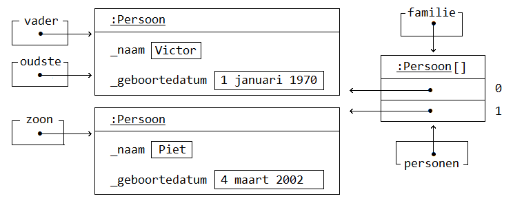

# Programmeren Basis - Deel 14
## 1. Objecten
Vaak werken we in de code met **objecten**. *Objecten* bundelen zaken die conceptueel samen horen, bijvoorbeeld:

-   informatie die bij een *persoon* hoort, bijvoorbeeld zijn *naam*, *adres* of *geboortedatum*

-   functionaliteit die *met* of *op* dat *persoon object* van toepassing is, bijvoorbeeld *adres wijzigen*, *leeftijd berekenen*, *initialen bepalen*, …​

Objecten zijn **steeds van een bepaald (data)type**, en worden ook wel eens een **instantie van dat type** genoemd. Een object zou bijvoorbeeld een instantie kunnen zijn van een type als `Persoon`, `Random` of `string`.

Een datatype als `Persoon` zou je zelf moeten definiëren, daar hebben we het straks over. Tot dus ver hebben we vooral gewerkt met instanties van voorgedefinieerde datatypes.

Voorbeeld van objecten van voorgedefinieerde datatypes

Objecten `naam`, `familienaam` of `randomGenerator` houden informatie bij over twee *teksten* (van type `string`), of een *getal generator* (van type `Random`).

```csharp
string naam = "Jan";
string familienaam = "Janssens"
Console.WriteLine($"Naam (in hoofdletters): {naam.ToUpper()}");

Random randomGenerator = new Random();
Console.WriteLine($"Willekeurig getal: {randomGenerator.Next(1, 11)}");
```

Niet alleen houden ze informatie over deze *tekst* of *getal generator* bij, ze staan ook nog eens toe daarmee of daarop handelingen toe te passen.

Zo kan je van deze *tekst* `naam` met de `ToUpper` method een *hoofdletter-representatie* opvragen.

Zal de `Next` method het *volgende willekeurige getal* van deze *generator* `randomGenerator` opleveren.

```csharp
Naam (in hoofdletters): JAN
Willekeurig getal: 6
```

> **Opmerking: Dot notatie**
>
> Voor de dot staat de naam van het object waarmee wordt gewerkt, waarvan bijvoorbeeld informatie wordt opgeleverd.
>
> `naam.ToUpper()` zal van de tekst in variabele `naam`, en bijvoorbeeld niet van de tekst `familienaam`, een hoofdletter-reprenstatie opleveren.

Straks willen we ook met objecten van onze eigen datatypes gaan werken. Bijvoorbeeld objecten van type `Persoon`.

Voorbeeld van objecten van zelfgedefinieerde datatypes

Ook deze objecten moeten informatie bijhouden, bijvoorbeeld de *naam* of *geboortedatum* van de *persoon* die met dat object wordt voorgesteld.

Op die `Persoon` objecten willen we echter graag ook bepaalde handelen uitvoeren…​

We zijn geïnteresseerd in het `Persoon` object met de hoogste `Leeftijd`. Van die `Persoon` willen we graag de *naam* opvragen. Een method als `GetNaam` zou ons die naam moeten opleveren.

De `Persoon` objecten zouden elk een *naam* en *geboortedatum* moeten krijgen, bijvoorbeeld via methods als `SetNaam` en `SetGeboortedatum`.

```csharp
class Program {
    static void Main() {
        DateTime geboorteDatum1 = new DateTime(1970, 1, 1);
        DateTime geboorteDatum2 = new DateTime(2002, 3, 4);

        Persoon vader = new Persoon();
        vader.SetNaam("Victor");                 // (1)
        vader.SetGeboortedatum(geboorteDatum1);  // (1)

        Persoon zoon = new Persoon();
        zoon.SetNaam("Piet");
        zoon.SetGeboortedatum(geboorteDatum2);

        Persoon[] familie = new Persoon[2];
        familie[0] = vader;
        familie[1] = zoon;

        Persoon oudste = Oudste(familie);
        Console.WriteLine($"De oudste persoon is: {oudste.GetNaam()}");  // (2)
    }

    static Persoon Oudste(Persoon[] personen) {
        Persoon oudste = null;

        if (personen.Length > 0) {
            // We veronderstellen dat de eerste persoon de oudste is...
            oudste = personen[0];

            // En bekijken vanaf het tweede element of er sprake is van nog een oudere...
            for (int i = 1; i < personen.Length; i++) {

                // Vervang indien zo de tot-nu-toe-oudste door de persoon in kwestie...
                if (personen[i].Leeftijd() > oudste.Leeftijd()) {  // (3)
                    oudste = personen[i];
                }
            }
        }
        return oudste;
    }
}
```

1.  Instellen van de *naam* (`SetNaam`) of *geboortedatum* (`SetGeboortedatum`).

2.  Opvragen van de *naam* via `GetNaam`.

3.  Opvragen van de *leeftijd* via `Leeftijd`.

Zo meteen bespreken we hoe we dergelijk eigen datatype als `Persoon` kunnen creëren.

Samengevat…​

**Een object bevindt zich in een bepaalde toestand**. Deze *toestand* wordt bepaald door de informatie die door dat object wordt bijgehouden. Bijvoorbeeld de *tekst* in een `string` object, of de *naam* en de *geboortedatum* in een `Persoon` object.

Daarnaast **vertoont een object gedrag**. Meer specifiek kan een object *vragen beantwoorden* of *opdrachten uitvoeren*. Bijvoorbeeld kan een `string` object antwoorden op de vraag wat zijn *hoofdletter-representatie* is, of kan een `Persoon` object zijn *leeftijd* opleveren.

## 2. Klasse, datavelden en methods
**Een (data)type kan worden gedefinieerd aan de hand van een klasse.**

Een *klasse* (Engels: *class*) is een voorschrift van wat voor informatie alle objecten van die klasse kunnen *bijhouden*, en welke functionaliteiten ze kunnen *uitvoeren*.

-   Aan de hand van **datavelden** (*variabelen op klasseniveau*) wordt het mogelijk gemaakt informatie bij te houden.

-   **Methods** (*commando’s* of *queries*) worden gebruikt om functionaliteit te voorzien.

Voorbeeld van een eigen klasse

Elk object van het type `Persoon` zal zijn eigen *naam* en *geboortedatum* kennen.

Van elk `Persoon` object kan je de *naam* en *geboortedatum* instellen en opvragen.

Daarnaast is het ook mogelijk van elk *Persoon* object de `Leeftijd` na te gaan.

```csharp
class Persoon {
    private string _naam;  // (1)
    public string GetNaam() {
        return _naam;
    }
    public void SetNaam(string naam) {
        _naam = naam;
    }

    private DateTime _geboortedatum;  // (2)
    public DateTime GetGeboortedatum() {
        return _geboortedatum;
    }
    public void SetGeboortedatum(DateTime geboortedatum) {
        _geboortedatum = geboortedatum;
    }

    public int Leeftijd() {
        int leeftijd = 0;
        DateTime dt = GetGeboortedatum().Date.AddYears(1);
        while (dt <= DateTime.Today) {
            leeftijd++;
            dt = dt.AddYears(1);
        }
        return leeftijd;
    }
}
```

1.  een dataveld `_naam`

2.  een dataveld `_geboortedatum`

We hebben twee **datavelden** (soms ook gewoon *velden* genoemd) voor het bijhouden van de toestand van onze verschillende `Persoon` instanties:

-   `_naam` van type `string` voor het bijhouden van de naam

-   `_geboortedatum` van type `DateTime` voor het bijhouden van de geboortedatum

Merk op dat dit variabelen zijn die niet in een method, maar **rechtstreeks in een klasse worden gedeclareerd**.

Typisch ga je het sleutelwoord `private` terugvinden op die declaratieregel. Zo meteen iets meer over die `private`.

> **Opmerking: Underscore voor datavelden**
>
> Doorgaans worden de namen van datavelden met een underscore gestart. Het voordeel is dat je zo meteen ook ziet (aan het al dan niet starten met een underscore) of het over een dataveld of een gewone lokale variabele.

We beschikken ook vijf methods.

Twee daarvan zijn **commando’s** (`void` methods) die de toestand van een `Persoon` object kunnen manipuleren:

-   `SetNaam` voor het instellen van de naam

-   `SetGeboortedatum` voor het instellen van de geboortedatum

En we hebben ook drie **queries** die de toestand, of een afgeleide toestand, kunnen opleveren:

-   `GetNaam` voor het opvragen van de naam

-   `GetGeboortedatum` voor het opvragen van de geboortedatum

-   `Leeftijd` voor het opvragen van de leeftijd

### Get of Set prefix
De *Get* en *Set* prefixen worden gebruikt om te benadrukken dat het gaat om het opvragen (*getten*) of instellen (*setten*) van een bepaalde *eigenschap*. De *naam* en de *geboortedatum* kan je als een *'eigenschap'* van een *persoon* bekijken.

Vooral indien je zowel voorziet in de mogelijkheid eigenschappen *op te vragen* als *in te stellen*, zijn deze prefixen zinvol. Ze benadrukken extra dat het gaat om het *getten* of *setten* van een waarde.

> **Opmerking: Bij properties laten we die vallen.**
>
> Verderop (in een volgend deel van het cursusmateriaal) werken we voor elke eigenschap met een zogenaamde *property*.
>
> Eén property (met één naam) kan de mogelijkheid bieden de eigenschap zowel *in te stellen* als *op te vragen*. Vanaf dan laten we de *Get* of *Set* prefixen meestal vallen.

Zolang we nog niet aan de slag gaan met properties, maken we vrij vaak gebruik van deze prefixen. Maar het hoeft enkel indien het zinvol is te benadrukken dat het gaat om *getten* of *setten*.

Omdat in dit voorbeeld de *leeftijd* enkel opvraagbaar is, biedt een *Get* prefix hier weinig meerwaarde.

### Namen van klassen starten met een hoofdletter
Net als de namen van methods gaan we telkens de namen van klassen starten met een hoofdletter. *Upper CamelCasing* (zoals men dat wel eens noemt) is hier van toepassing.

### 2.1. Gedrag en toestand
We zouden de verschillende onderdelen (*members*) van een klasse in volgend overzicht kunnen plaatsen…​


In dit overzicht staat het begrip *toestand* centraal. Zoals reeds aangegeven wordt de **toestand** bepaald door de informatie die door dat object wordt bijgehouden.

Vraag je je af welke datavelden in een klasse moeten worden voorzien? Of dus welke toestand objecten van dit type kunnen aannemen?

Stel jezelf dan de vraag in wat twee verschillende instanties van dit type kunnen verschillen?

Elke `Persoon` kan een eigen *naam* hebben, en een eigen *geboortedatum*.

Die dus anders is dan de *naam* of *geboortedatum* van een ander `Persoon` object.

Of nog beter, denk na over wat elk object moet *weten* (*bijhouden*) om elke vraag (*query*) te kunnen antwoorden.

Om te antwoorden op de vragen:

-   wat is de naam van deze persoon (`GetNaam`)

-   wat is zijn geboortedatum (`GetGeboortedatum`)

-   wat is zijn leeftijd (`Leeftijd`)

Moet elk object minstens beschikken over de kennis

-   wat de naam is, dit geeft ons `string _naam` want daarmee kan het gedrag van `GetNaam` vervuld worden

-   wat de geboortedatum is, dit geeft ons `string _geboortedatum` want daarmee kan `GetGeboortedatum` en `Leeftijd` vervuld worden

Op basis van het gewenste gedrag beslis je welke *toestand* objecten van een bepaalde klasse kunnen aannemen.

Of anders uitgedrukt: je voorziet voldoende datavelden om te kunnen voldoen aan het gedrag dat de methods moeten implementeren.

### 2.2. Terminologie
Het woord *'klasse'* of *'class'* heeft verschillende betekenissen. Hier in deze context bedoelen we zoiets als *'classificatie'* (of noem het *soort* of *categorie*). *Objecten* met dezelfde eigenschappen, horen tot dezelfde *categorie*.

Het woord *'object'* heeft ook veel betekenissen. Wij bedoelen in deze context *'exemplaar'*. Een instantie (één object) van type `string` stelt één tekst voor. Een ander object van type `string` (een andere instantie dus), stelt een ander *exemplaar* van deze *klasse* voor, een andere tekst dus.

Laat je niet teveel in de war brengen, simpel gesteld…​

-   *klasse = class = (data)type = categorie*

-   *object = instantie = exemplaar*

### 2.3. Private en public
Members van een klasse (onderdelen als datavelden of methods) hebben een bepaalde *visibility* (Nederlands: zichtbaarheid).

Deze visibility bepaalt waar deze members kunnen gebruiken:

-   `public` zaken kunnen elders in ons programma aanspreken, ook buiten de klasse waarin ze zijn gedefinieerd.

    De `public` methods van klasse `Persoon` kunnen bijvoorbeeld in een `Main` method van een `Program` klasse worden benaderd.

-   `private` zaken kunnen enkel in de klasse zelf gebruikt worden.

    De datavelden van een `Persoon` object kunnen we enkel in de klasse `Persoon` zelf gebruiken. Het is *niet* mogelijk om deze bijvoorbeeld in een method van een andere klasse aan te spreken.

Vergelijk het een beetje met de scope van een variabele. Deze beperkte ook de plaatsen in de code waar we die variabelen konden gebruiken.

> **Opmerking: Datavelden zijn private.**
>
> Datavelden worden doorgaans niet beschikbaar gesteld buiten de klassen waarin ze zijn gedefinieerd. Visibility `private` gaat dit verhinderen.

### 2.4. Een nieuwe klasse toevoegen in Visual Studio
Elke klasse wordt doorgaans in een apart broncode document geplaatst.

Toevoegen van een broncode document aan je Visual Studio project

Indien je in je project naast een `Program` klasse ook een `Persoon` klasse wil toevoegen kies je in de Visual Studio menu voor **Project** **›** **Add Class …​**…​


In het resulterende *'Add New Item'* venster selecteer je de *Class* template.


Als broncode bestandnaam kan je kiezen voor iets als *Persoon.cs*. Klik op de **Add** knop.

> **Opmerking: Klassenaam als bestandsnaam**
>
> Het is altijd een goed idee om je broncode document dezelfde naam te geven als de klasse die erin is gedefinieerd.
>
> Zo kan je bijvoorbeeld makkelijk in een toolvenster als de *Solution Explorer* je definitie terugvinden.

Op basis van de uitgekozen bestandsnaam zal een klasse met -in dit geval- de naam `Persoon` worden toegevoegd.


In je project zitten nu alvast twee broncode documenten.

Vervang de meegegeven `class Persoon` door onze eigen versie die we daarstraks hadden uitgeschreven.

## 3. Objecten aanmaken met new
Objecten van onze eigen (of voorgedefinieerde) klassen kunnen we aanmaken met `new`.

Het sleutelwoord `new` laat je volgen door de naam van het datatype (de klasse) die je wil *instantiëren*. Na de naam van het datatype staan ronde haakjes, bijvoorbeeld `new Persoon()` of `new Random()`.

Dergelijke *object initializer* maakt *het object/de instantie* aan (reserveert hiervoor geheugen), en levert de verwijzing (de referentie) naar dit object op. Typisch ga je meteen de opgeleverde verwijzing toekennen aan een variabele van corresponderend datatype, bijvoorbeeld…​

```csharp
Persoon p = new Persoon();
Random r = new Random();
```

Door de verwijzing in een variabele op te slaan kun je het object via die variabele gebruiken, bijvoorbeeld…​

```csharp
p.SetNaam("Jan");
Console.WriteLine(r.Next());
```

> **Opmerking**
>
> Van één klasse kan je oneindig veel objecten maken. De klasse is als het ware de *moule*, de objecten zijn dan de *afgietsels*.
>
> ```csharp
> Persoon p1 = new Persoon();
> Persoon p2 = new Persoon();
> Persoon p3 = new Persoon();
> ...
> ```

### 3.1. Reference type en null
Net als het `string` datatype, of *array datatypes*, zijn ook klasse datatypes **reference types**.

Dat maakt dat er een verschil is tussen de instantie enerzijds, en de *opslagplaats* (variabele of array-slot bijvoorbeeld) anderzijds.

Indien de referentie aan de opslagplaats is toegekend, verwijst hij naar het object. Bijvoorbeeld weergegeven met de pijltjes in onderstaande sectie over objectdiagrammen.

Is er niets toegekend aan deze opslagplaats dan bevat hij `null`. Indien bijvoorbeeld een variabele als `p` louter wordt gedeclareerd, maar nooit een waarde krijgt toegekend (`Persoon p;`) dan bevat hij `null`.


Je kan `null` ook expliciet aan een variabele toekennen, bijvoorbeeld `Persoon p = null`, maar dat gebeurt niet zo vaak. Zoals we straks zien, ga je dat soms wel doen om een *"Use of unassigned local variable"* compilefout te vermijden.

### 3.2. Source code en run-time constructie
Het is belangrijk dat je je realiseert dat een klasse en een object op twee verschillende momenten relevant zijn.

Een klasse is een *source code constructie*, en is met andere woorden enkel relevant voor de compiler, of dus VOOR de uitvoering begint.

Een object is dan een *run-time constructie*, en is enkel relevant NADAT de uitvoering begint.

## 4. Instance methods oproepen
Bij elk `Persoon` object kunnen we diens methods oproepen, bijvoorbeeld de `Set`- en `GetNaam` methods…​

Voorbeeld aanroepen van instance methods

Van de klasse `Persoon` zouden we twee objecten kunnen maken. Eén om daarmee *Jan* voor te stellen, geboren op *1 januari 2000*. En één om een persoon voor te stellen met de naam *Piet*, geboren op *4 maart 2002*.

```csharp
DateTime geboorteDatum1 = new DateTime(2000, 1, 1);
DateTime geboorteDatum2 = new DateTime(2002, 3, 4);

Persoon p1 = new Persoon();
p1.SetNaam("Jan");
p1.SetGeboortedatum(geboorteDatum1);

Persoon p2 = new Persoon();
p2.SetNaam("Piet");
p2.SetGeboortedatum(geboorteDatum2);

if (p1.Leeftijd() > p2.Leeftijd()) {
    Console.Write($"{p1.GetNaam()} is ouder dan {p2.GetNaam()}.");  // (1)
}
```

1.  Jan is ouder dan Piet.

De variabelen `p1` en `p2` bevatten elke een verwijzing (een referentie) naar een instantie van type `Persoon`.

Merk op dat de `SetNaam` en `GetNaam` methods van precies dat `Persoon` object worden aangeroepen waar de variabele `p1` of `p2` naar verwijst!

Bij de method oproep staat links naast de methodnaam een expressie (met een punt ertussen). Die expressie duidt het object aan wiens method we oproepen.

Zo is het van `p1` dat de naam op *"Jan"* wordt ingesteld (`p1.SetNaam("Jan")`). Vragen we vervolgens de naam van `p1` op (`p1.GetNaam()`) dan levert ons dat *"Jan"*, en bijvoorbeeld niet *"Piet"* (de naam van `p2`).

### 4.1. Objectdiagrammen
We zouden de toestand van onze twee objecten ook met volgend *objectdiagram* kunnen modelleren…​


Het objectdiagram benadrukt nogmaals dat elk object van type `Persoon` hier zijn eigen *naam* en *geboortedatum* kan hebben.

In een objectdiagram stelt een vierkant een object voor. Dit is een object van het type waarvan de naam in het bovenste compartiment na de dubbelpunt is weergegeven. Dit datatype wordt typisch onderlijnd, bijvoorbeeld :Persoon.

We krijgen ook de waardes van de datavelden te zien.

De naam van de variabele die de verwijzing naar een object bevat, kun je ook links van de dubbele punt zetten bovenin het object rechthoekje. In de cursus opteren we er liever voor om een pijl te laten vertrekken vanuit een apart vierkantje dat de variabele voorstelt. Door die pijl valt het beter op dat de variabele een verwijzing bevat. De naam van de variabele schrijven we dan bovenaan het vierkantje (`p1` en `p2` hierboven)

Verderop komen de pijltjes goed van pas, zeker als we meerdere variabelen naar hetzelfde object laten wijzen!

### 4.2. Instance methods versus class methods
#### 4.2.1. Object gerelateerde method
Een method waar geen `static` voor staat noemen we een *instance method* of *object (related) method*. We hebben er ondertussen zelf gecreëerd, bijvoorbeeld `Set`- en `GetNaam` uit de `Persoon` klasse.

Deze methods worden altijd *op* een object aangeroepen. Voor de dot staat de naam van het object waarmee wordt gewerkt. Bijvoorbeeld `p2.SetNaam("Piet")`, de *object expressie* `p2` maakt hier duidelijk dat de *naam* van die *persoon* wordt ingesteld.

Ook van voorgedefinieerde *instance methods* hebben we voorheen reeds gebruik gemaakt.

Voorbeeld van instance methods

```csharp
class Program {
    static void Main() {
        string s = "Hello World!";
        Factuur f = new Factuur();

        f.SetVervaldatum(dt);                           // (1)

        Console.WriteLine(s.ToUpper());                 // (1)
        Console.WriteLine(f.GetVervaldatum());          // (1)
    }
}

class Factuur {
    private DateTime _vervaldatum;
    public void SetVervaldatum(DateTime vervaldatum) {  // (2)
        _vervaldatum = vervaldatum;
    }
    public DateTime GetVervaldatum() {                  // (2)
        return _vervaldatum;
    }
}
```

1.  We roepen instance methods `SetVervaldatum`, `ToUpper` of `GetVervaldatum` aan **op objecten** van type `Factuur` en `string`.

2.  Merk op dat er geen `static` sleutelwoorden in de hoofding van de methods `SetVervaldatum` en `GetVervaldatum` wordt vermeld.

Probeer maar eens uit wat er gebeurt wanneer je een `static` sleutelwoord zou toevoegen in de definitie van bijvoorbeeld de `GetVervaldatum` method. De compiler levert ons de foutmelding *"Member 'Factuur.GetVervaldatum()' cannot be accessed with an instance reference; qualify it with a type name instead"*.

Ook in de implementatie van de `GetVervaldatum` method zelf zou een compilefout optreden: *"An object reference is required for the non-static field …​ \_vervaldatum "*.

Het dataveld `_vervaldatum` is inderdaad *non-static*, of noem het *instance related*. Het is gekoppeld aan het object in uitvoering.

> **Opmerking: Weinig parameters in instance methods.**
>
> Merk op dat bij instance methods typisch weinig parameters word gebruikt.
>
> Op basis van het object waarop de member wordt aangeroepen is immers reeds duidelijk wat de informatie is waarmee wordt gewerkt.
>
> Het volstaat bijvoorbeeld voor de *dot* naar `s` te verwijzen als je van deze `string` de *hoofdletter representatie* wenst op te vragen (`s.ToUpper()`). Tussen haakjes moet je bij het aanroepen van `ToUpper` dan ook geen parameterwaardes voorzien.

#### 4.2.2. Klasse gerelateerde method
Er zijn ook methods die niet bij objecten horen, namelijk de **class methods**. Deze methods worden ook wel *klasse (gerelateerde) methods* genoemd, in tegenstelling dus tot de *object (gerelateerde) methods*.

Deze class methods kan je herkennen aan het `static` sleutelwoord in de hoofding van deze method. De `Main` method bijvoorbeeld is een class method, en dus geen instance method.

Voorheen hebben we reeds intensief deze *class methods* ingezet. Nogmaals: daar was geen object nodig om deze method op aan te roepen.

Voorbeeld van static methods

```csharp
static void Main() {
    Console.WriteLine(Math.Sqrt(25));      // (1)
    Console.WriteLine(char.ToLower('A'));  // (1)

    PrintHelloWorld();                     // (1)
}

static void PrintHelloWorld() {  // (2)
    Console.WriteLine("Hello World!");
}
```

1.  We roepen methods `WriteLine`, `Sqrt`, `ToLower` of `PrintHelloWorld` aan zonder dat deze op een object van toepassing is.

2.  Merk op dat het `static` sleutelwoord in de hoofding van deze method is vermeld.

Probeer maar eens uit wat er gebeurt wanneer je het `static` sleutelwoord zou verwijderen in de definitie van de `PrintHelloWorld` method. De compiler levert ons de foutmelding *"An object reference is required for the non-static method 'PrintHelloWorld()' …​"*. Indien de method *non-static* zou zijn, of met andere woorden een *instance method*, dan zou inderdaad een verwijzing naar een object (*object reference*) noodzakelijk zijn.

In het geval van de `WriteLine`, `Sqrt` en `ToLower` methods, zetten we voor de dot de naam van de klasse waarin deze method is gedefinieerd. Voor het oproepen van `PrintHelloWorld` is dat niet noodzakelijk, daar roepen we deze method op vanuit dezelfde klasse als waarin ze is gedefinieerd.

> **Opmerking: Meer parameters in static methods.**
>
> Merk op dat bij `static` methods typisch meer parameters worden ingezet. Dit om duidelijk te maken wat de waardes zijn waarmee wordt gewerkt.
>
> We geven bij het aanroepen van `Console.WriteLine`, `Math.Sqrt` of `char.ToLower` telkens een parameterwaarde mee. Respectievelijk de *waarde die op de console wordt gedrukt*, de *waarde waarvan de vierkantswortel wordt opgeleverd*, of *het karakter waarvan de kleine letter variant wordt opgeleverd*.

### 4.3. this
Voorheen hebben we benadrukt dat elke *instance methods* van toepassing is op een bepaald object. Sterker nog bij het aanroepen van die instance method hebben we voor de *dot* telkens verwezen naar het object in kwestie. Merk in volgend voorbeeld op dat we dat ook kunnen doen…​

-   Bij het aanspreken van een dataveld.

-   Indien we die method aanroepen in de klasse zelf.

Daar kunnen we bij wijze van de `this` *object expressie* verduidelijken op welk object die member van toepassing is. **`this` zal als *object expressie* steeds wijzen naar het object in uitvoering.**

Voorbeeld van het gebruik van this

Van `Persoon` objecten kan je hier niet alleen de *naam* instellen en opvragen, maar ook de *initialen* bevragen.

Zowel bij het aanspreken van het `_naam` veld, als de `GetNaam()` method, wordt verduidelijkt dat het gaat om het object in uitvoering (`this`).

```csharp
class Program {
    static void Main() {
        DateTime geboorteDatum1 = new DateTime(2000, 1, 1);
        DateTime geboorteDatum2 = new DateTime(2002, 3, 4);

        Persoon p1 = new Persoon();
        p1.SetNaam("Jean-Jacques Peters");
        Console.WriteLine(p1.Initialen());  // JJP (1)

        Persoon p2 = new Persoon();
        p2.SetNaam("Rita Sanders");
        Console.WriteLine(p2.Initialen());  // RS (2)
    }
}

class Persoon {
    private string _naam;
    public string GetNaam() {
        return this._naam;  // (3)
    }
    public void SetNaam(string naam) {
        this._naam = naam;  // (3)
    }

    public string Initialen() {
        string initialen = "";
        char[] splitsKarakters = { ' ', '-' };
        string[] naamDelen = this.GetNaam().Split(splitsKarakters);  // (4)
        foreach (string naamDeel in naamDelen) {
            initialen += naamDeel.Substring(0, 1);
        }
        return initialen;
    }
}
```

1.  Bij de eerste call naar `Initialen` is `p1` het object in uitvoering.

2.  Bij de tweede call naar `Initialen` is `p2` het object in uitvoering.

3.  Voor het aanspreken van het dataveld `_naam` wordt benadrukt dat het gaat om dat object (in uitvoering).

4.  Ook bij het aanroepen van `GetNaam` wordt dat expliciet aangegeven.

Het voorbeeld zou net zo goed werken zonder `this`.

Het gebruik ervan kan echter geen kwaad. Je benadrukt ermee dat je gebruik maakt van een member (dataveld of method) van de klasse zelf.

#### 4.3.1. Underscore voor datavelden
Het gebruik van `this` is niet verplicht, al zeker niet indien er geen verwarring mogelijk is! Had het dataveld echter `naam` genoemd, zonder *underscore*, dan kan je je allicht inbeelden dat er bepaalde onduidelijkheid is.

```csharp
class Persoon {
    private string naam;  // (1)
    public void SetNaam(string naam) {
        naam = naam;  // Niet zinvol! (2)
    }
    ...
}
```

1.  Merk op dat dit dataveld exact hetzelfde noemt als de parameter van de `SetNaam` method.

2.  De `naam` variabele links van de toekenningsoperator `=` wijst, net als `naam` rechts van die operator, naar de parameter, en niet naar het dataveld.

Dergelijk implementatie (`naam = naam;`) zou bijgevolg geen zinvol resultaat opleveren. Wat we dan weer kunnen oplossen door `this.` voor de target te vermelden…​

```csharp
class Persoon {
    private string naam;
    public void SetNaam(string naam) {
        this.naam = naam;  // (1)
    }
    ...
}
```

1.  `this.naam` moet wel naar een member verwijzen van het object in uitvoering, hier dus het `naam` dataveld.

Hoewel het werken met `this` extra duidelijkheid kan verschaffen is het gebruik ervan bijna nooit noodzakelijk. Zeker niet wanneer je elke veldnaam met een *underscore* laat starten…​

```csharp
class Persoon {
    private string _naam;  // (1)
    public void SetNaam(string naam) {
        _naam = naam;  // (2)
    }
    ...
}
```

1.  Merk op dat de naam van het dataveld nu opnieuw start met een underscore.

2.  `_naam` wijst naar het dataveld.

Je zou van `_naam` `this._naam` kunnen maken, maar echt noodzakelijk lijkt het niet. De code is zo best duidelijk.

## 5. NullReferenceException
Wat gebeurt er indien we een instance method aanroepen zonder dat er sprake is van object? Een situatie die wel eens voorvalt wanneer we *"vergeten"* een object aan te maken.

```csharp
Persoon p;

p = null;
//p = new Persoon();  (1)

p.SetNaam("Jan");
```

1.  Deze regel, die de instantie aanmaakt, en de variabele opvult, *vergaten* we op te nemen.

Dan **treedt een NullReferenceException op**, met de bijkomende boodschap *"Object reference not set to an instance of an object."*.

Deze error betekent dat er geprobeerd werd een instance method op te roepen zonder object. Dat wil zeggen dat de method werd aangeroepen op een *object expressie* die tijdens de uitvoering `null` blijkt te zijn.

> **Opmerking: Use of unassigned local variable.**
>
> Indien in voorgaande code `p` een lokale variabele zou zijn, en we de `p = null;` regel verwijderen, krijgen we de foutmelding: *"Use of unassigned local variable."*
>
> 
>
> Het voordeel is dat we hiermee worden gewaarschuwd voor de mogelijke `NullReferenceException`.
>
> Deze waarschuwing komt er enkel bij gewone *lokale variabelen*. Zoals we verderop gaan zien, zou het bijvoorbeeld ook kunnen dat je vergat een *dataveld*, of *array-slot* op te vullen. In dat geval krijg je die foutmelding niet te zien.
>
> Om het optreden van die exception nu reeds te kunnen illustreren, kunnen we de *unassigned local variable* foutmelding omzeilen met de `p = null;` regel.

Je zult de `NullReferenceException` nog *heeeeeeeeeel vaak* tegenkomen in de komende jaren, jullie worden vast goeie vrienden ;)

Maar geen paniek dus, het wijst er je gewoon op dat je ergens in de code een object vergeet aan te maken, of op te halen.

## 6. Volwaardig datatype
Elke klasse introduceert een *nieuw (volwaardig) datatype* in ons programma.

Een klasse datatype kan gebruikt worden als type **voor lokale variabelen, datavelden, array-elementen, parameters, return values, enzovoort…​**.

Alles wat we tot dus ver met voorgedefinieerde datatypes hebben ondernomen, kan met andere woorden ook met onze eigen klasse datatypes.

Voorbeeld van de flexibele inzet van je (klasse) datatype

In dit voorbeeld wordt het type `Persoon` inzet voor *lokale variabelen*, als *array-element type* en als *return type*.

Method `Oudste` levert de *oudste persoon* op (return type `Persoon`) van een reeks van `Persoon` objecten (parameter van type `Persoon[]`).

```csharp
class Program {
    static void Main() {
        DateTime geboorteDatum1 = new DateTime(1970, 1, 1);
        DateTime geboorteDatum2 = new DateTime(2002, 3, 4);

        Persoon vader = new Persoon();  // (1)
        vader.SetNaam("Victor");
        vader.SetGeboortedatum(geboorteDatum1);

        Persoon zoon = new Persoon();  // (1)
        zoon.SetNaam("Piet");
        zoon.SetGeboortedatum(geboorteDatum2);

        Persoon[] familie = new Persoon[2];  // (2)
        familie[0] = vader;
        familie[1] = zoon;

        Persoon oudsteFamilielid = Oudste(familie);
        Console.WriteLine($"De oudste persoon is: {oudsteFamilielid.GetNaam()}");
    }

    static Persoon Oudste(Persoon[] personen) {  // (3) (4)
        Persoon oudste = null;  // (1)

        if (personen.Length > 0) {
            // We veronderstellen dat de eerste persoon de oudste is...
            oudste = personen[0];

            // En bekijken vanaf het tweede element of er sprake is van nog een oudere...
            for (int i = 1; i < personen.Length; i++) {

                // Vervang indien zo de tot-nu-toe-oudste door de persoon in kwestie...
                if (personen[i].Leeftijd() > oudste.Leeftijd()) {
                    oudste = personen[i];
                }
            }
        }
        return oudste;  // (4)
    }
}
```

1.  Lokale variabelen `vader`, `zoon` en `oudste` zijn van type `Persoon`.

2.  Array variabele `familie` is van type `Persoon[]` (lees: *Persoon array*).

3.  Array variabele `personen`, de parameter van method `Oudste`, is zijn van type `Persoon[]` (lees: *Persoon array*).

4.  Method `Oudste` levert een waarde van type `Persoon` op. Merk op dat in de hoofding van deze method `Persoon` dan ook als return type is opgegeven.

De uitvoer van dit voorbeeld zal zijn…​

```csharp
De oudste persoon is: Victor
```

### 6.1. Nog eens met een objectdiagram
Heb je het moeilijk de werking van bovenstaande code te doorgronden? Teken dan een objectdiagram dat de situatie toont op het moment dat de `return oudste` opdracht wordt uitgvoerd.

Het objectdiagram zou er zo kunnen uitzien…​



Merk op dat we tijdens uitvoer soms beschikken over meerdere verwijzingen naar hetzelfde object. (Met de pijltjes valt dit nu inderdaad op.) Dat kan zolang er sprake is van reference types, of dus klasse datatypes. Bijvoorbeeld onze eigen type `Persoon` of *array datatypes*.

Zowel de lokale variabelen `vader` als `oudste`, net als het *eerste array-element* wijst naar dat ene object dat *Victor* voorstelt.

De rol van de verwijzing is wat de naam van de variabele uitdrukt. Voor de `Main` method fungeert dat object onder de rol `vader`, of is het een deel van de `familie`.


Binnen de `Oudste` method, is het één van de `personen` die wordt bekeken, en wordt het uiteindelijk als `oudste` *persoon* aanzien…​


### 6.2. Terug naar de NullReferenceException
Test eens uit wat je in voorgaand voorbeeld bekomt indien je op regel &lt;2&gt; de `new Persoon[2]` vervangt door `new Persoon[3]`…​

```csharp
...
Persoon[] familie = new Persoon[3];  // (1)
familie[0] = vader;
familie[1] = zoon;                   // (2)
...
```

1.  In plaats van *2* slots, voorzien we er nu *3*.

2.  Toch worden er maar *2* opgevuld.

Voer je de code uit dan treedt een `NullReferenceException` exception op. Kan je volgen waarom?

We voorzien met die *3* een element teveel in onze `familie` array. Het laatste slot wordt nooit opgevuld, en bevat bijgevolg `null`, de defaultwaarde van elke *reference type*. Een call als `personen[i].Leeftijd()` wordt zo problematisch. Expressie `personen[i]` evalueert immers naar `null` indien `i` gelijk is aan *2*.


Indien je in de `Oudste` method rekening wil met de mogelijkheid dat van de array niet alle elementen zinvol zijn opgevuld, kan je een extra controle als `if (personen[i] != null) { …​ }` inbouwen. Zet dan uiteraard de code die de exceptie kan opleveren als body van het `if` statement.

```csharp
if (personen[i] != null) {
    // Vervang indien zo de tot-nu-toe-oudste door de persoon in kwestie...
    if (personen[i].Leeftijd() > oudste.Leeftijd()) {
        oudste = personen[i];
    }
}
```
