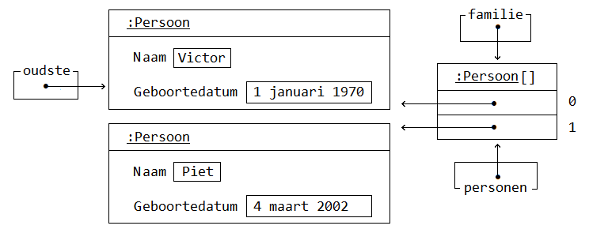
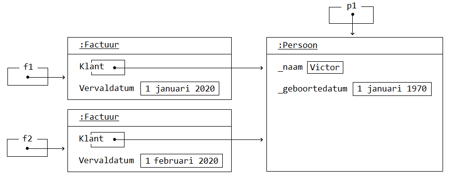

# Programmeren Basis - Deel 15
## 1. Constructoren
Om meteen bij het aanmaken van een object al wat informatie mee te geven, kan je gebruik maken van een **constructor**.

De constructor kan de datavelden initialiseren en zo het nieuwe object meteen in een zinvolle toestand brengen.

### De situatie tot dusver
Voorheen hebben we eerst een object aangemaakt (`new`), om daarna met de nodige *setters* (`Set` methods) informatie in het object te injecteren, bijvoorbeeld…​

```csharp
DateTime geboortedatum = new DateTime(2000, 1, 1);

Persoon p1 = new Persoon();           // (1)
p1.SetNaam("Jan");                    // (2)
p1.SetGeboortedatum(geboortedatum);   // (2)

Persoon p2 = new Persoon();
```

1.  Eerst maken we het object aan.

2.  Daarna stellen we informatie in.

Pas op het moment dat een object een betekenisvolle toestand heeft, kan het ook zinvol gedrag vertonen. Bijvoorbeeld antwoorden op vragen die we het stellen…​

```csharp
Console.WriteLine(p1.Leeftijd());  // (1)
Console.WriteLine(p2.Leeftijd());  // (2)
```

1.  Levert een zinvol antwoord, bijvoorbeeld *21* (in het jaar *2021*).

2.  Levert geen zinvol antwoord, bijvoorbeeld *2020* (in het jaar *2021*).

`p2.Leeftijd()` levert geen zinvol antwoord omdat `p2` object weliswaar is aangemaakt maar nog zinvolle data bevat.

Voor de volledigheid, nog eens de code van de `Persoon` klasse…​

Persoon.cs

```csharp
using System;

class Persoon {
    private string _naam;
    public string GetNaam() {
        return _naam;
    }
    public void SetNaam(string naam) {
        _naam = naam;
    }

    private DateTime _geboortedatum;
    public DateTime GetGeboortedatum() {
        return _geboortedatum;
    }
    public void SetGeboortedatum(DateTime geboortedatum) {
        _geboortedatum = geboortedatum;
    }

    public int Leeftijd() {
        int leeftijd = 0;
        DateTime dt = GetGeboortedatum().Date.AddYears(1);
        while (dt <= DateTime.Today) {
            leeftijd++;
            dt = dt.AddYears(1);
        }
        return leeftijd;
    }
}
```

### 1.1. Eenvoudiger objecten maken via constructoren
De typische opeenvolging van *'eerst een object aan te maken en meteen daarna informatie instellen'*, kan eenvoudiger.

Meestal wil je meteen bij het aanmaken van een object al direct de nodig informatie voorzien. Bijvoorbeeld…​

```csharp
DateTime geboortedatum = new DateTime(2000, 1, 1);  // (1)

Persoon p1 = new Persoon("Jan", geboortedatum);     // (2)
Console.WriteLine(p1.Leeftijd());
```

1.  Bij het aanmaken van een `DateTime`, geven we meteen mee dat het gaat om *jaar 2000*, *maand 1* en *dag 1*.

2.  Bij het aanmaken van een `Persoon`, geven we meteen de *naam* en *geboortedatum* mee.

Voor het `DateTime` datatype werd zoiets dus reeds mogelijk gemaakt door iemand bij Microsoft. Om hetzelfde te bereiken voor je eigen datatype, moet je een *constructor* toevoegen aan de klasse van je datatype.

### 1.2. Constructor definiëren
Een *constructor* is **een speciaal soort method om objecten bij constructie te initialiseren**.

Een constructor heeft **geen teruggeeftype (zelfs niet void!)**, en moet dezelfde naam hebben als de klasse. Bijvoorbeeld…​

Persoon.cs

```csharp
class Persoon {
    public Persoon(string naam, DateTime geboortedatum) {  // (1)
        _naam = naam;                                      // (2)
        _geboortedatum = geboortedatum;
    }

    private string _naam;
    public string GetNaam() {
        return _naam;
    }
    public void SetNaam(string naam) {
        _naam = naam;
    }

    private DateTime _geboortedatum;
    public DateTime GetGeboortedatum() {
        return _geboortedatum;
    }
    public void SetGeboortedatum(DateTime geboortedatum) {
        _geboortedatum = geboortedatum;
    }

    public int Leeftijd() {
        int leeftijd = 0;
        DateTime dt = GetGeboortedatum().Date.AddYears(1);
        while (dt <= DateTime.Today) {
            leeftijd++;
            dt = dt.AddYears(1);
        }
        return leeftijd;
    }
}
```

1.  De constructor verwacht een `string naam` en een `DateTime geboortedatum`.

2.  De ontvangen waardes worden aan de gepaste datavelden toegekend.

Het is deze constructor die **automatisch wordt aangeroepen bij het aanmaken van een object**, bijvoorbeeld bij `new Persoon("Jan", geboortedatum)`

Merk op dat de constructor **datavelden initialiseert**. Doorgaans doet de constructor niet veel meer dan de parameters kopiëren naar de datavelden.

> **Opmerking: Constructor bovenaan in een klasse definiëren**
>
> Het is zeker geen technische vereiste, maar typisch zijn de constructoren de eerste methods die je in een klasse ziet staan.

> **Opmerking: Wanneer gebruiken we een Get of Set prefix?**
>
> De *Get* en *Set* prefixen worden gebruikt om te benadrukken dat het gaat om het opvragen (*getten*) of instellen (*setten*) van een bepaalde *eigenschap*. De *naam* en de *geboortedatum* kan je als een *'eigenschap'* van een *persoon* bekijken.
>
> Vooral indien je zowel voorziet in de mogelijkheid eigenschappen *op te vragen* als *in te stellen*, zijn deze prefixen zinvol. Ze benadrukken extra dat het gaat om het *getten* of *setten* van een waarde.
>
> Straks werken we voor elke eigenschap met één *property*. Die de mogelijkheid kan bieden de eigenschap zowel *in te stellen* als *op te vragen*. Vanaf dan laten we de *Get* of *Set* prefixen vallen. Momenteel maken we er nog even gebruik van.

### 1.3. Default constructor
Een parameterloze constructor wordt wel eens de ***default constructor*** genoemd.

Deze default constructor zou er in een klasse als `Factuur` als volgt kunnen uitzien…​

Factuur.cs

```csharp
class Factuur {
    public Factuur() {  // (1)
        _vervaldatum = DateTime.Today.AddMonth(3);
    }
    ...
    private DateTime _vervaldatum;
    public DateTime GetVervaldatum() {
        return _vervaldatum;
    }
}
```

1.  De default constructor.

In dit geval gaat deze constructor louter het veld `_vervaldatum` initialiseren.

De **default constructor is `public` en parameterloos** en laat toe om een object te creëren zonder bijkomende informatie mee te (moeten) geven. De code van deze *default constructor* zal het object in een zinvolle *default toestand* brengen na constructie.

`new` laten we volgen door de naam van het datatype en ronde haakjes, zonder dat waardes tussen de haakjes worden opgegeven. Bijvoorbeeld…​

```csharp
Factuur f1 = new Factuur();  // (1)
```

1.  We hoeven geen initiële waardes te voorzien bij het creëren van een `Factuur`.

> **Opmerking**
>
> Indien je zelf geen enkele constructor in je klasse definieert, dan zal de compiler automatisch een default constructor toevoegen. Dit gebeurt achter de schermen, we zien dit niet expliciet in de code opduiken.
>
> Deze 'impliciete' default constructor is dus `public` en parameterloos en bevat ook geen specifieke implementatie (*het doet niets*).
>
> De aanwezigheid van een default constructor is best handig in quasi elke klasse die we maken. Zodra je een klasse gaat definiëren, bijvoorbeeld `class Gebouw { …​ }`, kan je die bijgevolg meteen ook (zonder parameterwaardes) instantiëren, bijvoorbeeld: `new Gebouw()`.
>
> **Belangrijk** : indien je zelf een constructor in een klasse definieert (met of zonder parameters), wordt er op de achtergrond geen constructor meer toegevoegd.

### 1.4. Verplichte initialisatie
Persoon.cs

```csharp
class Persoon {
    public Persoon(string naam, DateTime geboortedatum) {
        _naam = naam;
        _geboortedatum = geboortedatum;
    }

    private string _naam;
    private DateTime _geboortedatum;
    ...
}
```

Let op : indien er in een klasse slechts één constructor aanwezig is én die heeft geen parameters, dan kan je geen objecten aanmaken zonder waardes te voorzien. Er is immers geen parameterloze constructor (*default constructor*) aanwezig, zelfs niet impliciet.

Bijvoorbeeld, in klasse `Persoon` hierboven hebben we slechts 1 constructor, nl. `public Persoon(string naam, DateTime geboortedatum)`. Je kan dus geen parameterloze constructor gebruiken bij het aanmaken van `Persoon` objecten.

Probeer je toch nog een object aan te maken van het type `Persoon` zonder dat je initiële waardes gaat voorzien, dan treedt een compilefout op…​

Program.cs

```csharp
class Program {
    static void Main() {
        Persoon p2 = new Persoon();  // (1)
    }
}
```

1.  Compilefout: *"There is no argument given that corresponds to the required formal parameter 'naam' of 'Persoon.Persoon(string, DateTime)'"*

### 1.5. Meerdere constructoren
Indien je dat voorgaande toch wenst, dan kan je eenvoudigweg een parameterloze constructor aan de klasse `Persoon` toevoegen…​

Persoon.cs

```csharp
class Persoon {
    public Persoon() {  // (1)
        ....
    }
    public Persoon(string naam, DateTime geboortedatum) {  // (2)
        ...
    }
    ...
}
```

1.  Een parameterloze, …​

2.  …​ en niet parameterloze constructor zijn deze keer in de klasse `Persoon` voorzien.

Hierdoor kan de *client* (deze die gebruik maakt van `Persoon`) op twee manieren objecten van dat type creëren…​

```csharp
class Program {
    static void Main() {
        Persoon p1 = new Persoon("Jan", geboortedatum);  // (1)
        Persoon p2 = new Persoon();                      // (2)
        ...
    }
}
```

1.  Handig om meteen *naam* en *geboortedatum* te kunnen instellen.

2.  Soms heb je pas later de nodig info (*naam* en *geboortedatum*), maar wil je wel reeds het object aanmaken.

In dit geval zijn er twee constructoren, maar dat aantal is vrij uit te kiezen.

> **Opmerking**
>
> Als een klasse meerdere constructoren bevat, moeten deze verschillen in de volgorde, het aantal, of de datatypes van de parameters.
>
> Indien dat niet het geval zou zijn, wordt het voor de compiler onmogelijk te bepalen welke constructor er precies moet worden gebruikt (omdat er meerdere keuzes mogelijk zijn).

### 1.6. Constructoren die elkaar oproepen
Als je meerdere constructor wil voorzien, zul je merken dat ze veel gelijklopende code bevatten.

Je kunt deze code duplicatie vermijden (denk aan het *DRY*-principe) door een bepaalde constructor een andere constructor te laten oproepen. Deze oproep zorgt er dan voor dat die andere constructor alvast een deel van het initialisatie werk doet voor het nieuwe object. Er zullen in dit geval dus 2 constructoren uitgevoerd worden, die elk een stuk van het werk doen.

De manier waarop je dit doet is wel een beetje ongewoon, je moet een `: this(…​)` oproep toevoegen **in de hoofding** van de constructor.

Bijvoorbeeld, neem een klasse `Interval` die een interval met een instelbare onder- en een bovengrens voorstelt, bv. een interval van 5 tot 10. Stel dat we meestal beide grenzen willen opgeven maar vaak intervallen gebruiken die beginnen bij `0`, bv. een interval van 0 tot 20. We zouden dan 2 constructoren kunnen voorzien : eentje met parameters voor beide grenzen en eentje met enkel een parameter voor de bovengrens. Dat zou er dan zo kunnen uitzien :

```csharp
class Interval {
    public Interval(int min, int max) {       // (1)
        _min = min;
        _max = max;
        ...
    }

    public Interval(int max) : this(0, max) { // (2)
        ...
    }

    ...
}
```

1.  dit is een constructor die twee datavelden invult.

2.  deze constructor krijgt geen `min` informatie en roept de andere constructor op met een `min` waarde van `0`.

Let goed op de ongewone plaats waar die `this(0, max)` oproep moet terechtkomen!

Hieronder volgt nu een wat realistischer voorbeeld :

Voorbeeld met meerdere constructoren die elkaar oproepen

Objecten van een `Counter` klasse moeten bijvoorbeeld als *teller* kunnen dienen.

Met hoeveel een *teller* in één *stap* vooruit gaat (`Advance()`) kan worden afgetoetst met `Step()`. Dit zou om te beginnen *1* moeten zijn.

Op hoeveel een *teller* staat kan je opvragen met de `Value()` query. By default start een *teller* van *0*. Dat is bijvoorbeeld het geval als je een object aanmaakt als volgt…​

```csharp
Counter c1 = new Counter();     // (1)
Console.WriteLine(c1.Value());  // 0
Console.WriteLine(c1.Step());   // 1

c1.Advance();
c1.Advance();
Console.WriteLine(c1.Value());  // 2
```

1.  Een *teller* die als `new Counter()` wordt gemaakt vertrekt van *waarde 0* en met *stapwaarde 1*.

We zouden hier alvast één constructor kunnen gebruiken om een dataveld als `_stepValue` op *1* te zetten.

Counter.cs

```csharp
class Counter {
    public Counter() {
        _value = 0;          // (1)
        _stepValue = 1;      // (2)
    }

    private int _value;
    public int Value() {
        return _value;
    }

    private int _stepValue;
    public int Step() {
        return _stepValue;
    }

    public void Advance() {
        _value += Step();
    }
}
```

1.  Hoeft eigenlijk niet, *0* is immers de defaultwaarde van een `int`.

2.  Het dataveld `_stepValue` wordt hier in de constructor op *1* gezet.

Dit kon eigenlijk zonder constructor, ook op de declaratieregel van een dataveld kan je immers een waarde aan deze variabele toekennen (`private int _stepValue = 1;`).

We wensen echter ook meteen bij creatie van een `Counter` een initiële *waarde* te kunnen opgeven, en zelf in een mogelijkheid te voorzien een initiële *waarde* en *stapwaarde* te kunnen bepalen…​

```csharp
Counter c1 = new Counter();  // (1)
c1.Advance();
Console.WriteLine(c1.Value());  // 1

Counter c2 = new Counter(100);  // (2)
c2.Advance();
Console.WriteLine(c2.Value());  // 101

Counter c3 = new Counter(200, 2);  // (3)
c3.Advance();
Console.WriteLine(c3.Value());  // 202
```

1.  `c1` vertrekt met de *default waarde 0*, en *default stapwaarde 1*

2.  `c2` vertrekt met de *opgegeven waarde 100* , en *default stapwaarde 1*

3.  `c3` vertrekt met de *opgegeven waarde 200* , en *opgegeven stapwaarde 2*

Extra constructoren zijn hier vereist.

Om onszelf niet te herhalen (*DRY*) laten we de ene constructor van de andere herbruik maken. Dit kan met een `this()` call.

Vaak is er één constructor met *alle parameters* die door de andere constructoren kunnen worden *herbruikt*.

```csharp
class Counter {
    public Counter(int initialValue, int stepValue) {  // (1)
        _value = initialValue;
        _stepValue = stepValue;
    }

    public Counter(int initialValue) : this(initialValue, 1) {}  // (2)

    public Counter() : this(0, 1) {}  // (3)

    ...
}
```

1.  De eerste constructor heeft alle parameters, voor de initiële *waarde* en *stapwaarde*.

2.  De tweede constructor herbruikt de eerste door de `this(initialValue, 1)` call op de signatuurregel.

3.  Deze derde constructor kan onze oorspronkelijke vervangen, want ook hier kunnen we eigenlijk de eerste hergebruiken, met de call `this(0, 1)`.

> **Opmerking: this() call op de hoofding van de method**
>
> Om een constructor een andere constructor van dezelfde klasse te laten aanroepen is een `this()` call vereist. Je roept de constructor aan na een `:` die volgt op de parameterlijst. Merk op dat dit een ietswat vreemde plaats is, een plaats waar anders nooit code zou staan.
>
> Verwar de `this()` call hier niet met de *object expressie* `this` die we voorheen hadden gebruikt *voor een dot* (`this.member`) om te benadrukken dat we een member van de klasse benaderden.

Een alternatief is natuurlijk…​

```csharp
class Counter {
    public Counter(int initialValue) {
        _initialValue = initialValue;
    }
    public Counter(int initialValue, int stepValue) : this(initialValue) {  // (1)
        _stepValue = stepValue;
    }
    public Counter() : this(0, 1) {}
    ...
}
```

1.  Deze keer gaat de constructor met twee parameters deze met één parameter oproepen.

De eerste constructor, met de ene `initialValue` parameter, gaat louter de *waarde* van de *teller* instellen. De constructor met twee parameters, herbruikt deze voorgaande om de *waarde* in te stellen, maar gaat zelf nog de *stapwaarde* instellen.

Ook een elegante oplossing.

In de klasse `Counter` is enkel de mogelijkheid voorzien bij het aanmaken van een object de *waarde* en *stapwaarde* in te stellen.

Na creatie van het object kan de *waarde* enkel nog veranderen door de *teller* te laten vooruitgaan: `Advance()`. Er is verder geen sprake van één of ander *SetValue* method om de *waarde* rechtstreeks in te stellen.

> **Opmerking: Ontwerp**
>
> De keuze bepaalde mogelijkheden wel of niet te voorzien is een *ontwerpbeslissing*. *Wat je wil gaan doen* met objecten van een bepaald datatype is sturend voor de keuze die je maakt.
>
> Je vertrekt met andere woorden bij het ontwerp van datatypes altijd vanuit de vraagstelling *welke* ***interactie*** je wenst te hebben *met objecten van dit type*.

### 1.7. Immutable objecten
Indien de *toestand* van een object (de waardes waarover het beschikt) *niet aanpasbaar* is, noemen we dit object ***immutable***.

In een *immutable datatype* is een constructor beschikbaar die ons toestaat bij creatie van objecten de nodige initiële waardes te voorzien. Indien geen *setters* (`Set` methods bijvoorbeeld) of overige commando’s beschikbaar zijn om die ingestelde waardes nog verder te manipuleren, is de toestand van deze objecten als het ware *bevroren*.

> **Opmerking: Immutable string en DateTime**
>
> Datatypes als `string` en `DateTime` waar we voorheen reeds aan de slag zijn gegaan, zijn immutable. Zo kan je bijvoorbeeld op geen enkele wijze iets aan de toestand van een `string` object veranderen. Het zelfde is van toepassing voor waardes van type `DateTime`.

Indien je zelf datatype gedeeltelijk of geheel *immutable* wil maken, ga je typisch:

-   één of meerdere constructoren voorzien om initiële waardes bij creatie van het object te kunnen opgeven

-   allicht alsnog *getters* (bijvoorbeeld *query methods*) voorzien om de nodige informatie bevraagbaar te maken

-   datavelden die deel uitmaken van de *te bevriezen toestand* als `readonly` markeren

#### 1.7.1. Readonly datavelden
Aan `readonly` datavelden, bijvoorbeeld `private readonly string _afkorting`, kan je enkel op de declaratieregel of in de constructor een waarde toekennen.

`readonly` biedt je dus een soort extra beschermingslaag. Ga je toch, per ongeluk, elders een waarde aan zo’n dataveld toekennen dan bekomen we de compilefout *"A readonly field cannot be assigned to (except in a constructor of the class in which the field is defined or a variable initializer)"*.

Voorbeeld van een immutable datatype

In het geval van *EU valuta* bijvoorbeeld, ligt de *afkorting* en *Euro conversie factor* voor elke *valuta* vast. Er is geen nood aan mogelijkheid deze nog achteraf te kunnen wijzigen.

EuValuta.cs

```csharp
class EuValuta {
    public EuValuta(string afkorting, decimal euroConversieFactor) {  // (2)
        _afkorting = afkorting;
        _euroConversieFactor = euroConversieFactor;
    }

    private readonly string _afkorting;  // (1)
    public string Afkorting() {
        return _afkorting;
    }

    private readonly decimal _euroConversieFactor;  // (1)
    public decimal ToEuroConversieFactor() {
        return _euroConversieFactor;
    }

    public decimal ToEuro(decimal waarde) {
        return waarde * EuroConversieFactor();
    }
}
```

1.  Merk op dat de datavelden extra bescherming genieten dankzij het `readonly` sleutelwoord.

2.  Enkel in de constructor (of op de declaratieregels) zouden we er een waarde aan kunnen toekennen.

Naast de constructor zijn er geen andere mogelijkheden om van een `EuValuta` object de *afkorting* of *Euro conversie factor* in te stellen.

Program.cs

```csharp
class Program {
    static void Main() {
        EuValuta nederlandseGulden = new EuValuta("NLG", 2.20371m);
        Console.WriteLine(nederlandseGulden.ToEuro(100));  // 220.371

        EuValuta duitseMark = new EuValuta("DEM", 1.95583m);
        Console.WriteLine(duitseMark.ToEuro(200));         // 391.166
    }
}
```

Het gebruik van `readonly` datavelden is geen verplichting. Maar kan helpen fouten te vermijden.

## 2. Visibility
Elke member die we tot dusver hebben gedefinieerd is ofwel `public`, ofwel `private`. Deze sleutelwoorden wijzen op de *zichtbaarheid* (Engels: *visibility*) van dit onderdeel van de klasse, ter herhaling:

-   `public` members zijn **overal benaderbaar** waar men met deze klasse (of objecten van deze klasse) kan werken

-   `private` members zijn enkel **binnen de klasse benaderbaar**

Datavelden hebben we steeds `private` gemarkeerd, methods doorgaans `public`. Niet toevallig zijn dat ook de *defaults* voor deze members.

> **Opmerking: Default visibility**
>
> Indien je vergeet bij een dataveld de visibility te melden, zal dit veld `private` zijn.
>
> Zou je bij een method vergeten de visibility te bepalen, dan is deze `public`.
>
> Voor de leesbaarheid van je code is natuurlijk aan te raden steeds expliciet de visibility te vermelden. Ook *underscores* (die we gebruiken om de namen van datavelden mee te starten) helpen natuurlijk in de code duidelijk te maken dat het gaat om *beperkt zichtbare* (`private`) members.

### Keuze vanuit de interactie
De keuze voor `public` of `private` is een *ontwerpbeslissing*, en is helemaal niet moeilijk te maken!

**Denk eenvoudigweg steeds vanuit de interactie die je wenst te hebben met objecten van je te ontwerpen datatype.**

Denk met andere woorden na over welke `public` members dat datatype moet beschikken. De verzameling van deze publieke members noemt men ook wel eens de *interface van dat datatype*.

Per member uit die *interface* reflecteer je over de verantwoordelijkheid die ze vervult, en denk je alvast na over de naam, parameters en eventueel het return type (in het geval van een query).

Voorbeeld

Misschien wil je een programma bouwen voor een bedrijf dat cilindervormige regenwaterputten verkoopt.

Bij het opstellen van hun catalogus kent de verkoper op zijn minst voor elke waterput de diameter en hoogte. Die informatie, bijvoorbeeld *2* en *1,35 meter* voert hij in bij het toevoegen van waterputten.

Als het programma de details van een waterput wil tonen, wenst het echter verder te gaan. Ook de oppervlakte en inhoud van deze waterputten worden hier weergeven.

```csharp
DETAILS WATERPUT:
  Diameter: 1,35
  Hoogte: 2
  Oppervlakte: 1,4313881527918497
  Inhoud: 2,8627763055836994
```

Indien we in ons programma zouden beschikken over objecten die een *regenwaterput* voorstellen, kunnen we aan zo’n object misschien wel makkelijk dergelijke informatie kunnen opvragen…​

```csharp
Console.WriteLine($"  Diameter: {waterput.GetDiameter()}");
Console.WriteLine($"  Hoogte: {waterput.GetHoogte()}");
Console.WriteLine($"  Oppervlakte: {waterput.Oppervlakte()}");
Console.WriteLine($"  Inhoud: {waterput.Inhoud()}");
```

Dit dus in de veronderstelling dat `waterput` een object is van het type `Regenwaterput`.

En in de veronderstelling dat een `Regenwaterput` object voldoende weet om op al die vragen (*queries*) te kunnen antwoorden. Indien het zijn *diameter* en *hoogte* kent, zou dat moeten lukken.

Het stukje programma dat verantwoordelijk is voor het opvullen van de catalogus, of dus registreren van de waterputten, zou dan objecten kunnen aanmaken van het type `Regenwaterput`.

De gebruiker van het programma voert de *diameter* en *hoogte* in.

```csharp
NIEUWE WATERPUT:
  Diameter?: 2
  Hoogte?: 1,35
```

Op basis van die informatie kan het programma een object construeren…​

```csharp
Console.Write("  Diameter?: ");
double diameter = double.Parse(Console.ReadLine());

Console.Write("  Hoogte?: ");
double hoogte = double.Parse(Console.ReadLine());

Regenwaterput waterput = new Regenwaterput(diameter, hoogte);
```

Heel wat is alvast duidelijk. In de interface (verzameling van publieke members) van `Regenwaterput` zit op zijn minst:

-   een constructor die *diameter* en *hoogte* aanneemt: `Regenwaterput(double hoogte, double diameter)`

-   een query als: `double GetHoogte()`

-   een query als: `double GetDiameter()`

-   een query als: `double Oppervlakte()`

-   een query als: `double Inhoud()`

Al deze members zijn `public`, want hierin is de programmacode geïntereseerd! Aan de hand van deze members wenst de programmacode te communiceren met zijn *waterputten*.

Alle overige members, denk aan datavelden als `_diameter` of `_hoogte` maak je `private`. Implementatiedetails, als de manier waarop een `Regenwaterput` object zijn informatie intern bijhoudt (bijvoorbeeld of hij dat doet met *twee*, *drie*, *vier*, …​ velden), interesseert de programmacode helemaal niet. Om die reden worden ze ook verborgen.

Op basis van overige gewenste interactie kan je nog overwegen de interface aan te vullen met:

-   een commando als: `void SetDiameter(double diameter)`

-   een commando als: `void SetHoogte(double hoogte)`

Voor de *oppervlakte* en *inhoud* ga je allicht geen `Set` methods voorzien, die informatie is immers afgeleid van de *diameter* en *hoogte*.

### Information hiding of encapsulation
We spraken hier vooral over `private` en `public` als uit te kiezen ***visibility*** (Nederlands: *zichtbaarheid*) voor een bepaalde member.

Het *onzichtbaar*, of dus `private` maken van members wordt ook wel eens ***information hiding*** genoemd. Of zelfs een vorm van ***encapsulation*** (Nederlands: *inkapseling*).

> **Opmerking**
>
> Encapsulation is een basispijler van *object orientatie*, en is trouwens breder dan *information hiding*. Men bedoelt ermee ook het concept van bundeling van data (*toestand*) en methods (*gedrag*).

## 3. Properties
Om **op *eenvoudige wijze eigenschappen*** van objecten te laten **instellen of opvragen**, maken we gebruik van *properties*.

Zaken als de *naam* of de *geboortedatum* van een *persoon* kan je als een *eigenschap* (noem het *kenmerk* of *attribuut*) van deze *persoon* beschouwen.

Je geeft met een `get` en/of `set` gedeelte aan of de *eigenschap* zowel *opvraagbaar* (*gettable*) en/of *instelbaar* (*settable*) is. Bijvoorbeeld…​

Persoon.cs

```csharp
class Persoon {
    public string Naam { get; set; }
}
```

> **Opmerking**
>
> Net als methods starten de namen van properties met een hoofdletter.

Om de *naam* van een *persoon* in te stellen, zou je de `Naam` property kunnen gelijkstellen aan de *nieuwe naam*.

```csharp
Persoon persoon = new Persoon();
persoon.Naam = "Jan";  // (1)

string winnaar = persoon.Naam;  // (2)
Console.Write(winnaar);  // Jan
```

1.  Met een *klassieke toekenningsregel* kunnen we een waarde toekennen aan de `Naam` eigenschap.

2.  Merk op hoe we aan de hand van dezelfde `Naam` member deze eigenschap ook kunnen uitlezen.

> **Opmerking: Ronde haakjes enkel voor methods**
>
> Merk op hoe bij het gebruik van properties nooit ronde haakjes volgen op de property-naam.
>
> Bij het aanroepen van een method is er wel steeds sprake van ronde haakjes, zelfs indien er geen parameterwaardes zijn.

### 3.1. Properties instellen in de object initializer
Tijdens het aanmaken van objecten (aan de hand van een *object initializer*) kan je meteen ook *initiële waardes* toekennen aan de (instelbare) eigenschappen van dergelijk object.

Je doet dit door in de object initializer (bijvoorbeeld `New Persoon`) na de naam van het datatype tussen accolades, na een `.` de naam van de property te vermelden waaraan je waarde wenst toe te kennen, bijvoorbeeld…​

```csharp
Persoon persoon1;

persoon1 = new Persoon();    // (1)
persoon.Naam = "Jan";        // (2)
persoon.Postcode = "9000";   // (2)

Persoon persoon2;

persoon2 = new Persoon() { Naam = "Piet", Postcode = "8000" };   // (3)

Persoon persoon3;

persoon3 = new Persoon { Naam = "Joris", Postcode = "2000" };    // (4)
```

1.  In plaats van na het aanmaken van een object van type `Persoon`…​

2.  …​elke in-te-stellen eigenschap op een aparte instructieregel zijn waarde toe te kennen…​

3.  …​kan je met dergelijke *uitgebreide object initializer* deze verschillende stappen samen ondernemen, of dus in één regel coderen.

4.  De ronde haakjes na de naam van het type mogen bij een *uitgebreide object initializer* worden weggelaten. Dus bijvoorbeeld iets als `new Persoon { …​ }` in plaats van `new Persoon(…​) { …​ }`, indien de constructor geen parameterwaardes verwacht.

Hier natuurlijk in de veronderstelling dat we in klasse `Persoon` naast de instelbare (*settable*) property `Naam`, ook beschikken over een instelbare property `Postcode`…​

```csharp
class Persoon {
    public string Naam { get; set; }
    public string Postcode { get; set; }
}
```

### 3.2. Vereenvoudiging ten opzichte van methods
Vereenvoudiging voor de klasse

De hiervoor gedefinieerde property `public string Naam { get; set; }` correspondeert met een combinatie van:

-   een `Get` method voor het opvraagbaar maken van de *naam eigenschap*

-   een `Set` method voor het instelbaar maken van de *naam eigenschap*

-   een *achterliggend dataveld* voor het bewaren van de eigenschapswaarde

Het gebruik van een property maakt de code dus een stuk compacter, **één member per *eigenschap* volstaat**.

Het maakt de code ook *declaratiever*. In *declaratieve code* ligt je **focus op het *wat***, en niet op het *hoe*.


Met methods:
Met properties:


`class Persoon {
    private string _naam;
    public string GetNaam() {
    return _naam;
    }
    public void SetNaam(string naam) {
        _naam = naam
    }
}`


`class Persoon {
    public string Naam { get; set; }
&#10;
&#10;
&#10;
}`


De combinatie van de methods en het dataveld vertelt *hoe* de eigenschap functioneert. Het dataveld verduidelijkt *hoe* de waarde wordt onthouden. De `Get` en `Set` methods *hoe* het *opvragen* of *instellen* dan onderliggend verloopt.
De property maakt met één eenvoudige regel code duidelijk welke eigenschap wordt voorzien. Ook de `get` en `set` sleutelwoorden verduidelijken *wat* met die eigenschap kan gebeuren (*opvragen* en *instellen*).


Vereenvoudiging voor de client

Zeker het *instellen* van de *eigenschap* gebeurt op een heel andere wijze bij het gebruik van properties. Je kan een **eenvoudige toekenningsregel** opstellen: `eenObject.Eigenschap = eenWaarde`, geen gedoe meer met parameters: `eenObject.SetEigenschap(eenWaarde)`.

Het *opvragen* van de *eigenschap* gebeurt min of meer identiek, al hoef je hier bij het gebruik van properties **geen aparte member** voor in te zetten.


Met methods:
Met properties:


`Persoon persoon = new Persoon();
persoon.SetNaam(&quot;Jan&quot;);  // (1)
&#10;string winnaar = persoon.GetNaam();  // (2)
Console.Write(winnaar);  // Jan`


- `"Jan"` moest als parameterwaarde worden meegegeven aan de `SetNaam` method
- Het aparte method, specifiek voor het *getten* van de eigenschap, hier `GetNaam()`, wordt gebruikt voor het uitlezen van de eigenschap.


`Persoon persoon = new Persoon();
persoon.Naam = &quot;Jan&quot;;  // (1)
&#10;string winnaar = persoon.Naam;  // (2)
Console.Write(winnaar);  // Jan`


- Met een *klassieke toekenningsregel* kunnen we een waarde toekennen aan de `Naam` eigenschap.
- Merk op hoe we aan de hand van dezelfde `Naam` member deze eigenschap ook kunnen uitlezen.


### 3.3. Waarvoor kiezen we nu (methods of properties)?
We gieten het nog eens in een schematisch overzicht…​


Properties dienen net als methods voor het implementeren van gedrag. Het `set` gedeelte van een property correspondeert met het *commando aspect* van de eigenschap, het `get` gedeelte met het *query aspect*.

Er zijn een aantal voordelen aan het werken met properties:

-   de klasse hoeft maar één member per eigenschap te definiëren, die ene member zorgt zowel voor de opslag, het *getten* als het *setten*

-   de client kan met een eenvoudige toekenning een eigenschap instellen

We maken daarom **gebruik van properties daar waar mogelijk**.

De manier waarop we hier properties uitgeschreven staat niet toe dat we **code laten uitvoeren bij het *opvragen* of *instellen* van een *eigenschap***. Indien je **met methods** aan de slag gaat, is dat uiteraard wel het geval. Indien de *leeftijd* van een *persoon* wordt *afgeleid van* (lees: *berekend op basis van*) zijn *geboortedatum*, moet er dus code worden uitgevoerd. Aan de hand van een method `Leeftijd()` kunnen we de *eigenschap leeftijd* opvraagbaar maken.

```csharp
class Persoon {
    ...

    public DateTime Geboortedatum { get; set; }

    public int Leeftijd() {
        int leeftijd = 0;
        DateTime dt = Geboortedatum.Date.AddYears(1);
        while (dt <= DateTime.Today) {
            leeftijd++;
            dt = dt.AddYears(1);
        }
        return leeftijd;
    }
}
```

Technisch gezien zijn er nog wel een aantal verschillen tussen properties en methods. Denk bijvoorbeeld aan het gebruik van parameters, dit kan enkel indien je werkt met methods. Geen probleem echter, bij het benaderen van *eigenschappen* heb je zelden nood aan parameters.

### 3.4. Properties in voorgedefinieerde datatypes
Het gebruik van *properties* is helemaal niet nieuw voor ons.

Zo zijn `Length`, `ForegroundColor`, `Now` of `Year` in volgende code uiteraard ook properties…​

```csharp
Console.ForegroundColor = ConsoleColor.Green;

DateTime vandaag = DateTime.Today;
Console.WriteLine(vandaag.Year);

string vandaagAlsTekst = vandaag.ToString();
Console.WriteLine(vandaagAlsTekst.Length);
```

Je herkent dat het om een property gaat, door het gebrek aan ronde haakjes.

> **Opmerking: Instance vs static properties**
>
> `Year` en `Length` worden aangeroepen op een object, en zijn bijgevolg (*object gerelateerde*) *instance* properties.
>
> `ForegroundColor` en `Today` worden aangeroepen op een klasse-naam, deze zijn (*klasse gerelateerde*) `static` properties.

### 3.5. Enkel uitleesbare properties
De *visibility* van een property is zowel van toepassing op het `get` als `set` gedeelte. Een property als…​

```csharp
public string Naam { get; set; }
```

Is zowel publiek opvraagbaar (`public get`), als publiek instelbaar (`public set`).

Indien een **eigenschap enkel uitleesbaar** moet zijn, heb je een aantal mogelijkheden:

-   Je overschrijft de `public` visibility van de property, specifiek voor het `set` gedeelte met `private` visibility, bijvoorbeeld…​

    ```csharp
    public string Naam { get; private set; }
    ```

    Hierdoor kan je enkel nog binnen de klasse zelf een waarde toekennen aan deze property. Dit kan in de constructor zijn, of in de implementatie van een andere member.

-   Je laat het `set` gedeelte vallen, bijvoorbeeld…​

    ```csharp
    public string Naam { get; }
    ```

    Enkel in de constructor kan je nog een waarde toekennen aan deze property.

-   Je werkt met een `init` in plaats van `set`, bijvoorbeeld…​

    ```csharp
    public string Naam { get; init; }
    ```

    Hierdoor is de property instelbaar in de implemenatie van de constructor, en publiek settable op het moment dat je het object aanmaakt, bijvoorbeeld…​

```csharp
Persoon persoon1 = new Persoon { Naam = "Jan" };  // (1)

persoon1.Naam = "Piet";                            // kan niet meer => compilefout
```

1.  Aan de hand van *uitgebreide object initializer* kan je de `Naam` property een (initiële) waarde geven.

2.  Naderhand is het niet meer mogelijk de `Naam` nog te veranderen. Er is immers geen *publieke setter* (`public set`) aanwezig.

Het laten instellen van initiële waardes voor properties had niet mogelijk geweest bij wijze van properties zonder `set` of properties met een `private set`.

Voorbeeld van enkel uitleesbare eigenschappen

**`Value` property met `private set`:**

In onze klasse `Counter` hadden we voorheen de *waarde* van de *teller* enkel opvraagbaar gemaakt door enkel een `Value()` query te voorzien. Deze method ging de *waarde* uit het dataveld `_value` ophalen.

In de constructor en in de `Advance()` method wordt dat veld aangepast. Dat is beide binnen de klasse zelf. Ter vervanging van beide (`Value()` en `_value`) zetten we deze keer een `Value` property in met een `private set` gedeelte. De *private setter* stelt ons nog perfect in staat binnen de klasse zelf (bijvoorbeeld in de constructor en de `Advance()` method) een waarde aan deze property toe te kennen.

**`Step` property zonder `set`:**

Voorheen hadden we een `Step()` method en een `_stepValue` dataveld die enkel in de constructor werd ingesteld. Ter vervanging hiervan volstaat een `Step` property zonder `set` gedeelte.


Met methods:
Met properties:


`class Counter {
    public Counter() {
        _value = 0;
        _stepValue = 1;
    }
&#10;    private int _value;
    public int Value() {
        return _value;
    }
&#10;    private int _stepValue;
    public int Step() {
        return _stepValue;
    }
&#10;    public void Advance() {
        _value += Step();
    }
}`


`class Counter {
    public Counter() {
        Value = 0;
        Step = 1;
    }
&#10;
    public int Value { get; private set; }
&#10;
&#10;
    public int Step { get; }
&#10;
&#10;    public void Advance() {
        Value += Step;
    }
}`


Je merkt hoe je aan de hand van properties toch een stuk compacter kan coderen.

### 3.6. Werken we nog met Get en Set prefixen?
**Niet voor properties…​**

Merk op dat we natuurlijk voor de property `Naam` van onze `Persoon` klasse niet meer gaan werken met een *Get* of *Set* prefix, **dat zou verwarrend zijn**. De property wordt immers zowel gebruikt voor het *opvragen* (*getten*), als voor het *instellen* (*setten*) van de eigenschap.

**Voor methods…​**

Soms kies je voor het inzetten van een method, bijvoorbeeld omdat de *op te leveren waarde* wordt *berekend*, en niet zomaar wordt *opgehaald* uit een dataveld, bijvoorbeeld `Leeftijd()`. In dat geval **mag** je met een *Get* prefix benadrukken dat het om het *opvragen* van een waarde gaat, bijvoorbeeld `GetLeeftijd()`, maar dat **hoeft eigenlijk niet**. Dat de method in dat geval een return type heeft, maakt dat immers reeds duidelijk.

## 4. Verwijzingen en samengestelde objecten
### 4.1. Reference types
Om met objecten van een bepaald *klasse datatype* te werken, **verwijzen** we in een opslagplaats (variabele, slot van een array, …​) **naar deze instantie**. Deze verwijzing wordt ook wel een *referentie* genoemd.

Zoals we eerder reeds aangaven zijn datatypes gedefinieerd aan de hand van een `class` dan ook de zogenaamde *reference types*.

> **Opmerking: Waarom werken met verwijzingen?**
>
> De bestaansreden voor *reference types* is, dat we in grotere programma’s waarden willen doorspelen van het ene stuk van een programma naar een ander stuk.
>
> Stel bijvoorbeeld dat we een programma hebben met een grafische user interface, waarin de gebruiker persoonsgegevens kan intypen die na een druk op de *save knop* in een databank moeten bewaard worden.
>
> Dan zal het programmastuk dat uitgevoerd wordt na een druk op de knop, de data (alle persoonsgegevens) moeten doorspelen aan het programmastuk die met de databank communiceert.
>
> Om te vermijden dat we al de verschillende databrokjes (*naam*, *woonplaats*, *geboortedatum*, enzovoort) apart moet kopiëren, zullen we ze groeperen in een object, en gewoon de verwijzing naar dit object doorgeven van het ene programmastuk naar het andere.

Je kan tijdens uitvoer van het programma beschikken over meerdere verwijzing naar hetzelfde object. Elke verwijzing heeft zijn eigen *rol* voor het stukje code in kwestie.

Voorbeeld van meerdere verwijzingen naar hetzelfde object

Zo wordt zowel in het eerste slot van de array `familie`( of `personen`), als in de variabelen `oudste` naar *Victor* verwezen…​

Program.cs

```csharp
class Program {
    static void Main() {
        DateTime geboorteDatum1 = new DateTime(1970, 1, 1);
        DateTime geboorteDatum2 = new DateTime(2002, 3, 4);

        Persoon[] familie = new Persoon[2];
        familie[0] = new Persoon("Victor", geboorteDatum1);
        familie[1] = new Persoon("Piet", geboorteDatum2);

        Persoon oudste = Oudste(familie);
        Console.WriteLine($"De oudste persoon is: {oudste.Naam}");
    }
    static Persoon Oudste(Persoon[] personen) {
        Persoon oudste = personen[0];
        for (int i = 1; i < personen.Length; i++) {
            if (personen[i].Geboortedatum > oudste.Geboortedatum) {
                oudste = personen[i];
            }
        }
        return oudste;
    }
}
```



Bovenstaande objecten worden aangemaakt in de `Main()` method van onderstaande code.

De twee slots van een array `familie` wijzen beide naar een object van type `Persoon`. Method `Oudste()` zoek uit welk `Persoon` object daarvan als `oudste` kan bestempeld worden.

Persoon.cs

```csharp
class Persoon {
    public Persoon(string naam, DateTime geboortedatum) {
        this.Naam = naam;
        this.Geboortedatum = geboortedatum;
    }
    public string Naam { get; }
    public DateTime Geboortedatum { get; }
}
```

> **Opmerking: this**
>
> In de constructor van de klasse `Persoon` wordt hier trouwens met de object expressie `this` gewerkt.
>
> Strikt noodzakelijk was dat niet. Het verduidelijkt echter dat we aan de properties waardes toekennen. Iets als `this.Geboortedatum = geboortedatum` is immers op dat vlak explicieter dan `Geboortedatum = geboortedatum`.
>
> Zeker indien het verschil enkel zit in het hoofdlettergebruik (property start met een hoofdletter, parameter start met een kleine letter), helpt `this` duidelijkheid te scheppen.

### 4.2. Samengestelde objecten
**Meerdere objecten** van verschillende (of hetzelfde) datatype(s) kunnen ook **naar elkaar verwijzen**.

Ook hier kan je stellen dat het voordeel is dat er geen *overtollige data* wordt bijgehouden.

Voorbeeld van samengestelde objecten

*Victor* kan zo bijvoorbeeld zowel de klant zijn gekoppeld aan de eerste `Factuur f1`, als aan de tweede `Factuur f2`.

Program.cs

```csharp
class Program {
    static void Main() {
        Persoon p1 = new Persoon("Victor", new DateTime(1970, 1, 1));

        Factuur f1 = new Factuur(p1, new DateTime(2020, 1, 1));
        Factuur f2 = new Factuur(p1, new DateTime(2020, 2, 1));
    }
}
```

In plaats van de informatie voor *Victor* meermaals bij te houden, kan elke `Factuur` die aan hem gekoppeld is, naar hem verwijzen.



Elke object van het type `Factuur` kan hiervoor een verwijzing bijhouden naar een object van het type `Persoon`.

Factuur.cs

```csharp
class Factuur {
    public Factuur(Persoon klant, DateTime vervaldatum) {
        this.Klant = klant;
        this.Vervaldatum = vervaldatum;
    }

    public Persoon Klant { get; set; }  // (1)
    public DateTime Vervaldatum { get; set; }
}
```

1.  Merk op dat het datatype van de `Klant` property, `Persoon` is.

> **Opmerking: Program.cs**
>
> Een soort van *doorgedreven dot notatie* kan je inzetten om informatie uit dergelijk samengestelde objecten op te halen…​
>
> ```csharp
> Persoon p1 = new Persoon("Victor", new DateTime(1970, 1, 1));
> Factuur f1 = new Factuur(p1, new DateTime(2020, 1, 1));
>
> Console.Write($"De lengte van de naam van de klant van f1: {f1.Klant.Naam.Length}");  // 6 (1)
> ```
>
> 1.  De `Length` property van een `string` wordt uitgelezen. Deze `string` werd opgeleverd door de `Naam` property van een `Persoon` expressie (`f1.Klant`). De `Klant` property levert immers een `Persoon` waarde op.
>
> Het kan helpen iets als `f1.Klant.Naam.Length` van rechts naar links te lezen. De `Length` van de `Naam` van de `Klant` van `f1` is *Victor*.

## 5. Expressies en static typing
Stukken code gaan in hoofdzaak waardes manipuleren, en die waardes doorgeven aan ander stukken code. Hoe je (grammaticaal gezien) waardes kan manipuleren, is afhankelijk van het soort van waardes (*datatype*) waarmee je werkt.

Om correcte (voor de compiler begrijpbare) code op te stellen, is het van belang dat je de grammaticale opbouw van code kan ontleden. Meer specifiek moet je kunnen herkennen wat *expressies* zijn. Het datatype van deze expressies zal immers bepalen *wat* voor bewerkingen je kan gaan uitvoeren.

### 5.1. Statisch getypeerde programmeertaal
Voorbeeld

Kijk eens naar onderstaande code, en ga van de genummerde regels na of deze code zal compileren. Anders gezegd, zal de compiler de genummerde regels begrijpen?

```csharp
using System;

class Persoon
{
    public bool Vip { get; set; }
    public string Naam { get; set; }
    public Adres Adres { get; set; }
}
class Adres
{
    public string Straat { get; set; }
    public int Nummer { get; set; }
    public string Gemeente { get; set; }
}

class Program
{
    static void Main()
    {
        Persoon persoon = new Persoon();
        persoon.Straat = "Voskenslaan";             // (1)

        Adres adres = new Adres();
        adres.Nummer = "tien";                      // (2)

        Console.WriteLine("hello" - "world");       // (3)

        Console.WriteLine(Dubbele("hello world"));  // (4)

        while ("hello")                             // (5)
        {
            //...
        }
    }
    static int Dubbele(int value) { return value * 2; }
}
```

1.  Een *adres* heeft een *straat eigenschap*, een *persoon* heeft dat echter niet rechtstreeks.

2.  Het *huisnummer* van een *adres* is een *numeriek gegeven*, geen *tekst*.

3.  Wat zou een combinatie van *twee teksten* via de `-` operator moeten opleveren?

4.  Method `Dubbele` dient om het dubbele van een *getal*, en niet van een *tekst*, op te leveren.

5.  Bij een herhaling geef je aan wat de *voorwaarde* is waaraan voldaan moet zijn om te blijven herhalen of om te stoppen, je geeft geen *tekst* op.

De code op deze genummerde regels is niet bepaal *zinnig*, de compiler gaat ze dan ook niet accepteren!

Indien bovenstaande instructies niet zinvol zijn, wanneer zou je dan liefst een foutmelding hierover krijgen? Reeds bij het compileren (*at compile-time*) of pas bij het uitvoeren (*at run-time*)?

Uiteraard is het productiever om al bij het compileren zoveel mogelijk foutmeldingen te krijgen. Als je pas fouten bij de uitvoering krijgt, duurt het langer. Veel belangrijker echter is dat je foutdetectie dan afhankelijk is van de data die je bij die uitvoering gebruikt. Sommige fouten doen zich enkel voor bij bepaalde data combinaties en het is dan de vraag of je bij het testen/uitvoeren het geluk hebt een van die combinaties te gebruiken!

Gelukkig is dat hier ook het geval. **In een *statisch getypeerde taal*, zoals *C#*, beschouwt de compiler elke expressie van een welbepaald datatype.**

### 5.2. Expressies
**Een expressie is een stukje code dat een aangeeft met welke waarde je werkt.**

Enkele voorbeelden…​

Wens je bij het aanroepen van een method duidelijk te maken met welke *waarde* deze method gaat werken, dan formuleer je die *waarde* met een expressie:

```csharp
Console.Write(expressie1);
```

Wil je een *waarde* toekennen aan een bepaalde variabele, dan formuleer je die *waarde* met een expressie:

```csharp
int getal = expressie2;
```

Wens je twee *waardes* te combineren met een bepaalde operator, dan formuleer je die *waardes* met expressies:

```csharp
Console.WriteLine(expressie3 * expressie4);
```

Het geheel `expressie3 * expressie4` vormt natuurlijk zelf ook een expressie. Die in dit geval wordt gebruikt om duidelijk te maken aan de `WriteLine` method welke *waarde* wordt afgedrukt.

Wil je met een bepaalde object aan de slag, dan is dat *object* de *waarde* waarmee je werkt. Opnieuw formuleer maak je met een expressie duidelijk met welke *(object) waarde* je werkt:

```csharp
expressie5.Advance();
```

De expressie is hier vaak een variable, bijvoorbeeld van type `Counter`, zoals in…​

```csharp
Counter c1 = new Counter();
c1.Advance();  // (1)
```

1.  `c1` is een expressie van type `Counter`

> **Opmerking**
>
> Het is pas tijdens uitvoer dat bekeken wordt *naar wat de expressies evalueren*. Anders uitgedrukt: *welke waardes met deze expressie worden voorgesteld*:
>
> -   Bij `expressie1` om te weten welke waarde wordt afgedrukt.
>
> -   Bij `expressie2` om te weten welke waarde aan de variabele `getal` wordt toegekend.
>
> -   Bij `expressie3` en `expressie4` om te weten welke waardes worden vermenigvuldigd.
>
> -   Bij `expressie5` om te weten welke `Counter` object de oproep `Advance` moet ontvangen.
>
> *Naar wat de expressie evalueren* boeit ons hier echter minder, we focussen even op het *compile-time aspect*. We zijn hier vooral geïnteresseerd in welke code de compiler ons toestaat.

### 5.3. Type wordt door de compiler afgeleid
**Het datatype van een expressie kan de compiler ondermeer afleiden uit:**

-   **declaraties**: `c1` in `c1.Advance();` is een expressie van type `Counter`

    indien de compiler een declaratie als `Counter c1;` terugvindt

-   **definities**: `Dubbele(5)` is in `Console.Write(Dubbele(5));` een `int` expressie

    vanwege de method definitie met de hoofding `int Dubbele(int value)`

    net daarom wordt het return type op die hoofding vermeld

-   **literal notaties**: `"hello world"` is in `string x = "hello world".ToUpper()` een `string` expressie

    er is immers vastgelegd (in de compiler) dat tekst opgegeven tussen double quotes als `string` zal worden aanzien

-   overige grammaticale constructies…​

Meteen weet je ook waarom je het type moet vermelden in de declaraties van variabelen, of in de hoofding van methods en properties. Deze informatie heeft de compiler nodig om naderhand bij het uitlezen van die variabele, of aanroepen van die method of property, te weten om wat voor soort expressie het gaat.

Je begrijpt ook meteen waarom er voor `string` een andere literal formaat is (tekst tussen double quotes, bijvoorbeeld `"hello"`), dan voor het `char` datatype (karakter tussen singe quotes, bijvoorbeeld `'a'`). Het verschillend formaat is noodzakelijk om daaruit het type af te leiden.

### 5.4. Type bepaalt de mogelijkheden
**Het (data)type van een expressie bepaalt wat je kan doen met deze expressie, of met andere woorden: *hoe je deze grammaticaal kunt inzetten*.** Bijvoorbeeld:

-   waar je deze expressie kan gebruiken, naast welke keyword, als operand voor welke operator, in de toekenningsclausule voor welk type variabele, als parameterwaarde voor welk type parameter, …​ .

-   welke methods je hierop kan aanroepen (met de dot notatie)

In ons voorgaand voorbeeld…​

```csharp
Persoon persoon = new Persoon();
persoon.Straat = "Voskenslaan";             // (1)

Adres adres = new Adres();
adres.Nummer = "tien";                      // (2)

Console.WriteLine("hello" - "world");       // (3)

Console.WriteLine(Dubbele("hello world"));  // (4)

while ("hello")                             // (5)
{
    //...
}
```

…​leveren regels &lt;1&gt; tot en met &lt;5&gt; een compilefout op:

1.  `persoon` is een expressie van type `Persoon`, de compiler zal enkel toestaan op deze expressie publieke members van type `Persoon` aan te roepen. `Straat` is echter geen publieke member van `Persoon`.

2.  Expressie `adres.Nummer` is van type `int`, de `Nummer` property is van type `int` gedefinieerd, de compiler zal enkel toestaan om hier een waarde van type `int` aan toe te kennen.

3.  Als de compiler merkt dat voor een operator `-` twee `string` operanden worden gebruikt, gaat de compiler op zoek naar ondersteuning voor deze operator bij type `string`. Deze wordt niet gevonden.

4.  Parameter `value` van method `Dubbele` heeft aan een `int` waarde te verwachten. De compiler zal bijgevolg enkel toestaan dat bij een aanroep naar deze functie een `int` waarde wordt doorgegeven.

5.  In een `while` statement verwacht de compiler tussen haakjes naast het keyword `while` een `bool` expressie. `"hello"` is echter een expressie, gezien dat specifieke literal formaat, van type `string`.
